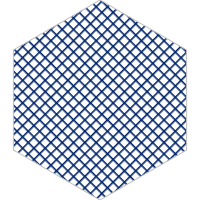

<!-- README.md is generated from README.Rmd. Please edit that file -->

```{r, include = FALSE}
knitr::opts_chunk$set(
  collapse = FALSE,
  comment = "  ",
  fig.path = "man/figures/README-",
  out.width = "100%"
)

suppressPackageStartupMessages({
  library(dplyr)
  library(ggplot2)
  library(tidyr)
  
  library(minisvg)
  library(svgpatternsimple)
})

set.seed(1) # for repeatable stipple pattern
```


```{r echo = FALSE, eval = FALSE}
# pkgdown::build_site(override = list(destination = "../coolbutuseless.github.io/package/svgpatternsimple"))
```


# svgpatternsimple   

<!-- badges: start -->


<!-- badges: end -->

`svgpatternsimple` provides a basic set of simple repeating SVG patterns.

For online documentation, see the [svgpatternsimple pkgdown website](https://coolbutuseless.github.io/package/svgpatternsimple/index.html).

## Installation

You can install from [GitHub](https://github.com/coolbutuseless/svgpatternsimple) with:

``` r
# install.packages("devtools")
install_github("coolbutuseless/poissoned")        # Generate points via poisson disk sampling
install_github("coolbutuseless/minnisvg")         # Build SVG documents with R
install_github("coolbutuseless/svgpatternsimple") # This package
```


## Example: What is a pattern?

The patterns generated by this package are SVG `<pattern>` elements created
with [`minisvg`](https://github.com/coolbutuseless/minisvg).

`minisvg` elements are R6 objects which render to a string representing SVG.

To wrap the pattern in a generic SVG document use the
method `$as_full_svg()`, and to display it in an RStudio session use `$show()`

```{r fig.width=4}
#~~~~~~~~~~~~~~~~~~~~~~~~~~~~~~~~~~~~~~~~~~~~~~~~~~~~~~~~~~~~~~~~~~~~~~~~~~~~~
# Create a dot pattern
#~~~~~~~~~~~~~~~~~~~~~~~~~~~~~~~~~~~~~~~~~~~~~~~~~~~~~~~~~~~~~~~~~~~~~~~~~~~~~
dot <- create_pattern_dot(id = 'dot')
```

```{r eval=FALSE}
dot$show()
```

```{r echo=FALSE, results='asis'}
cat(
  "<pre>",
  "<details><summary style='color: #4169E1;'> Show/hide SVG text </summary>",
  htmltools::htmlEscape(as.character(dot$as_full_svg())),
  "</details>",
  "</pre>", sep='')
```


```{r echo = FALSE}
if (interactive()) {
  dot$show()
} 
dot$save_full_svg("man/figures/README-example-dot.svg", height=100, include_declaration = FALSE)
```


## Example: All patterns

There are currently 7 pattern types included in this package.  
Patterns are created using `create_[type]_pattern()`, and arguments control the
appearance of the generated pattern e.g. opacity, orientation etc.

```{r}
dot          <- create_pattern_dot     (id = 'p1' , fill_fraction = 0.4)
stripe       <- create_pattern_stripe  (id = 'p2' , angle = 60)
hatch        <- create_pattern_hatch   (id = 'p3' , spacing = 50)
stipple      <- create_pattern_stipple (id = 'p4' , colour = 'hotpink')
hex          <- create_pattern_hex     (id = 'p5' , fill_fraction = 0.1)
check        <- create_pattern_check   (id = 'p6' , spacing = 30, colour = 'darkgreen')
gradient     <- create_pattern_gradient(id = 'p7' , colour1 = 'hotpink', colour2 = 'darkblue')

pattern_list <- list(dot, stripe, hatch, stipple, hex, check, gradient)
doc <- SVGPatternList_to_svg(pattern_list, height = 100, ncol = 2)
# doc$show()
doc$save("man/figures/README-all-patterns.svg")
```


```{r echo=FALSE, results='asis'}
cat(
  "<pre>",
  "<details><summary style='color: #4169E1;'> Show/hide SVG text </summary>",
  htmltools::htmlEscape(as.character(doc)),
  "</details>",
  "</pre>", sep='')
```


### Stripes

<details><summary style='color: #4169E1;'>Show R code (click to open/close) </summary>

```{r echo=TRUE}
vars <- expand.grid(
  angle = c(0, 45, 90, 135),
  fill_fraction = c(0.05, 0.25, 0.5, 0.95)
) %>% 
  mutate(id = paste('stripe', angle, fill_fraction, sep="_"))

patterns <- vars %>% 
  purrr::pmap(create_pattern_stripe)

doc <- SVGPatternList_to_svg(patterns, width = 200, height = 100, ncol = 4)
# doc$show()
```

</details>


```{r echo=FALSE, results='asis'}
cat(
  "<pre>",
  "<details><summary style='color: #4169E1;'> Show/hide SVG text </summary>",
  htmltools::htmlEscape(as.character(doc)),
  "</details>",
  "</pre>", sep='')
```

```{r echo = FALSE}
if (interactive()) {
  doc$show()
} 
doc$save("man/figures/README-stripes.svg")
```


### Dot patterns

<details><summary style='color: #4169E1;'>Show R code (click to open/close) </summary>

```{r echo=TRUE}
vars <- expand.grid(
  angle = c(0, 22.5, 45, 67.5),
  fill_fraction = c(0.05, 0.25, 0.5, 0.95)
) %>% 
  mutate(id = paste('dot', angle, fill_fraction, sep="_"))

patterns <- vars %>% 
  purrr::pmap(create_pattern_dot) 

doc <- SVGPatternList_to_svg(patterns, width = 200, height = 100, ncol = 4)
# doc$show()
doc$save("man/figures/README-dots.svg")
```

</details>


```{r echo=FALSE, results='asis'}
cat(
  "<pre>",
  "<details><summary style='color: #4169E1;'> Show/hide SVG text </summary>",
  htmltools::htmlEscape(as.character(doc)),
  "</details>",
  "</pre>", sep='')
```


### Hatching

<details><summary style='color: #4169E1;'>Show R code (click to open/close) </summary>

```{r echo=TRUE}
patterns <- vars %>% 
  mutate(id = paste('hatch', angle, fill_fraction, sep="_")) %>% 
  purrr::pmap(create_pattern_hatch) 

doc <- SVGPatternList_to_svg(patterns, width = 200, height = 100, ncol = 4)
# doc$show()
doc$save("man/figures/README-hatch.svg")
```

</details>


```{r echo=FALSE}
```


```{r echo=FALSE, results='asis'}
cat(
  "<pre>",
  "<details><summary style='color: #4169E1;'> Show/hide SVG text </summary>",
  htmltools::htmlEscape(as.character(doc)),
  "</details>",
  "</pre>", sep='')
```


### Stippling

<details><summary style='color: #4169E1;'>Show R code (click to open/close) </summary>

```{r echo=TRUE}
set.seed(1)
patterns <- vars %>% 
  mutate(id = paste('stipple', angle, fill_fraction, sep="_")) %>% 
  purrr::pmap(create_pattern_stipple) 

doc <- SVGPatternList_to_svg(patterns, width = 200, height = 100, ncol = 4)
# doc$show()
doc$save("man/figures/README-stipple.svg")
```

</details>


```{r echo=FALSE, results='asis'}
cat(
  "<pre>",
  "<details><summary style='color: #4169E1;'> Show/hide SVG text </summary>",
  htmltools::htmlEscape(as.character(doc)),
  "</details>",
  "</pre>", sep='')
```


### Hex patterns

<details><summary style='color: #4169E1;'>Show R code (click to open/close) </summary>

```{r echo=TRUE}
patterns <- vars %>% 
  mutate(id = paste('hex', angle, fill_fraction, sep="_")) %>% 
  purrr::pmap(create_pattern_hex)

doc <- SVGPatternList_to_svg(patterns, width = 200, height = 100, ncol = 4)
# doc$show()
doc$save("man/figures/README-hex.svg")
```

</details>


```{r echo=FALSE}
```


```{r echo=FALSE, results='asis'}
cat(
  "<pre>",
  "<details><summary style='color: #4169E1;'> Show/hide SVG text </summary>",
  htmltools::htmlEscape(as.character(doc)),
  "</details>",
  "</pre>", sep='')
```


### Check patterns

<details><summary style='color: #4169E1;'>Show R code (click to open/close) </summary>

```{r echo=TRUE}
vars <- expand.grid(
  angle = c(0, 22.5, 45, 67.5),
  spacing = c(0.1, 0.25, 0.5, 0.95) * 100
) %>% 
  mutate(id = paste('check', angle, spacing, sep="_"))

patterns <- vars %>% 
  purrr::pmap(create_pattern_check) 

doc <- SVGPatternList_to_svg(patterns, width = 200, height = 100, ncol = 4)
# doc$show()
doc$save("man/figures/README-check.svg")
```

</details>


```{r echo=FALSE, results='asis'}
cat(
  "<pre>",
  "<details><summary style='color: #4169E1;'> Show/hide SVG text </summary>",
  htmltools::htmlEscape(as.character(doc)),
  "</details>",
  "</pre>", sep='')
```


### Gradients

<details><summary style='color: #4169E1;'>Show R code (click to open/close) </summary>

```{r echo=TRUE}

vars <- expand.grid(
  angle = c(0, 45),
  colour1 = c('#ffffff', '#000000'),
  colour2 = c('#aa7733', '#224466', '#77aa33', '#ffbb99')
) %>% 
  mutate(id = paste('grad', angle, colour1, colour2, sep="_"))

patterns <- vars %>% 
  purrr::pmap(create_pattern_gradient) 

doc <- SVGPatternList_to_svg(patterns, width = 200, height = 100, ncol = 4)
# doc$show()
doc$save("man/figures/README-gradients.svg")
```

</details>


```{r echo=FALSE, results='asis'}
cat(
  "<pre>",
  "<details><summary style='color: #4169E1;'> Show/hide SVG text </summary>",
  htmltools::htmlEscape(as.character(doc)),
  "</details>",
  "</pre>", sep='')
```


## Creating the logo for this package


```{r}
#~~~~~~~~~~~~~~~~~~~~~~~~~~~~~~~~~~~~~~~~~~~~~~~~~~~~~~~~~~~~~~~~~~~~~~~~~~~~~
# Building an SVG logo with an animated stripe
#~~~~~~~~~~~~~~~~~~~~~~~~~~~~~~~~~~~~~~~~~~~~~~~~~~~~~~~~~~~~~~~~~~~~~~~~~~~~~
logo <- svg_doc(width = 200, height = 200)

#~~~~~~~~~~~~~~~~~~~~~~~~~~~~~~~~~~~~~~~~~~~~~~~~~~~~~~~~~~~~~~~~~~~~~~~~~~~~~
# Create a simple pattern using the `svgpatternsimple` package
#~~~~~~~~~~~~~~~~~~~~~~~~~~~~~~~~~~~~~~~~~~~~~~~~~~~~~~~~~~~~~~~~~~~~~~~~~~~~~
stripes <- svgpatternsimple::create_pattern_hatch(
  id            = 'stripe', 
  colour        = '#002366', 
  fill_fraction = 0.2,
  spacing       = 8,
  angle         = 45
)

#~~~~~~~~~~~~~~~~~~~~~~~~~~~~~~~~~~~~~~~~~~~~~~~~~~~~~~~~~~~~~~~~~~~~~~~~~~~~~
# Add the pattern to the documents list of definitions
#~~~~~~~~~~~~~~~~~~~~~~~~~~~~~~~~~~~~~~~~~~~~~~~~~~~~~~~~~~~~~~~~~~~~~~~~~~~~~
logo$defs(stripes)

#~~~~~~~~~~~~~~~~~~~~~~~~~~~~~~~~~~~~~~~~~~~~~~~~~~~~~~~~~~~~~~~~~~~~~~~~~~~~~
# Create a hexagon filled with this pattern, and add it to the document
#~~~~~~~~~~~~~~~~~~~~~~~~~~~~~~~~~~~~~~~~~~~~~~~~~~~~~~~~~~~~~~~~~~~~~~~~~~~~~
len     <- 100
angles  <- (seq(0, 360, 60) + 90) * pi/180
xs      <- round(len * cos(angles) + 100, 2)
ys      <- round(len * sin(angles) + 100, 2)
hex     <- stag$polygon(id = 'hex', xs = xs, ys = ys)
hex$update(stroke = '#c0c0c0', fill = stripes)
logo$append(hex)

#~~~~~~~~~~~~~~~~~~~~~~~~~~~~~~~~~~~~~~~~~~~~~~~~~~~~~~~~~~~~~~~~~~~~~~~~~~~~~
# output
#~~~~~~~~~~~~~~~~~~~~~~~~~~~~~~~~~~~~~~~~~~~~~~~~~~~~~~~~~~~~~~~~~~~~~~~~~~~~~
# logo$show()
logo$save("man/figures/logo.svg")
```


```{r echo=FALSE, results='asis'}
cat(
  "<pre>",
  "<details><summary style='color: #4169E1;'> Show/hide SVG text </summary>",
  htmltools::htmlEscape(as.character(logo)),
  "</details>",
  "</pre>", sep='')
```


