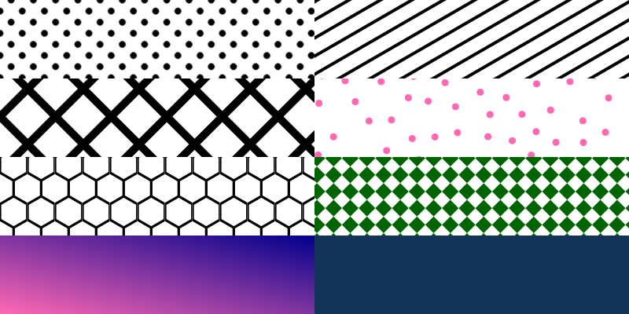
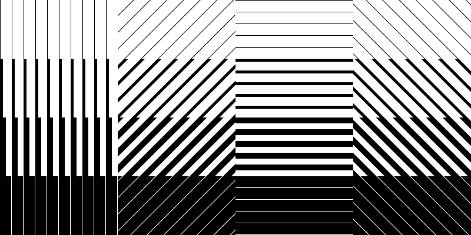
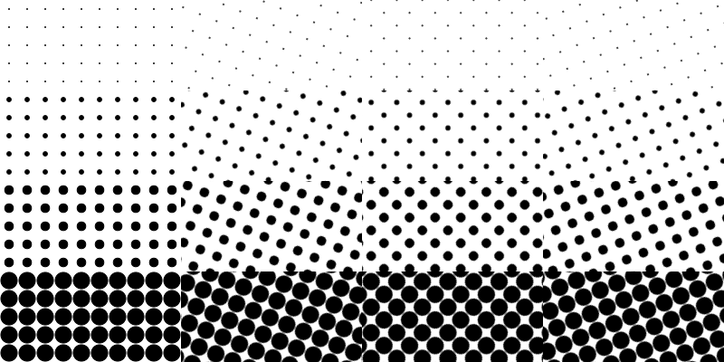
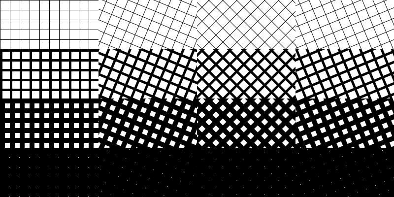
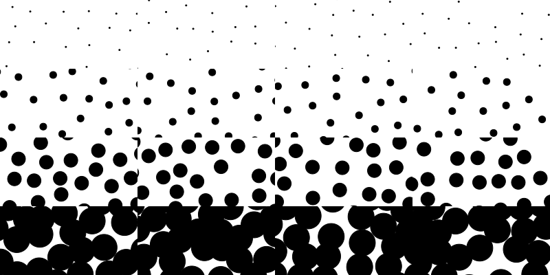
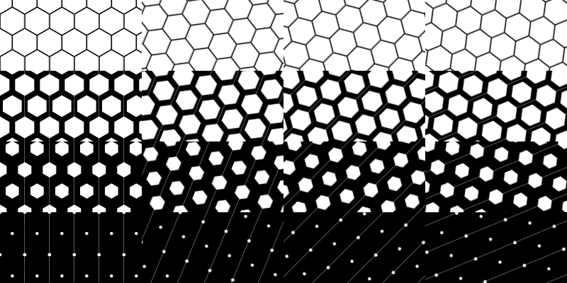
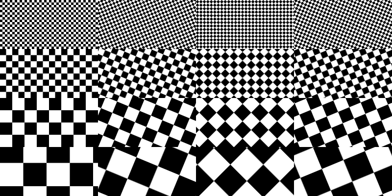

<!-- README.md is generated from README.Rmd. Please edit that file -->

# svgpatternsimple 

<!-- badges: start -->


<!-- badges: end -->

`svgpatternsimple` provides a basic set of simple repeating SVG
patterns.

## Installation

You can install from
[GitHub](https://github.com/coolbutuseless/svgpatternsimple) with:

``` r
# install.packages("devtools")
install_github("coolbutuseless/lofi")             # for encoding information as RGB colours
install_github("coolbutuseless/poissoned")        # Generate points via poisson disk sampling
install_github("coolbutuseless/minisvg")          # Build SVG documents with R
install_github("coolbutuseless/svgpatternsimple") # This package
```

## Example: What is a pattern?

The patterns generated by this package are SVG `<pattern>` elements
created with [`minisvg`](https://github.com/coolbutuseless/minisvg).

`minisvg` elements are R6 objects which render to a string representing
SVG.

To wrap the pattern in a generic SVG document use the method
`$as_full_svg()`, and to display it in an RStudio session use
`$show()`

``` r
#~~~~~~~~~~~~~~~~~~~~~~~~~~~~~~~~~~~~~~~~~~~~~~~~~~~~~~~~~~~~~~~~~~~~~~~~~~~~~
# Create a dot pattern
#~~~~~~~~~~~~~~~~~~~~~~~~~~~~~~~~~~~~~~~~~~~~~~~~~~~~~~~~~~~~~~~~~~~~~~~~~~~~~
dot <- create_dot_pattern(id = 'dot')
```

``` r
dot$show()
```

<pre><details closed><summary> Show SVG text (click to open) </summary>&lt;?xml version="1.0" encoding="UTF-8"?&gt;
&lt;svg viewBox="0 0 400 400" xmlns="http://www.w3.org/2000/svg" xmlns:xlink="http://www.w3.org/1999/xlink"&gt;
  &lt;defs&gt;
    &lt;pattern id="dot" width="20" height="20" patternTransform="rotate(45 0 0)" patternUnits="userSpaceOnUse"&gt;
      &lt;rect style="fill:#ffffff; fill-opacity:1; stroke:none;" width="100%" height="100%" /&gt;
      &lt;circle style="stroke:#000000; fill:#000000; fill-opacity:1; stroke-opacity:1;" cx="10" cy="10" r="1.9" /&gt;
    &lt;/pattern&gt;
  &lt;/defs&gt;
  &lt;rect style="fill: url(#dot) #fff;" x="0" y="0" width="100%" height="100%" /&gt;
&lt;/svg&gt;</details></pre>


## Example: All patterns

There are 8 pattern types included in this package - this includes a
`null` pattern which doesn’t do anything.

Patterns are created using `create_[type]_pattern()`, and arguments
control the appearance of the generated pattern e.g. opacity,
orientation etc.

``` r
dot          <- create_dot_pattern     (id = 'p1' , fill_fraction = 0.4)
stripe       <- create_stripe_pattern  (id = 'p2' , angle = 60)
hatch        <- create_hatch_pattern   (id = 'p3' , spacing = 50)
stipple      <- create_stipple_pattern (id = 'p4' , colour = 'hotpink')
hex          <- create_hex_pattern     (id = 'p5' , fill_fraction = 0.1)
check        <- create_check_pattern   (id = 'p6' , spacing = 30, colour = 'darkgreen')
gradient     <- create_gradient_pattern(id = 'p7' , colour1 = 'hotpink', colour2 = 'darkblue')
null         <- create_null_pattern    (id = 'p8' , colour = '#123456')
```

<pre><details closed><summary> Show SVG text (click to open) </summary>&lt;?xml version="1.0" encoding="UTF-8"?&gt;
&lt;svg width="800" height="400" viewBox="0 0 800 400" xmlns="http://www.w3.org/2000/svg" xmlns:xlink="http://www.w3.org/1999/xlink"&gt;
  &lt;defs&gt;
    &lt;pattern id="p1" width="20" height="20" patternTransform="rotate(45 0 0)" patternUnits="userSpaceOnUse"&gt;
      &lt;rect style="fill:#ffffff; fill-opacity:1; stroke:none;" width="100%" height="100%" /&gt;
      &lt;circle style="stroke:#000000; fill:#000000; fill-opacity:1; stroke-opacity:1;" cx="10" cy="10" r="3.81" /&gt;
    &lt;/pattern&gt;
    &lt;pattern id="p2" width="20" height="20" patternTransform="rotate(60 0 0)" patternUnits="userSpaceOnUse"&gt;
      &lt;rect style="fill:#ffffff; fill-opacity:1; stroke:none;" width="100%" height="100%" /&gt;
      &lt;line style="stroke:#000000; stroke-width:8; stroke-opacity:1;" x1="0" y1="0" x2="0" y2="20" /&gt;
    &lt;/pattern&gt;
    &lt;pattern id="p3" width="50" height="50" patternTransform="rotate(45 0 0)" patternUnits="userSpaceOnUse"&gt;
      &lt;rect style="fill:#ffffff; fill-opacity:1; stroke:none;" width="100%" height="100%" /&gt;
      &lt;g style="stroke:#000000; stroke-width:20; stroke-opacity:1;"&gt;
        &lt;line x1="0" y1="0" x2="0" y2="50" /&gt;
        &lt;line x1="0" y1="0" x2="50" y2="0" /&gt;
      &lt;/g&gt;
    &lt;/pattern&gt;
    &lt;pattern id="p4" width="400" height="400" patternUnits="userSpaceOnUse"&gt;
      &lt;rect style="fill:#ffffff; fill-opacity:1; stroke:none;" width="100%" height="100%" /&gt;
      &lt;g style="fill: hotpink; stroke: hotpink; fill-opacity: 1; stroke-opacity: 1"&gt;
        &lt;circle cx='-7.22' cy='-4.32' r='4' /&gt;
&lt;circle cx='-15.61' cy='47.93' r='4' /&gt;
&lt;circle cx='-16.54' cy='78.06' r='4' /&gt;
&lt;circle cx='-7.22' cy='395.68' r='4' /&gt;
&lt;circle cx='18.12' cy='10.17' r='4' /&gt;
&lt;circle cx='13.26' cy='61.42' r='4' /&gt;
&lt;circle cx='9.46' cy='96.27' r='4' /&gt;
&lt;circle cx='5.75' cy='131.56' r='4' /&gt;
&lt;circle cx='4.56' cy='197.36' r='4' /&gt;
&lt;circle cx='3.19' cy='235.5' r='4' /&gt;
&lt;circle cx='4.14' cy='282.68' r='4' /&gt;
&lt;circle cx='17.42' cy='328.23' r='4' /&gt;
&lt;circle cx='18.17' cy='378.64' r='4' /&gt;
&lt;circle cx='18.12' cy='410.17' r='4' /&gt;
&lt;circle cx='22.23' cy='38.31' r='4' /&gt;
&lt;circle cx='38.96' cy='102.91' r='4' /&gt;
&lt;circle cx='24.14' cy='174.25' r='4' /&gt;
&lt;circle cx='28.66' cy='220.65' r='4' /&gt;
&lt;circle cx='28.52' cy='260.29' r='4' /&gt;
&lt;circle cx='29.89' cy='301.87' r='4' /&gt;
&lt;circle cx='32.04' cy='353.3' r='4' /&gt;
&lt;circle cx='44.01' cy='16.75' r='4' /&gt;
&lt;circle cx='49.56' cy='61.2' r='4' /&gt;
&lt;circle cx='51.86' cy='129.59' r='4' /&gt;
&lt;circle cx='54.86' cy='206.89' r='4' /&gt;
&lt;circle cx='54.21' cy='379.55' r='4' /&gt;
&lt;circle cx='44.01' cy='416.75' r='4' /&gt;
&lt;circle cx='66.79' cy='34.14' r='4' /&gt;
&lt;circle cx='69.35' cy='154.15' r='4' /&gt;
&lt;circle cx='67.29' cy='239.33' r='4' /&gt;
&lt;circle cx='61.73' cy='278.56' r='4' /&gt;
&lt;circle cx='67.13' cy='306.66' r='4' /&gt;
&lt;circle cx='79.8' cy='342.52' r='4' /&gt;
&lt;circle cx='92.56' cy='17.08' r='4' /&gt;
&lt;circle cx='95.83' cy='68.24' r='4' /&gt;
&lt;circle cx='84.71' cy='103.95' r='4' /&gt;
&lt;circle cx='97.92' cy='152.81' r='4' /&gt;
&lt;circle cx='91.75' cy='191.84' r='4' /&gt;
&lt;circle cx='97.77' cy='228.05' r='4' /&gt;
&lt;circle cx='90.21' cy='258.89' r='4' /&gt;
&lt;circle cx='86.8' cy='379.54' r='4' /&gt;
&lt;circle cx='92.56' cy='417.08' r='4' /&gt;
&lt;circle cx='115.3' cy='-17.66' r='4' /&gt;
&lt;circle cx='113.89' cy='41.27' r='4' /&gt;
&lt;circle cx='119.3' cy='124.51' r='4' /&gt;
&lt;circle cx='109.95' cy='279.92' r='4' /&gt;
&lt;circle cx='103.78' cy='325.47' r='4' /&gt;
&lt;circle cx='115.3' cy='382.34' r='4' /&gt;
&lt;circle cx='129.24' cy='16.23' r='4' /&gt;
&lt;circle cx='129.91' cy='65.66' r='4' /&gt;
&lt;circle cx='126' cy='97.26' r='4' /&gt;
&lt;circle cx='124.3' cy='176.53' r='4' /&gt;
&lt;circle cx='132.86' cy='203.55' r='4' /&gt;
&lt;circle cx='120.95' cy='231.21' r='4' /&gt;
&lt;circle cx='139.66' cy='302.33' r='4' /&gt;
&lt;circle cx='120.57' cy='352.94' r='4' /&gt;
&lt;circle cx='129.24' cy='416.23' r='4' /&gt;
&lt;circle cx='159.36' cy='40.5' r='4' /&gt;
&lt;circle cx='144.52' cy='128.98' r='4' /&gt;
&lt;circle cx='153.1' cy='174.42' r='4' /&gt;
&lt;circle cx='143.23' cy='263.88' r='4' /&gt;
&lt;circle cx='156.87' cy='335.79' r='4' /&gt;
&lt;circle cx='169.19' cy='19.82' r='4' /&gt;
&lt;circle cx='173.81' cy='72.67' r='4' /&gt;
&lt;circle cx='166.07' cy='105.27' r='4' /&gt;
&lt;circle cx='179.33' cy='135.92' r='4' /&gt;
&lt;circle cx='160.9' cy='207.54' r='4' /&gt;
&lt;circle cx='170.61' cy='235.55' r='4' /&gt;
&lt;circle cx='176.37' cy='312.63' r='4' /&gt;
&lt;circle cx='161.62' cy='378.23' r='4' /&gt;
&lt;circle cx='169.19' cy='419.82' r='4' /&gt;
&lt;circle cx='199.15' cy='20' r='4' /&gt;
&lt;circle cx='189.35' cy='44.19' r='4' /&gt;
&lt;circle cx='181.88' cy='168.91' r='4' /&gt;
&lt;circle cx='191.13' cy='212.72' r='4' /&gt;
&lt;circle cx='188.58' cy='263.27' r='4' /&gt;
&lt;circle cx='188.12' cy='339.77' r='4' /&gt;
&lt;circle cx='195.85' cy='364.11' r='4' /&gt;
&lt;circle cx='199.15' cy='420' r='4' /&gt;
&lt;circle cx='213.82' cy='-5.9' r='4' /&gt;
&lt;circle cx='203.03' cy='74.37' r='4' /&gt;
&lt;circle cx='210.8' cy='117.48' r='4' /&gt;
&lt;circle cx='207.96' cy='301.37' r='4' /&gt;
&lt;circle cx='219.12' cy='331.36' r='4' /&gt;
&lt;circle cx='213.82' cy='394.1' r='4' /&gt;
&lt;circle cx='228.53' cy='18.99' r='4' /&gt;
&lt;circle cx='234.53' cy='53.48' r='4' /&gt;
&lt;circle cx='223.21' cy='145.96' r='4' /&gt;
&lt;circle cx='220.67' cy='174.14' r='4' /&gt;
&lt;circle cx='226.49' cy='209.06' r='4' /&gt;
&lt;circle cx='234.32' cy='246.39' r='4' /&gt;
&lt;circle cx='225.97' cy='276.93' r='4' /&gt;
&lt;circle cx='228.53' cy='418.99' r='4' /&gt;
&lt;circle cx='241.48' cy='81.39' r='4' /&gt;
&lt;circle cx='243.87' cy='124.23' r='4' /&gt;
&lt;circle cx='251.57' cy='179.21' r='4' /&gt;
&lt;circle cx='255.54' cy='222.18' r='4' /&gt;
&lt;circle cx='257.88' cy='276.15' r='4' /&gt;
&lt;circle cx='242.03' cy='302.43' r='4' /&gt;
&lt;circle cx='245.43' cy='333.22' r='4' /&gt;
&lt;circle cx='247.76' cy='378.65' r='4' /&gt;
&lt;circle cx='276.6' cy='-16.14' r='4' /&gt;
&lt;circle cx='268.35' cy='33.15' r='4' /&gt;
&lt;circle cx='269.86' cy='74.82' r='4' /&gt;
&lt;circle cx='263.95' cy='145.66' r='4' /&gt;
&lt;circle cx='275.71' cy='197.62' r='4' /&gt;
&lt;circle cx='270.83' cy='319.69' r='4' /&gt;
&lt;circle cx='274.54' cy='347.1' r='4' /&gt;
&lt;circle cx='276.6' cy='383.86' r='4' /&gt;
&lt;circle cx='298.84' cy='33.17' r='4' /&gt;
&lt;circle cx='282.5' cy='106.78' r='4' /&gt;
&lt;circle cx='281.88' cy='167.7' r='4' /&gt;
&lt;circle cx='284.02' cy='222.53' r='4' /&gt;
&lt;circle cx='280.4' cy='265.38' r='4' /&gt;
&lt;circle cx='289.36' cy='292.54' r='4' /&gt;
&lt;circle cx='306.81' cy='-4.65' r='4' /&gt;
&lt;circle cx='302.94' cy='78.66' r='4' /&gt;
&lt;circle cx='300.28' cy='140.23' r='4' /&gt;
&lt;circle cx='307.02' cy='181.35' r='4' /&gt;
&lt;circle cx='318.78' cy='236.17' r='4' /&gt;
&lt;circle cx='310.65' cy='261.75' r='4' /&gt;
&lt;circle cx='315.22' cy='306.77' r='4' /&gt;
&lt;circle cx='318.02' cy='335.7' r='4' /&gt;
&lt;circle cx='319.87' cy='366.24' r='4' /&gt;
&lt;circle cx='306.81' cy='395.35' r='4' /&gt;
&lt;circle cx='321.27' cy='45.01' r='4' /&gt;
&lt;circle cx='324.91' cy='103.97' r='4' /&gt;
&lt;circle cx='323.74' cy='204.69' r='4' /&gt;
&lt;circle cx='342.35' cy='-3.59' r='4' /&gt;
&lt;circle cx='356.53' cy='27.58' r='4' /&gt;
&lt;circle cx='351.28' cy='59.45' r='4' /&gt;
&lt;circle cx='356.59' cy='96.22' r='4' /&gt;
&lt;circle cx='341.31' cy='153.82' r='4' /&gt;
&lt;circle cx='341.97' cy='181.54' r='4' /&gt;
&lt;circle cx='345.77' cy='244.83' r='4' /&gt;
&lt;circle cx='358.25' cy='287.06' r='4' /&gt;
&lt;circle cx='341.96' cy='337.06' r='4' /&gt;
&lt;circle cx='352.15' cy='360.3' r='4' /&gt;
&lt;circle cx='342.35' cy='396.41' r='4' /&gt;
&lt;circle cx='374.02' cy='124.79' r='4' /&gt;
&lt;circle cx='370.08' cy='168.52' r='4' /&gt;
&lt;circle cx='367.84' cy='206.22' r='4' /&gt;
&lt;circle cx='374.28' cy='243.97' r='4' /&gt;
&lt;circle cx='373.13' cy='332.69' r='4' /&gt;
&lt;circle cx='379.75' cy='367.99' r='4' /&gt;
&lt;circle cx='392.78' cy='-4.32' r='4' /&gt;
&lt;circle cx='384.39' cy='47.93' r='4' /&gt;
&lt;circle cx='383.46' cy='78.06' r='4' /&gt;
&lt;circle cx='392.78' cy='395.68' r='4' /&gt;
&lt;circle cx='418.12' cy='10.17' r='4' /&gt;
&lt;circle cx='413.26' cy='61.42' r='4' /&gt;
&lt;circle cx='409.46' cy='96.27' r='4' /&gt;
&lt;circle cx='405.75' cy='131.56' r='4' /&gt;
&lt;circle cx='404.56' cy='197.36' r='4' /&gt;
&lt;circle cx='403.19' cy='235.5' r='4' /&gt;
&lt;circle cx='404.14' cy='282.68' r='4' /&gt;
&lt;circle cx='417.42' cy='328.23' r='4' /&gt;
&lt;circle cx='418.17' cy='378.64' r='4' /&gt;
&lt;circle cx='418.12' cy='410.17' r='4' /&gt;
      &lt;/g&gt;
    &lt;/pattern&gt;
    &lt;pattern id="p5" width="34.6410161513775" height="60" patternTransform="rotate(0 0 0)" patternUnits="userSpaceOnUse"&gt;
      &lt;rect style="fill:#ffffff; fill-opacity:1; stroke:none;" width="100%" height="100%" /&gt;
      &lt;g style="stroke:#000000; stroke-width:3.2; stroke-opacity:1;"&gt;
        &lt;line x1="17.3205080756888" y1="10" x2="0" y2="20" /&gt;
        &lt;line x1="17.3205080756888" y1="10" x2="34.6410161513775" y2="20" /&gt;
        &lt;line x1="17.3205080756888" y1="50" x2="0" y2="40" /&gt;
        &lt;line x1="17.3205080756888" y1="50" x2="34.6410161513775" y2="40" /&gt;
        &lt;line x1="17.3205080756888" y1="0" x2="17.3205080756888" y2="10" /&gt;
        &lt;line x1="17.3205080756888" y1="50" x2="17.3205080756888" y2="60" /&gt;
        &lt;line x1="0" y1="20" x2="0" y2="40" /&gt;
        &lt;line x1="34.6410161513775" y1="20" x2="34.6410161513775" y2="40" /&gt;
      &lt;/g&gt;
    &lt;/pattern&gt;
    &lt;pattern id="p6" width="30" height="30" patternTransform="rotate(45 0 0)" patternUnits="userSpaceOnUse"&gt;
      &lt;rect style="fill:#ffffff; fill-opacity:1; stroke:none;" width="100%" height="100%" /&gt;
      &lt;g style="fill:darkgreen; fill-opacity:1;"&gt;
        &lt;rect x="0" y="0" width="15" height="15" /&gt;
        &lt;rect x="15" y="15" width="15" height="15" /&gt;
      &lt;/g&gt;
    &lt;/pattern&gt;
    &lt;linearGradient id="p7" x1="0%" y1="100%" x2="100%" y2="0%"&gt;
      &lt;stop style="stop-color:hotpink;stop-opacity:1" offset="0%" /&gt;
      &lt;stop style="stop-color:darkblue;stop-opacity:1" offset="100%" /&gt;
    &lt;/linearGradient&gt;
    &lt;pattern id="p8" width="100" height="100" patternUnits="userSpaceOnUse"&gt;
      &lt;rect style="fill:#123456; fill-opacity:1; stroke:none;" width="100%" height="100%" /&gt;
    &lt;/pattern&gt;
  &lt;/defs&gt;
  &lt;rect style='fill: url(#p1);' x='0' y='0' height='100' width='400'&gt;&lt;/rect&gt;
&lt;rect style='fill: url(#p2);' x='400' y='0' height='100' width='400'&gt;&lt;/rect&gt;
&lt;rect style='fill: url(#p3);' x='0' y='100' height='100' width='400'&gt;&lt;/rect&gt;
&lt;rect style='fill: url(#p4);' x='400' y='100' height='100' width='400'&gt;&lt;/rect&gt;
&lt;rect style='fill: url(#p5);' x='0' y='200' height='100' width='400'&gt;&lt;/rect&gt;
&lt;rect style='fill: url(#p6);' x='400' y='200' height='100' width='400'&gt;&lt;/rect&gt;
&lt;rect style='fill: url(#p7);' x='0' y='300' height='100' width='400'&gt;&lt;/rect&gt;
&lt;rect style='fill: url(#p8);' x='400' y='300' height='100' width='400'&gt;&lt;/rect&gt;
&lt;/svg&gt;</details></pre>



### Stripes

<pre><details closed><summary> Show SVG text (click to open) </summary>&lt;?xml version="1.0" encoding="UTF-8"?&gt;
&lt;svg width="800" height="400" viewBox="0 0 800 400" xmlns="http://www.w3.org/2000/svg" xmlns:xlink="http://www.w3.org/1999/xlink"&gt;
  &lt;defs&gt;
    &lt;pattern id="stripe_0_0.05" width="20" height="20" patternTransform="rotate(0 0 0)" patternUnits="userSpaceOnUse"&gt;
      &lt;rect style="fill:#ffffff; fill-opacity:1; stroke:none;" width="100%" height="100%" /&gt;
      &lt;line style="stroke:#000000; stroke-width:2; stroke-opacity:1;" x1="0" y1="0" x2="0" y2="20" /&gt;
    &lt;/pattern&gt;
    &lt;pattern id="stripe_45_0.05" width="20" height="20" patternTransform="rotate(45 0 0)" patternUnits="userSpaceOnUse"&gt;
      &lt;rect style="fill:#ffffff; fill-opacity:1; stroke:none;" width="100%" height="100%" /&gt;
      &lt;line style="stroke:#000000; stroke-width:2; stroke-opacity:1;" x1="0" y1="0" x2="0" y2="20" /&gt;
    &lt;/pattern&gt;
    &lt;pattern id="stripe_90_0.05" width="20" height="20" patternTransform="rotate(90 0 0)" patternUnits="userSpaceOnUse"&gt;
      &lt;rect style="fill:#ffffff; fill-opacity:1; stroke:none;" width="100%" height="100%" /&gt;
      &lt;line style="stroke:#000000; stroke-width:2; stroke-opacity:1;" x1="0" y1="0" x2="0" y2="20" /&gt;
    &lt;/pattern&gt;
    &lt;pattern id="stripe_135_0.05" width="20" height="20" patternTransform="rotate(135 0 0)" patternUnits="userSpaceOnUse"&gt;
      &lt;rect style="fill:#ffffff; fill-opacity:1; stroke:none;" width="100%" height="100%" /&gt;
      &lt;line style="stroke:#000000; stroke-width:2; stroke-opacity:1;" x1="0" y1="0" x2="0" y2="20" /&gt;
    &lt;/pattern&gt;
    &lt;pattern id="stripe_0_0.25" width="20" height="20" patternTransform="rotate(0 0 0)" patternUnits="userSpaceOnUse"&gt;
      &lt;rect style="fill:#ffffff; fill-opacity:1; stroke:none;" width="100%" height="100%" /&gt;
      &lt;line style="stroke:#000000; stroke-width:10; stroke-opacity:1;" x1="0" y1="0" x2="0" y2="20" /&gt;
    &lt;/pattern&gt;
    &lt;pattern id="stripe_45_0.25" width="20" height="20" patternTransform="rotate(45 0 0)" patternUnits="userSpaceOnUse"&gt;
      &lt;rect style="fill:#ffffff; fill-opacity:1; stroke:none;" width="100%" height="100%" /&gt;
      &lt;line style="stroke:#000000; stroke-width:10; stroke-opacity:1;" x1="0" y1="0" x2="0" y2="20" /&gt;
    &lt;/pattern&gt;
    &lt;pattern id="stripe_90_0.25" width="20" height="20" patternTransform="rotate(90 0 0)" patternUnits="userSpaceOnUse"&gt;
      &lt;rect style="fill:#ffffff; fill-opacity:1; stroke:none;" width="100%" height="100%" /&gt;
      &lt;line style="stroke:#000000; stroke-width:10; stroke-opacity:1;" x1="0" y1="0" x2="0" y2="20" /&gt;
    &lt;/pattern&gt;
    &lt;pattern id="stripe_135_0.25" width="20" height="20" patternTransform="rotate(135 0 0)" patternUnits="userSpaceOnUse"&gt;
      &lt;rect style="fill:#ffffff; fill-opacity:1; stroke:none;" width="100%" height="100%" /&gt;
      &lt;line style="stroke:#000000; stroke-width:10; stroke-opacity:1;" x1="0" y1="0" x2="0" y2="20" /&gt;
    &lt;/pattern&gt;
    &lt;pattern id="stripe_0_0.5" width="20" height="20" patternTransform="rotate(0 0 0)" patternUnits="userSpaceOnUse"&gt;
      &lt;rect style="fill:#ffffff; fill-opacity:1; stroke:none;" width="100%" height="100%" /&gt;
      &lt;line style="stroke:#000000; stroke-width:20; stroke-opacity:1;" x1="0" y1="0" x2="0" y2="20" /&gt;
    &lt;/pattern&gt;
    &lt;pattern id="stripe_45_0.5" width="20" height="20" patternTransform="rotate(45 0 0)" patternUnits="userSpaceOnUse"&gt;
      &lt;rect style="fill:#ffffff; fill-opacity:1; stroke:none;" width="100%" height="100%" /&gt;
      &lt;line style="stroke:#000000; stroke-width:20; stroke-opacity:1;" x1="0" y1="0" x2="0" y2="20" /&gt;
    &lt;/pattern&gt;
    &lt;pattern id="stripe_90_0.5" width="20" height="20" patternTransform="rotate(90 0 0)" patternUnits="userSpaceOnUse"&gt;
      &lt;rect style="fill:#ffffff; fill-opacity:1; stroke:none;" width="100%" height="100%" /&gt;
      &lt;line style="stroke:#000000; stroke-width:20; stroke-opacity:1;" x1="0" y1="0" x2="0" y2="20" /&gt;
    &lt;/pattern&gt;
    &lt;pattern id="stripe_135_0.5" width="20" height="20" patternTransform="rotate(135 0 0)" patternUnits="userSpaceOnUse"&gt;
      &lt;rect style="fill:#ffffff; fill-opacity:1; stroke:none;" width="100%" height="100%" /&gt;
      &lt;line style="stroke:#000000; stroke-width:20; stroke-opacity:1;" x1="0" y1="0" x2="0" y2="20" /&gt;
    &lt;/pattern&gt;
    &lt;pattern id="stripe_0_0.95" width="20" height="20" patternTransform="rotate(0 0 0)" patternUnits="userSpaceOnUse"&gt;
      &lt;rect style="fill:#ffffff; fill-opacity:1; stroke:none;" width="100%" height="100%" /&gt;
      &lt;line style="stroke:#000000; stroke-width:38; stroke-opacity:1;" x1="0" y1="0" x2="0" y2="20" /&gt;
    &lt;/pattern&gt;
    &lt;pattern id="stripe_45_0.95" width="20" height="20" patternTransform="rotate(45 0 0)" patternUnits="userSpaceOnUse"&gt;
      &lt;rect style="fill:#ffffff; fill-opacity:1; stroke:none;" width="100%" height="100%" /&gt;
      &lt;line style="stroke:#000000; stroke-width:38; stroke-opacity:1;" x1="0" y1="0" x2="0" y2="20" /&gt;
    &lt;/pattern&gt;
    &lt;pattern id="stripe_90_0.95" width="20" height="20" patternTransform="rotate(90 0 0)" patternUnits="userSpaceOnUse"&gt;
      &lt;rect style="fill:#ffffff; fill-opacity:1; stroke:none;" width="100%" height="100%" /&gt;
      &lt;line style="stroke:#000000; stroke-width:38; stroke-opacity:1;" x1="0" y1="0" x2="0" y2="20" /&gt;
    &lt;/pattern&gt;
    &lt;pattern id="stripe_135_0.95" width="20" height="20" patternTransform="rotate(135 0 0)" patternUnits="userSpaceOnUse"&gt;
      &lt;rect style="fill:#ffffff; fill-opacity:1; stroke:none;" width="100%" height="100%" /&gt;
      &lt;line style="stroke:#000000; stroke-width:38; stroke-opacity:1;" x1="0" y1="0" x2="0" y2="20" /&gt;
    &lt;/pattern&gt;
  &lt;/defs&gt;
  &lt;rect style='fill: url(#stripe_0_0.05);' x='0' y='0' height='100' width='200'&gt;&lt;/rect&gt;
&lt;rect style='fill: url(#stripe_45_0.05);' x='200' y='0' height='100' width='200'&gt;&lt;/rect&gt;
&lt;rect style='fill: url(#stripe_90_0.05);' x='400' y='0' height='100' width='200'&gt;&lt;/rect&gt;
&lt;rect style='fill: url(#stripe_135_0.05);' x='600' y='0' height='100' width='200'&gt;&lt;/rect&gt;
&lt;rect style='fill: url(#stripe_0_0.25);' x='0' y='100' height='100' width='200'&gt;&lt;/rect&gt;
&lt;rect style='fill: url(#stripe_45_0.25);' x='200' y='100' height='100' width='200'&gt;&lt;/rect&gt;
&lt;rect style='fill: url(#stripe_90_0.25);' x='400' y='100' height='100' width='200'&gt;&lt;/rect&gt;
&lt;rect style='fill: url(#stripe_135_0.25);' x='600' y='100' height='100' width='200'&gt;&lt;/rect&gt;
&lt;rect style='fill: url(#stripe_0_0.5);' x='0' y='200' height='100' width='200'&gt;&lt;/rect&gt;
&lt;rect style='fill: url(#stripe_45_0.5);' x='200' y='200' height='100' width='200'&gt;&lt;/rect&gt;
&lt;rect style='fill: url(#stripe_90_0.5);' x='400' y='200' height='100' width='200'&gt;&lt;/rect&gt;
&lt;rect style='fill: url(#stripe_135_0.5);' x='600' y='200' height='100' width='200'&gt;&lt;/rect&gt;
&lt;rect style='fill: url(#stripe_0_0.95);' x='0' y='300' height='100' width='200'&gt;&lt;/rect&gt;
&lt;rect style='fill: url(#stripe_45_0.95);' x='200' y='300' height='100' width='200'&gt;&lt;/rect&gt;
&lt;rect style='fill: url(#stripe_90_0.95);' x='400' y='300' height='100' width='200'&gt;&lt;/rect&gt;
&lt;rect style='fill: url(#stripe_135_0.95);' x='600' y='300' height='100' width='200'&gt;&lt;/rect&gt;
&lt;/svg&gt;</details></pre>



### Dot patterns

<pre><details closed><summary> Show SVG text (click to open) </summary>&lt;?xml version="1.0" encoding="UTF-8"?&gt;
&lt;svg width="800" height="400" viewBox="0 0 800 400" xmlns="http://www.w3.org/2000/svg" xmlns:xlink="http://www.w3.org/1999/xlink"&gt;
  &lt;defs&gt;
    &lt;pattern id="dot_0_0.05" width="20" height="20" patternTransform="rotate(0 0 0)" patternUnits="userSpaceOnUse"&gt;
      &lt;rect style="fill:#ffffff; fill-opacity:1; stroke:none;" width="100%" height="100%" /&gt;
      &lt;circle style="stroke:#000000; fill:#000000; fill-opacity:1; stroke-opacity:1;" cx="10" cy="10" r="0.48" /&gt;
    &lt;/pattern&gt;
    &lt;pattern id="dot_22.5_0.05" width="20" height="20" patternTransform="rotate(22.5 0 0)" patternUnits="userSpaceOnUse"&gt;
      &lt;rect style="fill:#ffffff; fill-opacity:1; stroke:none;" width="100%" height="100%" /&gt;
      &lt;circle style="stroke:#000000; fill:#000000; fill-opacity:1; stroke-opacity:1;" cx="10" cy="10" r="0.48" /&gt;
    &lt;/pattern&gt;
    &lt;pattern id="dot_45_0.05" width="20" height="20" patternTransform="rotate(45 0 0)" patternUnits="userSpaceOnUse"&gt;
      &lt;rect style="fill:#ffffff; fill-opacity:1; stroke:none;" width="100%" height="100%" /&gt;
      &lt;circle style="stroke:#000000; fill:#000000; fill-opacity:1; stroke-opacity:1;" cx="10" cy="10" r="0.48" /&gt;
    &lt;/pattern&gt;
    &lt;pattern id="dot_67.5_0.05" width="20" height="20" patternTransform="rotate(67.5 0 0)" patternUnits="userSpaceOnUse"&gt;
      &lt;rect style="fill:#ffffff; fill-opacity:1; stroke:none;" width="100%" height="100%" /&gt;
      &lt;circle style="stroke:#000000; fill:#000000; fill-opacity:1; stroke-opacity:1;" cx="10" cy="10" r="0.48" /&gt;
    &lt;/pattern&gt;
    &lt;pattern id="dot_0_0.25" width="20" height="20" patternTransform="rotate(0 0 0)" patternUnits="userSpaceOnUse"&gt;
      &lt;rect style="fill:#ffffff; fill-opacity:1; stroke:none;" width="100%" height="100%" /&gt;
      &lt;circle style="stroke:#000000; fill:#000000; fill-opacity:1; stroke-opacity:1;" cx="10" cy="10" r="2.38" /&gt;
    &lt;/pattern&gt;
    &lt;pattern id="dot_22.5_0.25" width="20" height="20" patternTransform="rotate(22.5 0 0)" patternUnits="userSpaceOnUse"&gt;
      &lt;rect style="fill:#ffffff; fill-opacity:1; stroke:none;" width="100%" height="100%" /&gt;
      &lt;circle style="stroke:#000000; fill:#000000; fill-opacity:1; stroke-opacity:1;" cx="10" cy="10" r="2.38" /&gt;
    &lt;/pattern&gt;
    &lt;pattern id="dot_45_0.25" width="20" height="20" patternTransform="rotate(45 0 0)" patternUnits="userSpaceOnUse"&gt;
      &lt;rect style="fill:#ffffff; fill-opacity:1; stroke:none;" width="100%" height="100%" /&gt;
      &lt;circle style="stroke:#000000; fill:#000000; fill-opacity:1; stroke-opacity:1;" cx="10" cy="10" r="2.38" /&gt;
    &lt;/pattern&gt;
    &lt;pattern id="dot_67.5_0.25" width="20" height="20" patternTransform="rotate(67.5 0 0)" patternUnits="userSpaceOnUse"&gt;
      &lt;rect style="fill:#ffffff; fill-opacity:1; stroke:none;" width="100%" height="100%" /&gt;
      &lt;circle style="stroke:#000000; fill:#000000; fill-opacity:1; stroke-opacity:1;" cx="10" cy="10" r="2.38" /&gt;
    &lt;/pattern&gt;
    &lt;pattern id="dot_0_0.5" width="20" height="20" patternTransform="rotate(0 0 0)" patternUnits="userSpaceOnUse"&gt;
      &lt;rect style="fill:#ffffff; fill-opacity:1; stroke:none;" width="100%" height="100%" /&gt;
      &lt;circle style="stroke:#000000; fill:#000000; fill-opacity:1; stroke-opacity:1;" cx="10" cy="10" r="4.76" /&gt;
    &lt;/pattern&gt;
    &lt;pattern id="dot_22.5_0.5" width="20" height="20" patternTransform="rotate(22.5 0 0)" patternUnits="userSpaceOnUse"&gt;
      &lt;rect style="fill:#ffffff; fill-opacity:1; stroke:none;" width="100%" height="100%" /&gt;
      &lt;circle style="stroke:#000000; fill:#000000; fill-opacity:1; stroke-opacity:1;" cx="10" cy="10" r="4.76" /&gt;
    &lt;/pattern&gt;
    &lt;pattern id="dot_45_0.5" width="20" height="20" patternTransform="rotate(45 0 0)" patternUnits="userSpaceOnUse"&gt;
      &lt;rect style="fill:#ffffff; fill-opacity:1; stroke:none;" width="100%" height="100%" /&gt;
      &lt;circle style="stroke:#000000; fill:#000000; fill-opacity:1; stroke-opacity:1;" cx="10" cy="10" r="4.76" /&gt;
    &lt;/pattern&gt;
    &lt;pattern id="dot_67.5_0.5" width="20" height="20" patternTransform="rotate(67.5 0 0)" patternUnits="userSpaceOnUse"&gt;
      &lt;rect style="fill:#ffffff; fill-opacity:1; stroke:none;" width="100%" height="100%" /&gt;
      &lt;circle style="stroke:#000000; fill:#000000; fill-opacity:1; stroke-opacity:1;" cx="10" cy="10" r="4.76" /&gt;
    &lt;/pattern&gt;
    &lt;pattern id="dot_0_0.95" width="20" height="20" patternTransform="rotate(0 0 0)" patternUnits="userSpaceOnUse"&gt;
      &lt;rect style="fill:#ffffff; fill-opacity:1; stroke:none;" width="100%" height="100%" /&gt;
      &lt;circle style="stroke:#000000; fill:#000000; fill-opacity:1; stroke-opacity:1;" cx="10" cy="10" r="9.05" /&gt;
    &lt;/pattern&gt;
    &lt;pattern id="dot_22.5_0.95" width="20" height="20" patternTransform="rotate(22.5 0 0)" patternUnits="userSpaceOnUse"&gt;
      &lt;rect style="fill:#ffffff; fill-opacity:1; stroke:none;" width="100%" height="100%" /&gt;
      &lt;circle style="stroke:#000000; fill:#000000; fill-opacity:1; stroke-opacity:1;" cx="10" cy="10" r="9.05" /&gt;
    &lt;/pattern&gt;
    &lt;pattern id="dot_45_0.95" width="20" height="20" patternTransform="rotate(45 0 0)" patternUnits="userSpaceOnUse"&gt;
      &lt;rect style="fill:#ffffff; fill-opacity:1; stroke:none;" width="100%" height="100%" /&gt;
      &lt;circle style="stroke:#000000; fill:#000000; fill-opacity:1; stroke-opacity:1;" cx="10" cy="10" r="9.05" /&gt;
    &lt;/pattern&gt;
    &lt;pattern id="dot_67.5_0.95" width="20" height="20" patternTransform="rotate(67.5 0 0)" patternUnits="userSpaceOnUse"&gt;
      &lt;rect style="fill:#ffffff; fill-opacity:1; stroke:none;" width="100%" height="100%" /&gt;
      &lt;circle style="stroke:#000000; fill:#000000; fill-opacity:1; stroke-opacity:1;" cx="10" cy="10" r="9.05" /&gt;
    &lt;/pattern&gt;
  &lt;/defs&gt;
  &lt;rect style='fill: url(#dot_0_0.05);' x='0' y='0' height='100' width='200'&gt;&lt;/rect&gt;
&lt;rect style='fill: url(#dot_22.5_0.05);' x='200' y='0' height='100' width='200'&gt;&lt;/rect&gt;
&lt;rect style='fill: url(#dot_45_0.05);' x='400' y='0' height='100' width='200'&gt;&lt;/rect&gt;
&lt;rect style='fill: url(#dot_67.5_0.05);' x='600' y='0' height='100' width='200'&gt;&lt;/rect&gt;
&lt;rect style='fill: url(#dot_0_0.25);' x='0' y='100' height='100' width='200'&gt;&lt;/rect&gt;
&lt;rect style='fill: url(#dot_22.5_0.25);' x='200' y='100' height='100' width='200'&gt;&lt;/rect&gt;
&lt;rect style='fill: url(#dot_45_0.25);' x='400' y='100' height='100' width='200'&gt;&lt;/rect&gt;
&lt;rect style='fill: url(#dot_67.5_0.25);' x='600' y='100' height='100' width='200'&gt;&lt;/rect&gt;
&lt;rect style='fill: url(#dot_0_0.5);' x='0' y='200' height='100' width='200'&gt;&lt;/rect&gt;
&lt;rect style='fill: url(#dot_22.5_0.5);' x='200' y='200' height='100' width='200'&gt;&lt;/rect&gt;
&lt;rect style='fill: url(#dot_45_0.5);' x='400' y='200' height='100' width='200'&gt;&lt;/rect&gt;
&lt;rect style='fill: url(#dot_67.5_0.5);' x='600' y='200' height='100' width='200'&gt;&lt;/rect&gt;
&lt;rect style='fill: url(#dot_0_0.95);' x='0' y='300' height='100' width='200'&gt;&lt;/rect&gt;
&lt;rect style='fill: url(#dot_22.5_0.95);' x='200' y='300' height='100' width='200'&gt;&lt;/rect&gt;
&lt;rect style='fill: url(#dot_45_0.95);' x='400' y='300' height='100' width='200'&gt;&lt;/rect&gt;
&lt;rect style='fill: url(#dot_67.5_0.95);' x='600' y='300' height='100' width='200'&gt;&lt;/rect&gt;
&lt;/svg&gt;</details></pre>



### Hatching

<pre><details closed><summary> Show SVG text (click to open) </summary>&lt;?xml version="1.0" encoding="UTF-8"?&gt;
&lt;svg width="800" height="400" viewBox="0 0 800 400" xmlns="http://www.w3.org/2000/svg" xmlns:xlink="http://www.w3.org/1999/xlink"&gt;
  &lt;defs&gt;
    &lt;pattern id="hatch_0_0.05" width="20" height="20" patternTransform="rotate(0 0 0)" patternUnits="userSpaceOnUse"&gt;
      &lt;rect style="fill:#ffffff; fill-opacity:1; stroke:none;" width="100%" height="100%" /&gt;
      &lt;g style="stroke:#000000; stroke-width:2; stroke-opacity:1;"&gt;
        &lt;line x1="0" y1="0" x2="0" y2="20" /&gt;
        &lt;line x1="0" y1="0" x2="20" y2="0" /&gt;
      &lt;/g&gt;
    &lt;/pattern&gt;
    &lt;pattern id="hatch_22.5_0.05" width="20" height="20" patternTransform="rotate(22.5 0 0)" patternUnits="userSpaceOnUse"&gt;
      &lt;rect style="fill:#ffffff; fill-opacity:1; stroke:none;" width="100%" height="100%" /&gt;
      &lt;g style="stroke:#000000; stroke-width:2; stroke-opacity:1;"&gt;
        &lt;line x1="0" y1="0" x2="0" y2="20" /&gt;
        &lt;line x1="0" y1="0" x2="20" y2="0" /&gt;
      &lt;/g&gt;
    &lt;/pattern&gt;
    &lt;pattern id="hatch_45_0.05" width="20" height="20" patternTransform="rotate(45 0 0)" patternUnits="userSpaceOnUse"&gt;
      &lt;rect style="fill:#ffffff; fill-opacity:1; stroke:none;" width="100%" height="100%" /&gt;
      &lt;g style="stroke:#000000; stroke-width:2; stroke-opacity:1;"&gt;
        &lt;line x1="0" y1="0" x2="0" y2="20" /&gt;
        &lt;line x1="0" y1="0" x2="20" y2="0" /&gt;
      &lt;/g&gt;
    &lt;/pattern&gt;
    &lt;pattern id="hatch_67.5_0.05" width="20" height="20" patternTransform="rotate(67.5 0 0)" patternUnits="userSpaceOnUse"&gt;
      &lt;rect style="fill:#ffffff; fill-opacity:1; stroke:none;" width="100%" height="100%" /&gt;
      &lt;g style="stroke:#000000; stroke-width:2; stroke-opacity:1;"&gt;
        &lt;line x1="0" y1="0" x2="0" y2="20" /&gt;
        &lt;line x1="0" y1="0" x2="20" y2="0" /&gt;
      &lt;/g&gt;
    &lt;/pattern&gt;
    &lt;pattern id="hatch_0_0.25" width="20" height="20" patternTransform="rotate(0 0 0)" patternUnits="userSpaceOnUse"&gt;
      &lt;rect style="fill:#ffffff; fill-opacity:1; stroke:none;" width="100%" height="100%" /&gt;
      &lt;g style="stroke:#000000; stroke-width:10; stroke-opacity:1;"&gt;
        &lt;line x1="0" y1="0" x2="0" y2="20" /&gt;
        &lt;line x1="0" y1="0" x2="20" y2="0" /&gt;
      &lt;/g&gt;
    &lt;/pattern&gt;
    &lt;pattern id="hatch_22.5_0.25" width="20" height="20" patternTransform="rotate(22.5 0 0)" patternUnits="userSpaceOnUse"&gt;
      &lt;rect style="fill:#ffffff; fill-opacity:1; stroke:none;" width="100%" height="100%" /&gt;
      &lt;g style="stroke:#000000; stroke-width:10; stroke-opacity:1;"&gt;
        &lt;line x1="0" y1="0" x2="0" y2="20" /&gt;
        &lt;line x1="0" y1="0" x2="20" y2="0" /&gt;
      &lt;/g&gt;
    &lt;/pattern&gt;
    &lt;pattern id="hatch_45_0.25" width="20" height="20" patternTransform="rotate(45 0 0)" patternUnits="userSpaceOnUse"&gt;
      &lt;rect style="fill:#ffffff; fill-opacity:1; stroke:none;" width="100%" height="100%" /&gt;
      &lt;g style="stroke:#000000; stroke-width:10; stroke-opacity:1;"&gt;
        &lt;line x1="0" y1="0" x2="0" y2="20" /&gt;
        &lt;line x1="0" y1="0" x2="20" y2="0" /&gt;
      &lt;/g&gt;
    &lt;/pattern&gt;
    &lt;pattern id="hatch_67.5_0.25" width="20" height="20" patternTransform="rotate(67.5 0 0)" patternUnits="userSpaceOnUse"&gt;
      &lt;rect style="fill:#ffffff; fill-opacity:1; stroke:none;" width="100%" height="100%" /&gt;
      &lt;g style="stroke:#000000; stroke-width:10; stroke-opacity:1;"&gt;
        &lt;line x1="0" y1="0" x2="0" y2="20" /&gt;
        &lt;line x1="0" y1="0" x2="20" y2="0" /&gt;
      &lt;/g&gt;
    &lt;/pattern&gt;
    &lt;pattern id="hatch_0_0.5" width="20" height="20" patternTransform="rotate(0 0 0)" patternUnits="userSpaceOnUse"&gt;
      &lt;rect style="fill:#ffffff; fill-opacity:1; stroke:none;" width="100%" height="100%" /&gt;
      &lt;g style="stroke:#000000; stroke-width:20; stroke-opacity:1;"&gt;
        &lt;line x1="0" y1="0" x2="0" y2="20" /&gt;
        &lt;line x1="0" y1="0" x2="20" y2="0" /&gt;
      &lt;/g&gt;
    &lt;/pattern&gt;
    &lt;pattern id="hatch_22.5_0.5" width="20" height="20" patternTransform="rotate(22.5 0 0)" patternUnits="userSpaceOnUse"&gt;
      &lt;rect style="fill:#ffffff; fill-opacity:1; stroke:none;" width="100%" height="100%" /&gt;
      &lt;g style="stroke:#000000; stroke-width:20; stroke-opacity:1;"&gt;
        &lt;line x1="0" y1="0" x2="0" y2="20" /&gt;
        &lt;line x1="0" y1="0" x2="20" y2="0" /&gt;
      &lt;/g&gt;
    &lt;/pattern&gt;
    &lt;pattern id="hatch_45_0.5" width="20" height="20" patternTransform="rotate(45 0 0)" patternUnits="userSpaceOnUse"&gt;
      &lt;rect style="fill:#ffffff; fill-opacity:1; stroke:none;" width="100%" height="100%" /&gt;
      &lt;g style="stroke:#000000; stroke-width:20; stroke-opacity:1;"&gt;
        &lt;line x1="0" y1="0" x2="0" y2="20" /&gt;
        &lt;line x1="0" y1="0" x2="20" y2="0" /&gt;
      &lt;/g&gt;
    &lt;/pattern&gt;
    &lt;pattern id="hatch_67.5_0.5" width="20" height="20" patternTransform="rotate(67.5 0 0)" patternUnits="userSpaceOnUse"&gt;
      &lt;rect style="fill:#ffffff; fill-opacity:1; stroke:none;" width="100%" height="100%" /&gt;
      &lt;g style="stroke:#000000; stroke-width:20; stroke-opacity:1;"&gt;
        &lt;line x1="0" y1="0" x2="0" y2="20" /&gt;
        &lt;line x1="0" y1="0" x2="20" y2="0" /&gt;
      &lt;/g&gt;
    &lt;/pattern&gt;
    &lt;pattern id="hatch_0_0.95" width="20" height="20" patternTransform="rotate(0 0 0)" patternUnits="userSpaceOnUse"&gt;
      &lt;rect style="fill:#ffffff; fill-opacity:1; stroke:none;" width="100%" height="100%" /&gt;
      &lt;g style="stroke:#000000; stroke-width:38; stroke-opacity:1;"&gt;
        &lt;line x1="0" y1="0" x2="0" y2="20" /&gt;
        &lt;line x1="0" y1="0" x2="20" y2="0" /&gt;
      &lt;/g&gt;
    &lt;/pattern&gt;
    &lt;pattern id="hatch_22.5_0.95" width="20" height="20" patternTransform="rotate(22.5 0 0)" patternUnits="userSpaceOnUse"&gt;
      &lt;rect style="fill:#ffffff; fill-opacity:1; stroke:none;" width="100%" height="100%" /&gt;
      &lt;g style="stroke:#000000; stroke-width:38; stroke-opacity:1;"&gt;
        &lt;line x1="0" y1="0" x2="0" y2="20" /&gt;
        &lt;line x1="0" y1="0" x2="20" y2="0" /&gt;
      &lt;/g&gt;
    &lt;/pattern&gt;
    &lt;pattern id="hatch_45_0.95" width="20" height="20" patternTransform="rotate(45 0 0)" patternUnits="userSpaceOnUse"&gt;
      &lt;rect style="fill:#ffffff; fill-opacity:1; stroke:none;" width="100%" height="100%" /&gt;
      &lt;g style="stroke:#000000; stroke-width:38; stroke-opacity:1;"&gt;
        &lt;line x1="0" y1="0" x2="0" y2="20" /&gt;
        &lt;line x1="0" y1="0" x2="20" y2="0" /&gt;
      &lt;/g&gt;
    &lt;/pattern&gt;
    &lt;pattern id="hatch_67.5_0.95" width="20" height="20" patternTransform="rotate(67.5 0 0)" patternUnits="userSpaceOnUse"&gt;
      &lt;rect style="fill:#ffffff; fill-opacity:1; stroke:none;" width="100%" height="100%" /&gt;
      &lt;g style="stroke:#000000; stroke-width:38; stroke-opacity:1;"&gt;
        &lt;line x1="0" y1="0" x2="0" y2="20" /&gt;
        &lt;line x1="0" y1="0" x2="20" y2="0" /&gt;
      &lt;/g&gt;
    &lt;/pattern&gt;
  &lt;/defs&gt;
  &lt;rect style='fill: url(#hatch_0_0.05);' x='0' y='0' height='100' width='200'&gt;&lt;/rect&gt;
&lt;rect style='fill: url(#hatch_22.5_0.05);' x='200' y='0' height='100' width='200'&gt;&lt;/rect&gt;
&lt;rect style='fill: url(#hatch_45_0.05);' x='400' y='0' height='100' width='200'&gt;&lt;/rect&gt;
&lt;rect style='fill: url(#hatch_67.5_0.05);' x='600' y='0' height='100' width='200'&gt;&lt;/rect&gt;
&lt;rect style='fill: url(#hatch_0_0.25);' x='0' y='100' height='100' width='200'&gt;&lt;/rect&gt;
&lt;rect style='fill: url(#hatch_22.5_0.25);' x='200' y='100' height='100' width='200'&gt;&lt;/rect&gt;
&lt;rect style='fill: url(#hatch_45_0.25);' x='400' y='100' height='100' width='200'&gt;&lt;/rect&gt;
&lt;rect style='fill: url(#hatch_67.5_0.25);' x='600' y='100' height='100' width='200'&gt;&lt;/rect&gt;
&lt;rect style='fill: url(#hatch_0_0.5);' x='0' y='200' height='100' width='200'&gt;&lt;/rect&gt;
&lt;rect style='fill: url(#hatch_22.5_0.5);' x='200' y='200' height='100' width='200'&gt;&lt;/rect&gt;
&lt;rect style='fill: url(#hatch_45_0.5);' x='400' y='200' height='100' width='200'&gt;&lt;/rect&gt;
&lt;rect style='fill: url(#hatch_67.5_0.5);' x='600' y='200' height='100' width='200'&gt;&lt;/rect&gt;
&lt;rect style='fill: url(#hatch_0_0.95);' x='0' y='300' height='100' width='200'&gt;&lt;/rect&gt;
&lt;rect style='fill: url(#hatch_22.5_0.95);' x='200' y='300' height='100' width='200'&gt;&lt;/rect&gt;
&lt;rect style='fill: url(#hatch_45_0.95);' x='400' y='300' height='100' width='200'&gt;&lt;/rect&gt;
&lt;rect style='fill: url(#hatch_67.5_0.95);' x='600' y='300' height='100' width='200'&gt;&lt;/rect&gt;
&lt;/svg&gt;</details></pre>



### Stippling

<pre><details closed><summary> Show SVG text (click to open) </summary>&lt;?xml version="1.0" encoding="UTF-8"?&gt;
&lt;svg width="800" height="400" viewBox="0 0 800 400" xmlns="http://www.w3.org/2000/svg" xmlns:xlink="http://www.w3.org/1999/xlink"&gt;
  &lt;defs&gt;
    &lt;pattern id="stipple_0_0.05" width="400" height="400" patternUnits="userSpaceOnUse"&gt;
      &lt;rect style="fill:#ffffff; fill-opacity:1; stroke:none;" width="100%" height="100%" /&gt;
      &lt;g style="fill: #000000; stroke: #000000; fill-opacity: 1; stroke-opacity: 1"&gt;
        &lt;circle cx='-7.22' cy='-4.32' r='1' /&gt;
&lt;circle cx='-15.61' cy='47.93' r='1' /&gt;
&lt;circle cx='-16.54' cy='78.06' r='1' /&gt;
&lt;circle cx='-7.22' cy='395.68' r='1' /&gt;
&lt;circle cx='18.12' cy='10.17' r='1' /&gt;
&lt;circle cx='13.26' cy='61.42' r='1' /&gt;
&lt;circle cx='9.46' cy='96.27' r='1' /&gt;
&lt;circle cx='5.75' cy='131.56' r='1' /&gt;
&lt;circle cx='4.56' cy='197.36' r='1' /&gt;
&lt;circle cx='3.19' cy='235.5' r='1' /&gt;
&lt;circle cx='4.14' cy='282.68' r='1' /&gt;
&lt;circle cx='17.42' cy='328.23' r='1' /&gt;
&lt;circle cx='18.17' cy='378.64' r='1' /&gt;
&lt;circle cx='18.12' cy='410.17' r='1' /&gt;
&lt;circle cx='22.23' cy='38.31' r='1' /&gt;
&lt;circle cx='38.96' cy='102.91' r='1' /&gt;
&lt;circle cx='24.14' cy='174.25' r='1' /&gt;
&lt;circle cx='28.66' cy='220.65' r='1' /&gt;
&lt;circle cx='28.52' cy='260.29' r='1' /&gt;
&lt;circle cx='29.89' cy='301.87' r='1' /&gt;
&lt;circle cx='32.04' cy='353.3' r='1' /&gt;
&lt;circle cx='44.01' cy='16.75' r='1' /&gt;
&lt;circle cx='49.56' cy='61.2' r='1' /&gt;
&lt;circle cx='51.86' cy='129.59' r='1' /&gt;
&lt;circle cx='54.86' cy='206.89' r='1' /&gt;
&lt;circle cx='54.21' cy='379.55' r='1' /&gt;
&lt;circle cx='44.01' cy='416.75' r='1' /&gt;
&lt;circle cx='66.79' cy='34.14' r='1' /&gt;
&lt;circle cx='69.35' cy='154.15' r='1' /&gt;
&lt;circle cx='67.29' cy='239.33' r='1' /&gt;
&lt;circle cx='61.73' cy='278.56' r='1' /&gt;
&lt;circle cx='67.13' cy='306.66' r='1' /&gt;
&lt;circle cx='79.8' cy='342.52' r='1' /&gt;
&lt;circle cx='92.56' cy='17.08' r='1' /&gt;
&lt;circle cx='95.83' cy='68.24' r='1' /&gt;
&lt;circle cx='84.71' cy='103.95' r='1' /&gt;
&lt;circle cx='97.92' cy='152.81' r='1' /&gt;
&lt;circle cx='91.75' cy='191.84' r='1' /&gt;
&lt;circle cx='97.77' cy='228.05' r='1' /&gt;
&lt;circle cx='90.21' cy='258.89' r='1' /&gt;
&lt;circle cx='86.8' cy='379.54' r='1' /&gt;
&lt;circle cx='92.56' cy='417.08' r='1' /&gt;
&lt;circle cx='115.3' cy='-17.66' r='1' /&gt;
&lt;circle cx='113.89' cy='41.27' r='1' /&gt;
&lt;circle cx='119.3' cy='124.51' r='1' /&gt;
&lt;circle cx='109.95' cy='279.92' r='1' /&gt;
&lt;circle cx='103.78' cy='325.47' r='1' /&gt;
&lt;circle cx='115.3' cy='382.34' r='1' /&gt;
&lt;circle cx='129.24' cy='16.23' r='1' /&gt;
&lt;circle cx='129.91' cy='65.66' r='1' /&gt;
&lt;circle cx='126' cy='97.26' r='1' /&gt;
&lt;circle cx='124.3' cy='176.53' r='1' /&gt;
&lt;circle cx='132.86' cy='203.55' r='1' /&gt;
&lt;circle cx='120.95' cy='231.21' r='1' /&gt;
&lt;circle cx='139.66' cy='302.33' r='1' /&gt;
&lt;circle cx='120.57' cy='352.94' r='1' /&gt;
&lt;circle cx='129.24' cy='416.23' r='1' /&gt;
&lt;circle cx='159.36' cy='40.5' r='1' /&gt;
&lt;circle cx='144.52' cy='128.98' r='1' /&gt;
&lt;circle cx='153.1' cy='174.42' r='1' /&gt;
&lt;circle cx='143.23' cy='263.88' r='1' /&gt;
&lt;circle cx='156.87' cy='335.79' r='1' /&gt;
&lt;circle cx='169.19' cy='19.82' r='1' /&gt;
&lt;circle cx='173.81' cy='72.67' r='1' /&gt;
&lt;circle cx='166.07' cy='105.27' r='1' /&gt;
&lt;circle cx='179.33' cy='135.92' r='1' /&gt;
&lt;circle cx='160.9' cy='207.54' r='1' /&gt;
&lt;circle cx='170.61' cy='235.55' r='1' /&gt;
&lt;circle cx='176.37' cy='312.63' r='1' /&gt;
&lt;circle cx='161.62' cy='378.23' r='1' /&gt;
&lt;circle cx='169.19' cy='419.82' r='1' /&gt;
&lt;circle cx='199.15' cy='20' r='1' /&gt;
&lt;circle cx='189.35' cy='44.19' r='1' /&gt;
&lt;circle cx='181.88' cy='168.91' r='1' /&gt;
&lt;circle cx='191.13' cy='212.72' r='1' /&gt;
&lt;circle cx='188.58' cy='263.27' r='1' /&gt;
&lt;circle cx='188.12' cy='339.77' r='1' /&gt;
&lt;circle cx='195.85' cy='364.11' r='1' /&gt;
&lt;circle cx='199.15' cy='420' r='1' /&gt;
&lt;circle cx='213.82' cy='-5.9' r='1' /&gt;
&lt;circle cx='203.03' cy='74.37' r='1' /&gt;
&lt;circle cx='210.8' cy='117.48' r='1' /&gt;
&lt;circle cx='207.96' cy='301.37' r='1' /&gt;
&lt;circle cx='219.12' cy='331.36' r='1' /&gt;
&lt;circle cx='213.82' cy='394.1' r='1' /&gt;
&lt;circle cx='228.53' cy='18.99' r='1' /&gt;
&lt;circle cx='234.53' cy='53.48' r='1' /&gt;
&lt;circle cx='223.21' cy='145.96' r='1' /&gt;
&lt;circle cx='220.67' cy='174.14' r='1' /&gt;
&lt;circle cx='226.49' cy='209.06' r='1' /&gt;
&lt;circle cx='234.32' cy='246.39' r='1' /&gt;
&lt;circle cx='225.97' cy='276.93' r='1' /&gt;
&lt;circle cx='228.53' cy='418.99' r='1' /&gt;
&lt;circle cx='241.48' cy='81.39' r='1' /&gt;
&lt;circle cx='243.87' cy='124.23' r='1' /&gt;
&lt;circle cx='251.57' cy='179.21' r='1' /&gt;
&lt;circle cx='255.54' cy='222.18' r='1' /&gt;
&lt;circle cx='257.88' cy='276.15' r='1' /&gt;
&lt;circle cx='242.03' cy='302.43' r='1' /&gt;
&lt;circle cx='245.43' cy='333.22' r='1' /&gt;
&lt;circle cx='247.76' cy='378.65' r='1' /&gt;
&lt;circle cx='276.6' cy='-16.14' r='1' /&gt;
&lt;circle cx='268.35' cy='33.15' r='1' /&gt;
&lt;circle cx='269.86' cy='74.82' r='1' /&gt;
&lt;circle cx='263.95' cy='145.66' r='1' /&gt;
&lt;circle cx='275.71' cy='197.62' r='1' /&gt;
&lt;circle cx='270.83' cy='319.69' r='1' /&gt;
&lt;circle cx='274.54' cy='347.1' r='1' /&gt;
&lt;circle cx='276.6' cy='383.86' r='1' /&gt;
&lt;circle cx='298.84' cy='33.17' r='1' /&gt;
&lt;circle cx='282.5' cy='106.78' r='1' /&gt;
&lt;circle cx='281.88' cy='167.7' r='1' /&gt;
&lt;circle cx='284.02' cy='222.53' r='1' /&gt;
&lt;circle cx='280.4' cy='265.38' r='1' /&gt;
&lt;circle cx='289.36' cy='292.54' r='1' /&gt;
&lt;circle cx='306.81' cy='-4.65' r='1' /&gt;
&lt;circle cx='302.94' cy='78.66' r='1' /&gt;
&lt;circle cx='300.28' cy='140.23' r='1' /&gt;
&lt;circle cx='307.02' cy='181.35' r='1' /&gt;
&lt;circle cx='318.78' cy='236.17' r='1' /&gt;
&lt;circle cx='310.65' cy='261.75' r='1' /&gt;
&lt;circle cx='315.22' cy='306.77' r='1' /&gt;
&lt;circle cx='318.02' cy='335.7' r='1' /&gt;
&lt;circle cx='319.87' cy='366.24' r='1' /&gt;
&lt;circle cx='306.81' cy='395.35' r='1' /&gt;
&lt;circle cx='321.27' cy='45.01' r='1' /&gt;
&lt;circle cx='324.91' cy='103.97' r='1' /&gt;
&lt;circle cx='323.74' cy='204.69' r='1' /&gt;
&lt;circle cx='342.35' cy='-3.59' r='1' /&gt;
&lt;circle cx='356.53' cy='27.58' r='1' /&gt;
&lt;circle cx='351.28' cy='59.45' r='1' /&gt;
&lt;circle cx='356.59' cy='96.22' r='1' /&gt;
&lt;circle cx='341.31' cy='153.82' r='1' /&gt;
&lt;circle cx='341.97' cy='181.54' r='1' /&gt;
&lt;circle cx='345.77' cy='244.83' r='1' /&gt;
&lt;circle cx='358.25' cy='287.06' r='1' /&gt;
&lt;circle cx='341.96' cy='337.06' r='1' /&gt;
&lt;circle cx='352.15' cy='360.3' r='1' /&gt;
&lt;circle cx='342.35' cy='396.41' r='1' /&gt;
&lt;circle cx='374.02' cy='124.79' r='1' /&gt;
&lt;circle cx='370.08' cy='168.52' r='1' /&gt;
&lt;circle cx='367.84' cy='206.22' r='1' /&gt;
&lt;circle cx='374.28' cy='243.97' r='1' /&gt;
&lt;circle cx='373.13' cy='332.69' r='1' /&gt;
&lt;circle cx='379.75' cy='367.99' r='1' /&gt;
&lt;circle cx='392.78' cy='-4.32' r='1' /&gt;
&lt;circle cx='384.39' cy='47.93' r='1' /&gt;
&lt;circle cx='383.46' cy='78.06' r='1' /&gt;
&lt;circle cx='392.78' cy='395.68' r='1' /&gt;
&lt;circle cx='418.12' cy='10.17' r='1' /&gt;
&lt;circle cx='413.26' cy='61.42' r='1' /&gt;
&lt;circle cx='409.46' cy='96.27' r='1' /&gt;
&lt;circle cx='405.75' cy='131.56' r='1' /&gt;
&lt;circle cx='404.56' cy='197.36' r='1' /&gt;
&lt;circle cx='403.19' cy='235.5' r='1' /&gt;
&lt;circle cx='404.14' cy='282.68' r='1' /&gt;
&lt;circle cx='417.42' cy='328.23' r='1' /&gt;
&lt;circle cx='418.17' cy='378.64' r='1' /&gt;
&lt;circle cx='418.12' cy='410.17' r='1' /&gt;
      &lt;/g&gt;
    &lt;/pattern&gt;
    &lt;pattern id="stipple_22.5_0.05" width="400" height="400" patternUnits="userSpaceOnUse"&gt;
      &lt;rect style="fill:#ffffff; fill-opacity:1; stroke:none;" width="100%" height="100%" /&gt;
      &lt;g style="fill: #000000; stroke: #000000; fill-opacity: 1; stroke-opacity: 1"&gt;
        &lt;circle cx='-17.35' cy='-9.75' r='1' /&gt;
&lt;circle cx='-4.89' cy='103.85' r='1' /&gt;
&lt;circle cx='-18.93' cy='158.18' r='1' /&gt;
&lt;circle cx='-17.7' cy='187.11' r='1' /&gt;
&lt;circle cx='-17.35' cy='390.25' r='1' /&gt;
&lt;circle cx='6.19' cy='10.32' r='1' /&gt;
&lt;circle cx='11.17' cy='58.41' r='1' /&gt;
&lt;circle cx='17.56' cy='145.57' r='1' /&gt;
&lt;circle cx='13.74' cy='218.12' r='1' /&gt;
&lt;circle cx='9.8' cy='242.51' r='1' /&gt;
&lt;circle cx='4.95' cy='271.23' r='1' /&gt;
&lt;circle cx='10.12' cy='307.83' r='1' /&gt;
&lt;circle cx='18.6' cy='347.38' r='1' /&gt;
&lt;circle cx='6.19' cy='410.32' r='1' /&gt;
&lt;circle cx='35.11' cy='9.8' r='1' /&gt;
&lt;circle cx='38.47' cy='43.96' r='1' /&gt;
&lt;circle cx='24.8' cy='101.46' r='1' /&gt;
&lt;circle cx='30.4' cy='192.42' r='1' /&gt;
&lt;circle cx='35.11' cy='409.8' r='1' /&gt;
&lt;circle cx='45.16' cy='71.52' r='1' /&gt;
&lt;circle cx='43.44' cy='125.22' r='1' /&gt;
&lt;circle cx='43.17' cy='159.15' r='1' /&gt;
&lt;circle cx='54.28' cy='213.91' r='1' /&gt;
&lt;circle cx='43.97' cy='251.83' r='1' /&gt;
&lt;circle cx='42.75' cy='297.62' r='1' /&gt;
&lt;circle cx='49.03' cy='331.26' r='1' /&gt;
&lt;circle cx='55.61' cy='368.94' r='1' /&gt;
&lt;circle cx='63.31' cy='20.67' r='1' /&gt;
&lt;circle cx='71.47' cy='51.39' r='1' /&gt;
&lt;circle cx='71.6' cy='97.88' r='1' /&gt;
&lt;circle cx='70.63' cy='170.98' r='1' /&gt;
&lt;circle cx='76.17' cy='259.05' r='1' /&gt;
&lt;circle cx='66.8' cy='282.01' r='1' /&gt;
&lt;circle cx='78.01' cy='331.59' r='1' /&gt;
&lt;circle cx='80.17' cy='-11.81' r='1' /&gt;
&lt;circle cx='99.69' cy='48.92' r='1' /&gt;
&lt;circle cx='95.25' cy='80.38' r='1' /&gt;
&lt;circle cx='87.77' cy='144.07' r='1' /&gt;
&lt;circle cx='91.31' cy='200.48' r='1' /&gt;
&lt;circle cx='84.16' cy='228.19' r='1' /&gt;
&lt;circle cx='99.26' cy='308.09' r='1' /&gt;
&lt;circle cx='92.46' cy='359.83' r='1' /&gt;
&lt;circle cx='80.17' cy='388.19' r='1' /&gt;
&lt;circle cx='100.47' cy='11.55' r='1' /&gt;
&lt;circle cx='115.85' cy='122.2' r='1' /&gt;
&lt;circle cx='116.89' cy='169.81' r='1' /&gt;
&lt;circle cx='107.97' cy='243.95' r='1' /&gt;
&lt;circle cx='104.59' cy='273.93' r='1' /&gt;
&lt;circle cx='100.47' cy='411.55' r='1' /&gt;
&lt;circle cx='120.89' cy='-19.45' r='1' /&gt;
&lt;circle cx='137.44' cy='6.41' r='1' /&gt;
&lt;circle cx='125.29' cy='57.72' r='1' /&gt;
&lt;circle cx='122.75' cy='99.53' r='1' /&gt;
&lt;circle cx='133.99' cy='145.06' r='1' /&gt;
&lt;circle cx='127.05' cy='200.53' r='1' /&gt;
&lt;circle cx='136.76' cy='234.05' r='1' /&gt;
&lt;circle cx='123.23' cy='306.63' r='1' /&gt;
&lt;circle cx='123.93' cy='339.4' r='1' /&gt;
&lt;circle cx='120.89' cy='380.55' r='1' /&gt;
&lt;circle cx='137.44' cy='406.41' r='1' /&gt;
&lt;circle cx='156.67' cy='37.31' r='1' /&gt;
&lt;circle cx='153.46' cy='77.33' r='1' /&gt;
&lt;circle cx='153.19' cy='103.23' r='1' /&gt;
&lt;circle cx='157.02' cy='164.95' r='1' /&gt;
&lt;circle cx='153.59' cy='276.57' r='1' /&gt;
&lt;circle cx='149.93' cy='357.24' r='1' /&gt;
&lt;circle cx='170.91' cy='0.16' r='1' /&gt;
&lt;circle cx='170.29' cy='130.47' r='1' /&gt;
&lt;circle cx='166.69' cy='202.64' r='1' /&gt;
&lt;circle cx='162.02' cy='243.73' r='1' /&gt;
&lt;circle cx='172.52' cy='298.35' r='1' /&gt;
&lt;circle cx='162.8' cy='326.03' r='1' /&gt;
&lt;circle cx='177.72' cy='369.23' r='1' /&gt;
&lt;circle cx='170.91' cy='400.16' r='1' /&gt;
&lt;circle cx='181.65' cy='27.31' r='1' /&gt;
&lt;circle cx='196.29' cy='60.74' r='1' /&gt;
&lt;circle cx='199.16' cy='99.34' r='1' /&gt;
&lt;circle cx='187.16' cy='167.45' r='1' /&gt;
&lt;circle cx='197.44' cy='204.61' r='1' /&gt;
&lt;circle cx='193.83' cy='239.41' r='1' /&gt;
&lt;circle cx='216.77' cy='0.31' r='1' /&gt;
&lt;circle cx='216.43' cy='33.32' r='1' /&gt;
&lt;circle cx='216.97' cy='122.77' r='1' /&gt;
&lt;circle cx='211.76' cy='151.32' r='1' /&gt;
&lt;circle cx='200.93' cy='260.58' r='1' /&gt;
&lt;circle cx='206.28' cy='323.31' r='1' /&gt;
&lt;circle cx='202.19' cy='353.94' r='1' /&gt;
&lt;circle cx='216.77' cy='400.31' r='1' /&gt;
&lt;circle cx='230.59' cy='201.85' r='1' /&gt;
&lt;circle cx='230.64' cy='254.47' r='1' /&gt;
&lt;circle cx='231.31' cy='283.22' r='1' /&gt;
&lt;circle cx='239.62' cy='346.56' r='1' /&gt;
&lt;circle cx='247.52' cy='-18.84' r='1' /&gt;
&lt;circle cx='241.59' cy='17.45' r='1' /&gt;
&lt;circle cx='257.81' cy='41.54' r='1' /&gt;
&lt;circle cx='242.73' cy='78.97' r='1' /&gt;
&lt;circle cx='259.18' cy='119.26' r='1' /&gt;
&lt;circle cx='240.24' cy='165.53' r='1' /&gt;
&lt;circle cx='240.83' cy='311.24' r='1' /&gt;
&lt;circle cx='247.52' cy='381.16' r='1' /&gt;
&lt;circle cx='241.59' cy='417.45' r='1' /&gt;
&lt;circle cx='270.78' cy='7.88' r='1' /&gt;
&lt;circle cx='276.63' cy='86.65' r='1' /&gt;
&lt;circle cx='272.08' cy='147.13' r='1' /&gt;
&lt;circle cx='262.59' cy='184.01' r='1' /&gt;
&lt;circle cx='267.62' cy='226' r='1' /&gt;
&lt;circle cx='278.44' cy='268.63' r='1' /&gt;
&lt;circle cx='268.09' cy='343.57' r='1' /&gt;
&lt;circle cx='270.78' cy='407.88' r='1' /&gt;
&lt;circle cx='281.05' cy='41.91' r='1' /&gt;
&lt;circle cx='281.35' cy='302.82' r='1' /&gt;
&lt;circle cx='290.09' cy='376.84' r='1' /&gt;
&lt;circle cx='308.82' cy='19.04' r='1' /&gt;
&lt;circle cx='309.33' cy='46.06' r='1' /&gt;
&lt;circle cx='302.52' cy='74.45' r='1' /&gt;
&lt;circle cx='309.45' cy='124.56' r='1' /&gt;
&lt;circle cx='308.83' cy='172.43' r='1' /&gt;
&lt;circle cx='308.71' cy='204.95' r='1' /&gt;
&lt;circle cx='307.16' cy='241.92' r='1' /&gt;
&lt;circle cx='315.86' cy='277.92' r='1' /&gt;
&lt;circle cx='310.21' cy='313.79' r='1' /&gt;
&lt;circle cx='314.73' cy='350.9' r='1' /&gt;
&lt;circle cx='308.82' cy='419.04' r='1' /&gt;
&lt;circle cx='336.49' cy='60.45' r='1' /&gt;
&lt;circle cx='335.41' cy='142.92' r='1' /&gt;
&lt;circle cx='338.23' cy='233.89' r='1' /&gt;
&lt;circle cx='337.39' cy='371.61' r='1' /&gt;
&lt;circle cx='358.5' cy='9.37' r='1' /&gt;
&lt;circle cx='342.35' cy='39.4' r='1' /&gt;
&lt;circle cx='343.91' cy='112.89' r='1' /&gt;
&lt;circle cx='355.85' cy='162.85' r='1' /&gt;
&lt;circle cx='341.47' cy='187.47' r='1' /&gt;
&lt;circle cx='358.41' cy='212.02' r='1' /&gt;
&lt;circle cx='342.77' cy='267.46' r='1' /&gt;
&lt;circle cx='346.1' cy='296.55' r='1' /&gt;
&lt;circle cx='341.25' cy='325.5' r='1' /&gt;
&lt;circle cx='358.5' cy='409.37' r='1' /&gt;
&lt;circle cx='371.34' cy='38.57' r='1' /&gt;
&lt;circle cx='371.47' cy='63.32' r='1' /&gt;
&lt;circle cx='370.61' cy='122.74' r='1' /&gt;
&lt;circle cx='374.61' cy='249.15' r='1' /&gt;
&lt;circle cx='377.32' cy='305.47' r='1' /&gt;
&lt;circle cx='374.33' cy='336.08' r='1' /&gt;
&lt;circle cx='365.89' cy='366.16' r='1' /&gt;
&lt;circle cx='382.65' cy='-9.75' r='1' /&gt;
&lt;circle cx='395.11' cy='103.85' r='1' /&gt;
&lt;circle cx='381.07' cy='158.18' r='1' /&gt;
&lt;circle cx='382.3' cy='187.11' r='1' /&gt;
&lt;circle cx='382.65' cy='390.25' r='1' /&gt;
&lt;circle cx='406.19' cy='10.32' r='1' /&gt;
&lt;circle cx='411.17' cy='58.41' r='1' /&gt;
&lt;circle cx='417.56' cy='145.57' r='1' /&gt;
&lt;circle cx='413.74' cy='218.12' r='1' /&gt;
&lt;circle cx='409.8' cy='242.51' r='1' /&gt;
&lt;circle cx='404.95' cy='271.23' r='1' /&gt;
&lt;circle cx='410.12' cy='307.83' r='1' /&gt;
&lt;circle cx='418.6' cy='347.38' r='1' /&gt;
&lt;circle cx='406.19' cy='410.32' r='1' /&gt;
      &lt;/g&gt;
    &lt;/pattern&gt;
    &lt;pattern id="stipple_45_0.05" width="400" height="400" patternUnits="userSpaceOnUse"&gt;
      &lt;rect style="fill:#ffffff; fill-opacity:1; stroke:none;" width="100%" height="100%" /&gt;
      &lt;g style="fill: #000000; stroke: #000000; fill-opacity: 1; stroke-opacity: 1"&gt;
        &lt;circle cx='-16.69' cy='40.33' r='1' /&gt;
&lt;circle cx='-0.63' cy='67.41' r='1' /&gt;
&lt;circle cx='-19.04' cy='88.93' r='1' /&gt;
&lt;circle cx='-6.42' cy='128.71' r='1' /&gt;
&lt;circle cx='-5.3' cy='216.32' r='1' /&gt;
&lt;circle cx='-13.06' cy='246.41' r='1' /&gt;
&lt;circle cx='-2.91' cy='288.87' r='1' /&gt;
&lt;circle cx='-1.85' cy='326.08' r='1' /&gt;
&lt;circle cx='0.34' cy='8.94' r='1' /&gt;
&lt;circle cx='15.92' cy='32.91' r='1' /&gt;
&lt;circle cx='16.1' cy='99.67' r='1' /&gt;
&lt;circle cx='16.57' cy='354.23' r='1' /&gt;
&lt;circle cx='3.27' cy='379.23' r='1' /&gt;
&lt;circle cx='0.34' cy='408.94' r='1' /&gt;
&lt;circle cx='35.99' cy='-13.57' r='1' /&gt;
&lt;circle cx='28.91' cy='70.72' r='1' /&gt;
&lt;circle cx='26.04' cy='126.59' r='1' /&gt;
&lt;circle cx='35.82' cy='163.27' r='1' /&gt;
&lt;circle cx='20.15' cy='196.54' r='1' /&gt;
&lt;circle cx='39.13' cy='233.39' r='1' /&gt;
&lt;circle cx='29.42' cy='264.79' r='1' /&gt;
&lt;circle cx='35.99' cy='386.43' r='1' /&gt;
&lt;circle cx='58.62' cy='6.14' r='1' /&gt;
&lt;circle cx='50.09' cy='42' r='1' /&gt;
&lt;circle cx='49.7' cy='96.72' r='1' /&gt;
&lt;circle cx='50.01' cy='194.08' r='1' /&gt;
&lt;circle cx='48.81' cy='285.9' r='1' /&gt;
&lt;circle cx='47.2' cy='317.57' r='1' /&gt;
&lt;circle cx='44.34' cy='346.53' r='1' /&gt;
&lt;circle cx='58.62' cy='406.14' r='1' /&gt;
&lt;circle cx='60.14' cy='128.93' r='1' /&gt;
&lt;circle cx='61.83' cy='167.99' r='1' /&gt;
&lt;circle cx='79.81' cy='215.4' r='1' /&gt;
&lt;circle cx='67.21' cy='254.52' r='1' /&gt;
&lt;circle cx='90.13' cy='-1.36' r='1' /&gt;
&lt;circle cx='84.66' cy='21.73' r='1' /&gt;
&lt;circle cx='82.82' cy='51.48' r='1' /&gt;
&lt;circle cx='87.61' cy='79.87' r='1' /&gt;
&lt;circle cx='97.81' cy='100.25' r='1' /&gt;
&lt;circle cx='87.63' cy='147.77' r='1' /&gt;
&lt;circle cx='80.22' cy='279.82' r='1' /&gt;
&lt;circle cx='86.33' cy='328' r='1' /&gt;
&lt;circle cx='81.01' cy='368.94' r='1' /&gt;
&lt;circle cx='90.13' cy='398.64' r='1' /&gt;
&lt;circle cx='114.28' cy='15.54' r='1' /&gt;
&lt;circle cx='100.94' cy='200.53' r='1' /&gt;
&lt;circle cx='103.54' cy='246.3' r='1' /&gt;
&lt;circle cx='113.99' cy='280.52' r='1' /&gt;
&lt;circle cx='104.98' cy='353.64' r='1' /&gt;
&lt;circle cx='114.28' cy='415.54' r='1' /&gt;
&lt;circle cx='122.72' cy='53.35' r='1' /&gt;
&lt;circle cx='135.2' cy='80.64' r='1' /&gt;
&lt;circle cx='122.85' cy='129.94' r='1' /&gt;
&lt;circle cx='120.2' cy='158.63' r='1' /&gt;
&lt;circle cx='128.88' cy='185.33' r='1' /&gt;
&lt;circle cx='126.39' cy='216.74' r='1' /&gt;
&lt;circle cx='132.53' cy='322.61' r='1' /&gt;
&lt;circle cx='136.92' cy='371.94' r='1' /&gt;
&lt;circle cx='142.25' cy='21.55' r='1' /&gt;
&lt;circle cx='157.27' cy='142.94' r='1' /&gt;
&lt;circle cx='156.98' cy='195.48' r='1' /&gt;
&lt;circle cx='153.79' cy='249.73' r='1' /&gt;
&lt;circle cx='141.17' cy='280.45' r='1' /&gt;
&lt;circle cx='167.3' cy='2.61' r='1' /&gt;
&lt;circle cx='160.04' cy='50.01' r='1' /&gt;
&lt;circle cx='165.48' cy='88.78' r='1' /&gt;
&lt;circle cx='170.62' cy='117.96' r='1' /&gt;
&lt;circle cx='175.91' cy='271.83' r='1' /&gt;
&lt;circle cx='176.57' cy='311.19' r='1' /&gt;
&lt;circle cx='165.05' cy='362.52' r='1' /&gt;
&lt;circle cx='167.3' cy='402.61' r='1' /&gt;
&lt;circle cx='195.78' cy='-17.72' r='1' /&gt;
&lt;circle cx='186.68' cy='34.67' r='1' /&gt;
&lt;circle cx='197.24' cy='64.09' r='1' /&gt;
&lt;circle cx='183.46' cy='190.54' r='1' /&gt;
&lt;circle cx='192.37' cy='219.66' r='1' /&gt;
&lt;circle cx='195.73' cy='348.04' r='1' /&gt;
&lt;circle cx='195.78' cy='382.28' r='1' /&gt;
&lt;circle cx='216.91' cy='13.9' r='1' /&gt;
&lt;circle cx='219.34' cy='98.18' r='1' /&gt;
&lt;circle cx='207.38' cy='127.84' r='1' /&gt;
&lt;circle cx='205.64' cy='158.28' r='1' /&gt;
&lt;circle cx='218.74' cy='245.85' r='1' /&gt;
&lt;circle cx='208.34' cy='317.93' r='1' /&gt;
&lt;circle cx='216.91' cy='413.9' r='1' /&gt;
&lt;circle cx='227.92' cy='64.52' r='1' /&gt;
&lt;circle cx='230.91' cy='172.82' r='1' /&gt;
&lt;circle cx='235.3' cy='200.87' r='1' /&gt;
&lt;circle cx='222.42' cy='278.48' r='1' /&gt;
&lt;circle cx='238.29' cy='342.73' r='1' /&gt;
&lt;circle cx='225.15' cy='368.98' r='1' /&gt;
&lt;circle cx='243.4' cy='-8.41' r='1' /&gt;
&lt;circle cx='256.02' cy='53.5' r='1' /&gt;
&lt;circle cx='246.15' cy='87.72' r='1' /&gt;
&lt;circle cx='241.36' cy='125.76' r='1' /&gt;
&lt;circle cx='250.24' cy='258.44' r='1' /&gt;
&lt;circle cx='258.09' cy='301.64' r='1' /&gt;
&lt;circle cx='243.4' cy='391.59' r='1' /&gt;
&lt;circle cx='261.49' cy='23.18' r='1' /&gt;
&lt;circle cx='275.94' cy='96.83' r='1' /&gt;
&lt;circle cx='277.18' cy='145.23' r='1' /&gt;
&lt;circle cx='265.95' cy='172.4' r='1' /&gt;
&lt;circle cx='264.61' cy='226.43' r='1' /&gt;
&lt;circle cx='265.29' cy='330.57' r='1' /&gt;
&lt;circle cx='262.65' cy='364.23' r='1' /&gt;
&lt;circle cx='297.81' cy='3.31' r='1' /&gt;
&lt;circle cx='288.46' cy='52.81' r='1' /&gt;
&lt;circle cx='294.44' cy='120.81' r='1' /&gt;
&lt;circle cx='283.32' cy='261.54' r='1' /&gt;
&lt;circle cx='291.38' cy='299.15' r='1' /&gt;
&lt;circle cx='290.62' cy='355.16' r='1' /&gt;
&lt;circle cx='297.81' cy='403.31' r='1' /&gt;
&lt;circle cx='317.2' cy='-17.77' r='1' /&gt;
&lt;circle cx='312.22' cy='31.89' r='1' /&gt;
&lt;circle cx='311.83' cy='69.46' r='1' /&gt;
&lt;circle cx='302.23' cy='96.43' r='1' /&gt;
&lt;circle cx='304.58' cy='155.07' r='1' /&gt;
&lt;circle cx='300.3' cy='191.02' r='1' /&gt;
&lt;circle cx='311.26' cy='247.9' r='1' /&gt;
&lt;circle cx='306.54' cy='324.24' r='1' /&gt;
&lt;circle cx='317.2' cy='382.23' r='1' /&gt;
&lt;circle cx='335.54' cy='14.8' r='1' /&gt;
&lt;circle cx='335.73' cy='49.88' r='1' /&gt;
&lt;circle cx='338.3' cy='182.21' r='1' /&gt;
&lt;circle cx='326.19' cy='211.11' r='1' /&gt;
&lt;circle cx='326.41' cy='285.09' r='1' /&gt;
&lt;circle cx='334.33' cy='316.5' r='1' /&gt;
&lt;circle cx='336.15' cy='340.41' r='1' /&gt;
&lt;circle cx='335.54' cy='414.8' r='1' /&gt;
&lt;circle cx='349.62' cy='-16.01' r='1' /&gt;
&lt;circle cx='349.29' cy='76.33' r='1' /&gt;
&lt;circle cx='342.02' cy='126.77' r='1' /&gt;
&lt;circle cx='340.02' cy='155.7' r='1' /&gt;
&lt;circle cx='357.78' cy='230.71' r='1' /&gt;
&lt;circle cx='359.33' cy='279.56' r='1' /&gt;
&lt;circle cx='349.62' cy='383.99' r='1' /&gt;
&lt;circle cx='371' cy='6.78' r='1' /&gt;
&lt;circle cx='374' cy='160.6' r='1' /&gt;
&lt;circle cx='375.5' cy='190.35' r='1' /&gt;
&lt;circle cx='371.2' cy='313.92' r='1' /&gt;
&lt;circle cx='371.36' cy='360.4' r='1' /&gt;
&lt;circle cx='371' cy='406.78' r='1' /&gt;
&lt;circle cx='383.31' cy='40.33' r='1' /&gt;
&lt;circle cx='399.37' cy='67.41' r='1' /&gt;
&lt;circle cx='380.96' cy='88.93' r='1' /&gt;
&lt;circle cx='393.58' cy='128.71' r='1' /&gt;
&lt;circle cx='394.7' cy='216.32' r='1' /&gt;
&lt;circle cx='386.94' cy='246.41' r='1' /&gt;
&lt;circle cx='397.09' cy='288.87' r='1' /&gt;
&lt;circle cx='398.15' cy='326.08' r='1' /&gt;
&lt;circle cx='400.34' cy='8.94' r='1' /&gt;
&lt;circle cx='415.92' cy='32.91' r='1' /&gt;
&lt;circle cx='416.1' cy='99.67' r='1' /&gt;
&lt;circle cx='416.57' cy='354.23' r='1' /&gt;
&lt;circle cx='403.27' cy='379.23' r='1' /&gt;
&lt;circle cx='400.34' cy='408.94' r='1' /&gt;
      &lt;/g&gt;
    &lt;/pattern&gt;
    &lt;pattern id="stipple_67.5_0.05" width="400" height="400" patternUnits="userSpaceOnUse"&gt;
      &lt;rect style="fill:#ffffff; fill-opacity:1; stroke:none;" width="100%" height="100%" /&gt;
      &lt;g style="fill: #000000; stroke: #000000; fill-opacity: 1; stroke-opacity: 1"&gt;
        &lt;circle cx='-1.76' cy='21.54' r='1' /&gt;
&lt;circle cx='-12.41' cy='56.83' r='1' /&gt;
&lt;circle cx='-14.89' cy='95.53' r='1' /&gt;
&lt;circle cx='-18.55' cy='124.52' r='1' /&gt;
&lt;circle cx='-14.89' cy='207.84' r='1' /&gt;
&lt;circle cx='-17.14' cy='239.35' r='1' /&gt;
&lt;circle cx='-10.83' cy='278.98' r='1' /&gt;
&lt;circle cx='-14.81' cy='303.77' r='1' /&gt;
&lt;circle cx='9.25' cy='-12.56' r='1' /&gt;
&lt;circle cx='18.26' cy='81.46' r='1' /&gt;
&lt;circle cx='6.41' cy='157.47' r='1' /&gt;
&lt;circle cx='5.92' cy='182.13' r='1' /&gt;
&lt;circle cx='17.42' cy='222.2' r='1' /&gt;
&lt;circle cx='13.63' cy='309.48' r='1' /&gt;
&lt;circle cx='7.46' cy='337.36' r='1' /&gt;
&lt;circle cx='9.25' cy='387.44' r='1' /&gt;
&lt;circle cx='24.82' cy='23.6' r='1' /&gt;
&lt;circle cx='20.46' cy='54.8' r='1' /&gt;
&lt;circle cx='28.59' cy='110.69' r='1' /&gt;
&lt;circle cx='37.42' cy='149.56' r='1' /&gt;
&lt;circle cx='37.49' cy='189.66' r='1' /&gt;
&lt;circle cx='23.57' cy='258.73' r='1' /&gt;
&lt;circle cx='36.68' cy='281.07' r='1' /&gt;
&lt;circle cx='27.04' cy='361.27' r='1' /&gt;
&lt;circle cx='54.26' cy='-11.11' r='1' /&gt;
&lt;circle cx='54.15' cy='26.2' r='1' /&gt;
&lt;circle cx='44.08' cy='75.19' r='1' /&gt;
&lt;circle cx='50.18' cy='216.67' r='1' /&gt;
&lt;circle cx='44.1' cy='333.82' r='1' /&gt;
&lt;circle cx='54.26' cy='388.89' r='1' /&gt;
&lt;circle cx='63.22' cy='100.92' r='1' /&gt;
&lt;circle cx='67.47' cy='157.73' r='1' /&gt;
&lt;circle cx='60.8' cy='254.76' r='1' /&gt;
&lt;circle cx='76.92' cy='279.8' r='1' /&gt;
&lt;circle cx='76.25' cy='313.82' r='1' /&gt;
&lt;circle cx='67.81' cy='351.59' r='1' /&gt;
&lt;circle cx='83.61' cy='-12.36' r='1' /&gt;
&lt;circle cx='84.66' cy='54.69' r='1' /&gt;
&lt;circle cx='93.25' cy='137.79' r='1' /&gt;
&lt;circle cx='86.45' cy='209.91' r='1' /&gt;
&lt;circle cx='91.67' cy='254.07' r='1' /&gt;
&lt;circle cx='99.14' cy='363.27' r='1' /&gt;
&lt;circle cx='83.61' cy='387.64' r='1' /&gt;
&lt;circle cx='113.58' cy='-9.67' r='1' /&gt;
&lt;circle cx='110.63' cy='25.5' r='1' /&gt;
&lt;circle cx='117.75' cy='67.08' r='1' /&gt;
&lt;circle cx='102.23' cy='94.6' r='1' /&gt;
&lt;circle cx='109.22' cy='171.73' r='1' /&gt;
&lt;circle cx='104.63' cy='288.8' r='1' /&gt;
&lt;circle cx='115.25' cy='332.23' r='1' /&gt;
&lt;circle cx='113.58' cy='390.33' r='1' /&gt;
&lt;circle cx='132.9' cy='110.39' r='1' /&gt;
&lt;circle cx='125.21' cy='140.2' r='1' /&gt;
&lt;circle cx='139.03' cy='167.95' r='1' /&gt;
&lt;circle cx='131.04' cy='209.36' r='1' /&gt;
&lt;circle cx='126.95' cy='242.96' r='1' /&gt;
&lt;circle cx='136.42' cy='296.37' r='1' /&gt;
&lt;circle cx='139.1' cy='374.46' r='1' /&gt;
&lt;circle cx='144.24' cy='8.82' r='1' /&gt;
&lt;circle cx='142.89' cy='38.95' r='1' /&gt;
&lt;circle cx='143.16' cy='61.63' r='1' /&gt;
&lt;circle cx='157.61' cy='245.58' r='1' /&gt;
&lt;circle cx='154.54' cy='344.07' r='1' /&gt;
&lt;circle cx='144.24' cy='408.82' r='1' /&gt;
&lt;circle cx='160.58' cy='-18.32' r='1' /&gt;
&lt;circle cx='173.42' cy='13.89' r='1' /&gt;
&lt;circle cx='164.8' cy='108.66' r='1' /&gt;
&lt;circle cx='178.15' cy='139.78' r='1' /&gt;
&lt;circle cx='160.22' cy='211.72' r='1' /&gt;
&lt;circle cx='162.43' cy='314.53' r='1' /&gt;
&lt;circle cx='160.58' cy='381.68' r='1' /&gt;
&lt;circle cx='173.42' cy='413.89' r='1' /&gt;
&lt;circle cx='180.86' cy='42.19' r='1' /&gt;
&lt;circle cx='194.58' cy='68.96' r='1' /&gt;
&lt;circle cx='198.87' cy='107.35' r='1' /&gt;
&lt;circle cx='191.71' cy='164.59' r='1' /&gt;
&lt;circle cx='188.92' cy='196.35' r='1' /&gt;
&lt;circle cx='183.99' cy='261.67' r='1' /&gt;
&lt;circle cx='181.18' cy='291.54' r='1' /&gt;
&lt;circle cx='195.5' cy='324.96' r='1' /&gt;
&lt;circle cx='191.5' cy='366.42' r='1' /&gt;
&lt;circle cx='206.15' cy='-7.11' r='1' /&gt;
&lt;circle cx='214.78' cy='20.06' r='1' /&gt;
&lt;circle cx='217.76' cy='48.59' r='1' /&gt;
&lt;circle cx='218.05' cy='202.68' r='1' /&gt;
&lt;circle cx='206.98' cy='242.41' r='1' /&gt;
&lt;circle cx='213.39' cy='273.38' r='1' /&gt;
&lt;circle cx='206.15' cy='392.89' r='1' /&gt;
&lt;circle cx='239.01' cy='-7.47' r='1' /&gt;
&lt;circle cx='238.63' cy='69.51' r='1' /&gt;
&lt;circle cx='225.29' cy='118.86' r='1' /&gt;
&lt;circle cx='220.48' cy='156.89' r='1' /&gt;
&lt;circle cx='223.43' cy='310.69' r='1' /&gt;
&lt;circle cx='233.42' cy='340.86' r='1' /&gt;
&lt;circle cx='221.77' cy='368.42' r='1' /&gt;
&lt;circle cx='239.01' cy='392.53' r='1' /&gt;
&lt;circle cx='252.7' cy='27.27' r='1' /&gt;
&lt;circle cx='247.27' cy='137.01' r='1' /&gt;
&lt;circle cx='252.28' cy='179.31' r='1' /&gt;
&lt;circle cx='240.13' cy='213.86' r='1' /&gt;
&lt;circle cx='243.52' cy='256.78' r='1' /&gt;
&lt;circle cx='247.32' cy='288.77' r='1' /&gt;
&lt;circle cx='250.68' cy='363.48' r='1' /&gt;
&lt;circle cx='267.26' cy='2.43' r='1' /&gt;
&lt;circle cx='263.1' cy='69.48' r='1' /&gt;
&lt;circle cx='273.93' cy='123.12' r='1' /&gt;
&lt;circle cx='272.84' cy='216.03' r='1' /&gt;
&lt;circle cx='274.86' cy='250.31' r='1' /&gt;
&lt;circle cx='261.38' cy='339.8' r='1' /&gt;
&lt;circle cx='267.26' cy='402.43' r='1' /&gt;
&lt;circle cx='282.25' cy='33.88' r='1' /&gt;
&lt;circle cx='296.15' cy='63.05' r='1' /&gt;
&lt;circle cx='291.34' cy='97.44' r='1' /&gt;
&lt;circle cx='283.52' cy='156.86' r='1' /&gt;
&lt;circle cx='282.05' cy='188.21' r='1' /&gt;
&lt;circle cx='287.46' cy='282.14' r='1' /&gt;
&lt;circle cx='288.25' cy='320.89' r='1' /&gt;
&lt;circle cx='284.8' cy='379.81' r='1' /&gt;
&lt;circle cx='319.21' cy='123.27' r='1' /&gt;
&lt;circle cx='309.94' cy='176.13' r='1' /&gt;
&lt;circle cx='304.64' cy='218.92' r='1' /&gt;
&lt;circle cx='304.8' cy='248.99' r='1' /&gt;
&lt;circle cx='317.82' cy='359.98' r='1' /&gt;
&lt;circle cx='320' cy='-6.78' r='1' /&gt;
&lt;circle cx='320.47' cy='39.55' r='1' /&gt;
&lt;circle cx='321.4' cy='60.94' r='1' /&gt;
&lt;circle cx='337.93' cy='85.5' r='1' /&gt;
&lt;circle cx='331.74' cy='199.86' r='1' /&gt;
&lt;circle cx='321.09' cy='297.46' r='1' /&gt;
&lt;circle cx='320.07' cy='322.28' r='1' /&gt;
&lt;circle cx='320' cy='393.22' r='1' /&gt;
&lt;circle cx='359.5' cy='19.91' r='1' /&gt;
&lt;circle cx='357.26' cy='50.14' r='1' /&gt;
&lt;circle cx='348.94' cy='122.82' r='1' /&gt;
&lt;circle cx='344.94' cy='159.36' r='1' /&gt;
&lt;circle cx='359.37' cy='189.72' r='1' /&gt;
&lt;circle cx='346.03' cy='232.97' r='1' /&gt;
&lt;circle cx='350.85' cy='279.14' r='1' /&gt;
&lt;circle cx='348.51' cy='315.65' r='1' /&gt;
&lt;circle cx='348.65' cy='369.16' r='1' /&gt;
&lt;circle cx='359.5' cy='419.91' r='1' /&gt;
&lt;circle cx='374.1' cy='-18.33' r='1' /&gt;
&lt;circle cx='361.87' cy='79.34' r='1' /&gt;
&lt;circle cx='374.99' cy='165.37' r='1' /&gt;
&lt;circle cx='368.65' cy='347.32' r='1' /&gt;
&lt;circle cx='374.1' cy='381.67' r='1' /&gt;
&lt;circle cx='398.24' cy='21.54' r='1' /&gt;
&lt;circle cx='387.59' cy='56.83' r='1' /&gt;
&lt;circle cx='385.11' cy='95.53' r='1' /&gt;
&lt;circle cx='381.45' cy='124.52' r='1' /&gt;
&lt;circle cx='385.11' cy='207.84' r='1' /&gt;
&lt;circle cx='382.86' cy='239.35' r='1' /&gt;
&lt;circle cx='389.17' cy='278.98' r='1' /&gt;
&lt;circle cx='385.19' cy='303.77' r='1' /&gt;
&lt;circle cx='409.25' cy='-12.56' r='1' /&gt;
&lt;circle cx='418.26' cy='81.46' r='1' /&gt;
&lt;circle cx='406.41' cy='157.47' r='1' /&gt;
&lt;circle cx='405.92' cy='182.13' r='1' /&gt;
&lt;circle cx='417.42' cy='222.2' r='1' /&gt;
&lt;circle cx='413.63' cy='309.48' r='1' /&gt;
&lt;circle cx='407.46' cy='337.36' r='1' /&gt;
&lt;circle cx='409.25' cy='387.44' r='1' /&gt;
      &lt;/g&gt;
    &lt;/pattern&gt;
    &lt;pattern id="stipple_0_0.25" width="400" height="400" patternUnits="userSpaceOnUse"&gt;
      &lt;rect style="fill:#ffffff; fill-opacity:1; stroke:none;" width="100%" height="100%" /&gt;
      &lt;g style="fill: #000000; stroke: #000000; fill-opacity: 1; stroke-opacity: 1"&gt;
        &lt;circle cx='-13.59' cy='5.95' r='5' /&gt;
&lt;circle cx='-14.29' cy='36.12' r='5' /&gt;
&lt;circle cx='-4.2' cy='104.52' r='5' /&gt;
&lt;circle cx='-18.18' cy='254.23' r='5' /&gt;
&lt;circle cx='-4.24' cy='315.4' r='5' /&gt;
&lt;circle cx='-19.01' cy='358.09' r='5' /&gt;
&lt;circle cx='-13.59' cy='405.95' r='5' /&gt;
&lt;circle cx='10.37' cy='-17.81' r='5' /&gt;
&lt;circle cx='5.26' cy='71.21' r='5' /&gt;
&lt;circle cx='5.52' cy='137.03' r='5' /&gt;
&lt;circle cx='17.23' cy='185.19' r='5' /&gt;
&lt;circle cx='1.75' cy='209.51' r='5' /&gt;
&lt;circle cx='10.37' cy='258.11' r='5' /&gt;
&lt;circle cx='0.05' cy='283.3' r='5' /&gt;
&lt;circle cx='19.34' cy='334.03' r='5' /&gt;
&lt;circle cx='10.37' cy='382.19' r='5' /&gt;
&lt;circle cx='24.51' cy='20.22' r='5' /&gt;
&lt;circle cx='26.86' cy='112.08' r='5' /&gt;
&lt;circle cx='29.17' cy='219.31' r='5' /&gt;
&lt;circle cx='35.84' cy='271.64' r='5' /&gt;
&lt;circle cx='28.67' cy='302.42' r='5' /&gt;
&lt;circle cx='52.71' cy='-4.09' r='5' /&gt;
&lt;circle cx='47.74' cy='36.93' r='5' /&gt;
&lt;circle cx='53.47' cy='85.12' r='5' /&gt;
&lt;circle cx='48.87' cy='144.95' r='5' /&gt;
&lt;circle cx='48.25' cy='329.64' r='5' /&gt;
&lt;circle cx='41.86' cy='359.09' r='5' /&gt;
&lt;circle cx='52.71' cy='395.91' r='5' /&gt;
&lt;circle cx='73.69' cy='17.8' r='5' /&gt;
&lt;circle cx='74.41' cy='64.82' r='5' /&gt;
&lt;circle cx='77.34' cy='109' r='5' /&gt;
&lt;circle cx='62.93' cy='184.2' r='5' /&gt;
&lt;circle cx='68.51' cy='229.89' r='5' /&gt;
&lt;circle cx='69.44' cy='267.78' r='5' /&gt;
&lt;circle cx='71.39' cy='304.54' r='5' /&gt;
&lt;circle cx='77.79' cy='362.39' r='5' /&gt;
&lt;circle cx='73.69' cy='417.8' r='5' /&gt;
&lt;circle cx='95.23' cy='-10' r='5' /&gt;
&lt;circle cx='92.37' cy='142.17' r='5' /&gt;
&lt;circle cx='90.51' cy='194.89' r='5' /&gt;
&lt;circle cx='97.56' cy='227.61' r='5' /&gt;
&lt;circle cx='84.03' cy='338.49' r='5' /&gt;
&lt;circle cx='95.23' cy='390' r='5' /&gt;
&lt;circle cx='117.47' cy='40.92' r='5' /&gt;
&lt;circle cx='105.56' cy='70.16' r='5' /&gt;
&lt;circle cx='105.13' cy='103.84' r='5' /&gt;
&lt;circle cx='117.18' cy='172.32' r='5' /&gt;
&lt;circle cx='106.5' cy='287.66' r='5' /&gt;
&lt;circle cx='116.89' cy='330.39' r='5' /&gt;
&lt;circle cx='121.69' cy='14.75' r='5' /&gt;
&lt;circle cx='131.62' cy='90.78' r='5' /&gt;
&lt;circle cx='129.69' cy='143.67' r='5' /&gt;
&lt;circle cx='123.8' cy='211.28' r='5' /&gt;
&lt;circle cx='139.56' cy='238.99' r='5' /&gt;
&lt;circle cx='126.27' cy='264.35' r='5' /&gt;
&lt;circle cx='122.74' cy='373.7' r='5' /&gt;
&lt;circle cx='121.69' cy='414.75' r='5' /&gt;
&lt;circle cx='154.41' cy='-17.14' r='5' /&gt;
&lt;circle cx='152.43' cy='14.14' r='5' /&gt;
&lt;circle cx='156.53' cy='74.51' r='5' /&gt;
&lt;circle cx='150.21' cy='117.7' r='5' /&gt;
&lt;circle cx='158.65' cy='152.7' r='5' /&gt;
&lt;circle cx='157.75' cy='191.54' r='5' /&gt;
&lt;circle cx='150.29' cy='300.95' r='5' /&gt;
&lt;circle cx='142.84' cy='348.75' r='5' /&gt;
&lt;circle cx='154.41' cy='382.86' r='5' /&gt;
&lt;circle cx='152.43' cy='414.14' r='5' /&gt;
&lt;circle cx='164.22' cy='44.05' r='5' /&gt;
&lt;circle cx='164.33' cy='233.83' r='5' /&gt;
&lt;circle cx='175.61' cy='270.22' r='5' /&gt;
&lt;circle cx='178.15' cy='328.32' r='5' /&gt;
&lt;circle cx='185.34' cy='-19.98' r='5' /&gt;
&lt;circle cx='188.56' cy='12.63' r='5' /&gt;
&lt;circle cx='188.95' cy='94.91' r='5' /&gt;
&lt;circle cx='183.87' cy='147.17' r='5' /&gt;
&lt;circle cx='187.88' cy='178.57' r='5' /&gt;
&lt;circle cx='184.43' cy='207.99' r='5' /&gt;
&lt;circle cx='196.45' cy='295.24' r='5' /&gt;
&lt;circle cx='184.29' cy='358.8' r='5' /&gt;
&lt;circle cx='185.34' cy='380.02' r='5' /&gt;
&lt;circle cx='188.56' cy='412.63' r='5' /&gt;
&lt;circle cx='211.8' cy='46.89' r='5' /&gt;
&lt;circle cx='203.24' cy='122.59' r='5' /&gt;
&lt;circle cx='217.46' cy='161.74' r='5' /&gt;
&lt;circle cx='211.15' cy='195.72' r='5' /&gt;
&lt;circle cx='209.81' cy='227.99' r='5' /&gt;
&lt;circle cx='211.28' cy='261.97' r='5' /&gt;
&lt;circle cx='217.96' cy='324.02' r='5' /&gt;
&lt;circle cx='231.1' cy='-17.11' r='5' /&gt;
&lt;circle cx='236.78' cy='15.98' r='5' /&gt;
&lt;circle cx='228.34' cy='98.43' r='5' /&gt;
&lt;circle cx='234.46' cy='129.11' r='5' /&gt;
&lt;circle cx='238.57' cy='185.21' r='5' /&gt;
&lt;circle cx='223.34' cy='357.81' r='5' /&gt;
&lt;circle cx='231.1' cy='382.89' r='5' /&gt;
&lt;circle cx='236.78' cy='415.98' r='5' /&gt;
&lt;circle cx='257.62' cy='-4.75' r='5' /&gt;
&lt;circle cx='259.2' cy='54.23' r='5' /&gt;
&lt;circle cx='258.3' cy='146.03' r='5' /&gt;
&lt;circle cx='246.32' cy='218.1' r='5' /&gt;
&lt;circle cx='258.56' cy='257.73' r='5' /&gt;
&lt;circle cx='242.67' cy='284.46' r='5' /&gt;
&lt;circle cx='240.38' cy='329.45' r='5' /&gt;
&lt;circle cx='257.62' cy='395.25' r='5' /&gt;
&lt;circle cx='273.85' cy='24.28' r='5' /&gt;
&lt;circle cx='264.21' cy='82.82' r='5' /&gt;
&lt;circle cx='264.59' cy='113.17' r='5' /&gt;
&lt;circle cx='267.56' cy='175.83' r='5' /&gt;
&lt;circle cx='271.4' cy='200.69' r='5' /&gt;
&lt;circle cx='270.83' cy='291.69' r='5' /&gt;
&lt;circle cx='274.69' cy='329.99' r='5' /&gt;
&lt;circle cx='266.24' cy='366.82' r='5' /&gt;
&lt;circle cx='296.26' cy='71.11' r='5' /&gt;
&lt;circle cx='292.44' cy='107.19' r='5' /&gt;
&lt;circle cx='293.35' cy='230.29' r='5' /&gt;
&lt;circle cx='282.16' cy='262.42' r='5' /&gt;
&lt;circle cx='307.53' cy='-4.55' r='5' /&gt;
&lt;circle cx='314.92' cy='49.2' r='5' /&gt;
&lt;circle cx='305.63' cy='138.47' r='5' /&gt;
&lt;circle cx='317.01' cy='165.08' r='5' /&gt;
&lt;circle cx='315.43' cy='209.31' r='5' /&gt;
&lt;circle cx='311.34' cy='272.49' r='5' /&gt;
&lt;circle cx='311.44' cy='304.27' r='5' /&gt;
&lt;circle cx='306.13' cy='332.78' r='5' /&gt;
&lt;circle cx='308.82' cy='366.85' r='5' /&gt;
&lt;circle cx='307.53' cy='395.45' r='5' /&gt;
&lt;circle cx='322.42' cy='103.55' r='5' /&gt;
&lt;circle cx='320.2' cy='242.93' r='5' /&gt;
&lt;circle cx='347.04' cy='-6.55' r='5' /&gt;
&lt;circle cx='352.12' cy='32.01' r='5' /&gt;
&lt;circle cx='350.65' cy='75.92' r='5' /&gt;
&lt;circle cx='340.96' cy='128.57' r='5' /&gt;
&lt;circle cx='345.17' cy='197.93' r='5' /&gt;
&lt;circle cx='340.29' cy='267.66' r='5' /&gt;
&lt;circle cx='341.07' cy='322.93' r='5' /&gt;
&lt;circle cx='356.37' cy='356.54' r='5' /&gt;
&lt;circle cx='347.04' cy='393.45' r='5' /&gt;
&lt;circle cx='379.61' cy='76.26' r='5' /&gt;
&lt;circle cx='360.46' cy='106.35' r='5' /&gt;
&lt;circle cx='379.03' cy='129.4' r='5' /&gt;
&lt;circle cx='364.51' cy='168.68' r='5' /&gt;
&lt;circle cx='378.43' cy='200.74' r='5' /&gt;
&lt;circle cx='364.98' cy='231.14' r='5' /&gt;
&lt;circle cx='360.34' cy='296.69' r='5' /&gt;
&lt;circle cx='386.41' cy='5.95' r='5' /&gt;
&lt;circle cx='385.71' cy='36.12' r='5' /&gt;
&lt;circle cx='395.8' cy='104.52' r='5' /&gt;
&lt;circle cx='381.82' cy='254.23' r='5' /&gt;
&lt;circle cx='395.76' cy='315.4' r='5' /&gt;
&lt;circle cx='380.99' cy='358.09' r='5' /&gt;
&lt;circle cx='386.41' cy='405.95' r='5' /&gt;
&lt;circle cx='410.37' cy='-17.81' r='5' /&gt;
&lt;circle cx='405.26' cy='71.21' r='5' /&gt;
&lt;circle cx='405.52' cy='137.03' r='5' /&gt;
&lt;circle cx='417.23' cy='185.19' r='5' /&gt;
&lt;circle cx='401.75' cy='209.51' r='5' /&gt;
&lt;circle cx='410.37' cy='258.11' r='5' /&gt;
&lt;circle cx='400.05' cy='283.3' r='5' /&gt;
&lt;circle cx='419.34' cy='334.03' r='5' /&gt;
&lt;circle cx='410.37' cy='382.19' r='5' /&gt;
      &lt;/g&gt;
    &lt;/pattern&gt;
    &lt;pattern id="stipple_22.5_0.25" width="400" height="400" patternUnits="userSpaceOnUse"&gt;
      &lt;rect style="fill:#ffffff; fill-opacity:1; stroke:none;" width="100%" height="100%" /&gt;
      &lt;g style="fill: #000000; stroke: #000000; fill-opacity: 1; stroke-opacity: 1"&gt;
        &lt;circle cx='-8.86' cy='-15.73' r='5' /&gt;
&lt;circle cx='-15.83' cy='16.06' r='5' /&gt;
&lt;circle cx='-0.52' cy='73.02' r='5' /&gt;
&lt;circle cx='-18.87' cy='97.07' r='5' /&gt;
&lt;circle cx='-1.67' cy='197.97' r='5' /&gt;
&lt;circle cx='-4.05' cy='248.9' r='5' /&gt;
&lt;circle cx='-3.53' cy='287.51' r='5' /&gt;
&lt;circle cx='-1.98' cy='320.74' r='5' /&gt;
&lt;circle cx='-8.69' cy='354.83' r='5' /&gt;
&lt;circle cx='-8.86' cy='384.27' r='5' /&gt;
&lt;circle cx='-15.83' cy='416.06' r='5' /&gt;
&lt;circle cx='6.83' cy='37.9' r='5' /&gt;
&lt;circle cx='4.86' cy='116.53' r='5' /&gt;
&lt;circle cx='1.52' cy='146.9' r='5' /&gt;
&lt;circle cx='28.42' cy='10.52' r='5' /&gt;
&lt;circle cx='22.66' cy='88.7' r='5' /&gt;
&lt;circle cx='33.23' cy='148.54' r='5' /&gt;
&lt;circle cx='30.91' cy='189.35' r='5' /&gt;
&lt;circle cx='22.5' cy='327.27' r='5' /&gt;
&lt;circle cx='31.43' cy='377.92' r='5' /&gt;
&lt;circle cx='28.42' cy='410.52' r='5' /&gt;
&lt;circle cx='40.46' cy='41.46' r='5' /&gt;
&lt;circle cx='55.28' cy='130.4' r='5' /&gt;
&lt;circle cx='41.31' cy='217.53' r='5' /&gt;
&lt;circle cx='45.63' cy='240.13' r='5' /&gt;
&lt;circle cx='42.53' cy='283.43' r='5' /&gt;
&lt;circle cx='55.32' cy='336.7' r='5' /&gt;
&lt;circle cx='62.7' cy='22.2' r='5' /&gt;
&lt;circle cx='71.95' cy='67.94' r='5' /&gt;
&lt;circle cx='75.63' cy='103.78' r='5' /&gt;
&lt;circle cx='79.73' cy='162.76' r='5' /&gt;
&lt;circle cx='60.53' cy='187.33' r='5' /&gt;
&lt;circle cx='73.69' cy='231.65' r='5' /&gt;
&lt;circle cx='76.14' cy='310.42' r='5' /&gt;
&lt;circle cx='66.34' cy='375.66' r='5' /&gt;
&lt;circle cx='89.74' cy='-2.42' r='5' /&gt;
&lt;circle cx='93.87' cy='46.67' r='5' /&gt;
&lt;circle cx='99.98' cy='79.89' r='5' /&gt;
&lt;circle cx='88.25' cy='131.46' r='5' /&gt;
&lt;circle cx='86' cy='270.41' r='5' /&gt;
&lt;circle cx='91.22' cy='356.62' r='5' /&gt;
&lt;circle cx='89.74' cy='397.58' r='5' /&gt;
&lt;circle cx='118.08' cy='-17.01' r='5' /&gt;
&lt;circle cx='112.11' cy='19.88' r='5' /&gt;
&lt;circle cx='111.09' cy='164.24' r='5' /&gt;
&lt;circle cx='102.98' cy='197.72' r='5' /&gt;
&lt;circle cx='108.1' cy='225.26' r='5' /&gt;
&lt;circle cx='103.76' cy='322.53' r='5' /&gt;
&lt;circle cx='118.08' cy='382.99' r='5' /&gt;
&lt;circle cx='112.11' cy='419.88' r='5' /&gt;
&lt;circle cx='123.26' cy='45.59' r='5' /&gt;
&lt;circle cx='124.52' cy='84.44' r='5' /&gt;
&lt;circle cx='124.58' cy='116.61' r='5' /&gt;
&lt;circle cx='137.27' cy='192.14' r='5' /&gt;
&lt;circle cx='138.02' cy='222.19' r='5' /&gt;
&lt;circle cx='139.58' cy='261.27' r='5' /&gt;
&lt;circle cx='127.76' cy='291.23' r='5' /&gt;
&lt;circle cx='120.59' cy='352.45' r='5' /&gt;
&lt;circle cx='146.53' cy='18.94' r='5' /&gt;
&lt;circle cx='147' cy='62.51' r='5' /&gt;
&lt;circle cx='153.77' cy='96.13' r='5' /&gt;
&lt;circle cx='150.1' cy='152.82' r='5' /&gt;
&lt;circle cx='145.72' cy='366.82' r='5' /&gt;
&lt;circle cx='146.53' cy='418.94' r='5' /&gt;
&lt;circle cx='171.74' cy='-0.63' r='5' /&gt;
&lt;circle cx='176.68' cy='59.31' r='5' /&gt;
&lt;circle cx='173.34' cy='126.69' r='5' /&gt;
&lt;circle cx='163.84' cy='184.7' r='5' /&gt;
&lt;circle cx='165.33' cy='254.61' r='5' /&gt;
&lt;circle cx='174.23' cy='285.13' r='5' /&gt;
&lt;circle cx='166.19' cy='324.11' r='5' /&gt;
&lt;circle cx='178.64' cy='361.06' r='5' /&gt;
&lt;circle cx='171.74' cy='399.37' r='5' /&gt;
&lt;circle cx='193.07' cy='35.68' r='5' /&gt;
&lt;circle cx='186.3' cy='90.62' r='5' /&gt;
&lt;circle cx='183.7' cy='155.4' r='5' /&gt;
&lt;circle cx='187.41' cy='216.37' r='5' /&gt;
&lt;circle cx='206.69' cy='-11.24' r='5' /&gt;
&lt;circle cx='218.56' cy='64.66' r='5' /&gt;
&lt;circle cx='217.79' cy='111.04' r='5' /&gt;
&lt;circle cx='214.52' cy='147.22' r='5' /&gt;
&lt;circle cx='200.37' cy='189.93' r='5' /&gt;
&lt;circle cx='204.88' cy='238.76' r='5' /&gt;
&lt;circle cx='203.4' cy='260.93' r='5' /&gt;
&lt;circle cx='206.92' cy='307.54' r='5' /&gt;
&lt;circle cx='203.24' cy='337.17' r='5' /&gt;
&lt;circle cx='206.69' cy='388.76' r='5' /&gt;
&lt;circle cx='237.43' cy='31.02' r='5' /&gt;
&lt;circle cx='230.73' cy='201.02' r='5' /&gt;
&lt;circle cx='237.21' cy='230.41' r='5' /&gt;
&lt;circle cx='233.96' cy='259.4' r='5' /&gt;
&lt;circle cx='237.43' cy='301.61' r='5' /&gt;
&lt;circle cx='224.85' cy='356.44' r='5' /&gt;
&lt;circle cx='241.19' cy='-3.58' r='5' /&gt;
&lt;circle cx='242.27' cy='87.29' r='5' /&gt;
&lt;circle cx='248.45' cy='120.95' r='5' /&gt;
&lt;circle cx='251.27' cy='177.1' r='5' /&gt;
&lt;circle cx='251.48' cy='340.08' r='5' /&gt;
&lt;circle cx='254.52' cy='370.4' r='5' /&gt;
&lt;circle cx='241.19' cy='396.42' r='5' /&gt;
&lt;circle cx='262.02' cy='23.66' r='5' /&gt;
&lt;circle cx='271.49' cy='64.32' r='5' /&gt;
&lt;circle cx='270.25' cy='93.99' r='5' /&gt;
&lt;circle cx='279.48' cy='132.27' r='5' /&gt;
&lt;circle cx='278.22' cy='161.72' r='5' /&gt;
&lt;circle cx='263.45' cy='224.12' r='5' /&gt;
&lt;circle cx='265.66' cy='267.1' r='5' /&gt;
&lt;circle cx='265.77' cy='304.26' r='5' /&gt;
&lt;circle cx='282.3' cy='-5.01' r='5' /&gt;
&lt;circle cx='288.15' cy='198.13' r='5' /&gt;
&lt;circle cx='298.86' cy='299.36' r='5' /&gt;
&lt;circle cx='285.58' cy='359.07' r='5' /&gt;
&lt;circle cx='282.3' cy='394.99' r='5' /&gt;
&lt;circle cx='316.14' cy='31.64' r='5' /&gt;
&lt;circle cx='304.22' cy='62.31' r='5' /&gt;
&lt;circle cx='308.67' cy='105.18' r='5' /&gt;
&lt;circle cx='311.73' cy='147.61' r='5' /&gt;
&lt;circle cx='313.17' cy='176.11' r='5' /&gt;
&lt;circle cx='302.95' cy='234.43' r='5' /&gt;
&lt;circle cx='301.44' cy='266.38' r='5' /&gt;
&lt;circle cx='321.64' cy='-7.34' r='5' /&gt;
&lt;circle cx='336.99' cy='94.29' r='5' /&gt;
&lt;circle cx='332.54' cy='197.97' r='5' /&gt;
&lt;circle cx='331.16' cy='229.36' r='5' /&gt;
&lt;circle cx='337.58' cy='275.28' r='5' /&gt;
&lt;circle cx='334.49' cy='303.81' r='5' /&gt;
&lt;circle cx='324.06' cy='331.55' r='5' /&gt;
&lt;circle cx='331.72' cy='363.46' r='5' /&gt;
&lt;circle cx='321.64' cy='392.66' r='5' /&gt;
&lt;circle cx='346.69' cy='19.39' r='5' /&gt;
&lt;circle cx='344.94' cy='55.62' r='5' /&gt;
&lt;circle cx='343.34' cy='138.88' r='5' /&gt;
&lt;circle cx='358.98' cy='354.36' r='5' /&gt;
&lt;circle cx='346.69' cy='419.39' r='5' /&gt;
&lt;circle cx='361.73' cy='-8.7' r='5' /&gt;
&lt;circle cx='373.6' cy='58.19' r='5' /&gt;
&lt;circle cx='376.08' cy='129.44' r='5' /&gt;
&lt;circle cx='375.3' cy='171.04' r='5' /&gt;
&lt;circle cx='370.62' cy='203.91' r='5' /&gt;
&lt;circle cx='363.14' cy='234.44' r='5' /&gt;
&lt;circle cx='370.19' cy='261.72' r='5' /&gt;
&lt;circle cx='368.09' cy='295.49' r='5' /&gt;
&lt;circle cx='366.73' cy='322.77' r='5' /&gt;
&lt;circle cx='361.73' cy='391.3' r='5' /&gt;
&lt;circle cx='391.14' cy='-15.73' r='5' /&gt;
&lt;circle cx='384.17' cy='16.06' r='5' /&gt;
&lt;circle cx='399.48' cy='73.02' r='5' /&gt;
&lt;circle cx='381.13' cy='97.07' r='5' /&gt;
&lt;circle cx='398.33' cy='197.97' r='5' /&gt;
&lt;circle cx='395.95' cy='248.9' r='5' /&gt;
&lt;circle cx='396.47' cy='287.51' r='5' /&gt;
&lt;circle cx='398.02' cy='320.74' r='5' /&gt;
&lt;circle cx='391.31' cy='354.83' r='5' /&gt;
&lt;circle cx='391.14' cy='384.27' r='5' /&gt;
&lt;circle cx='384.17' cy='416.06' r='5' /&gt;
&lt;circle cx='406.83' cy='37.9' r='5' /&gt;
&lt;circle cx='404.86' cy='116.53' r='5' /&gt;
&lt;circle cx='401.52' cy='146.9' r='5' /&gt;
      &lt;/g&gt;
    &lt;/pattern&gt;
    &lt;pattern id="stipple_45_0.25" width="400" height="400" patternUnits="userSpaceOnUse"&gt;
      &lt;rect style="fill:#ffffff; fill-opacity:1; stroke:none;" width="100%" height="100%" /&gt;
      &lt;g style="fill: #000000; stroke: #000000; fill-opacity: 1; stroke-opacity: 1"&gt;
        &lt;circle cx='-16.01' cy='7.48' r='5' /&gt;
&lt;circle cx='-15.89' cy='39.69' r='5' /&gt;
&lt;circle cx='-9.36' cy='172.98' r='5' /&gt;
&lt;circle cx='-13.42' cy='213.3' r='5' /&gt;
&lt;circle cx='-19.72' cy='252.6' r='5' /&gt;
&lt;circle cx='-15.43' cy='288.32' r='5' /&gt;
&lt;circle cx='-17.12' cy='370.79' r='5' /&gt;
&lt;circle cx='-16.01' cy='407.48' r='5' /&gt;
&lt;circle cx='19.47' cy='12.36' r='5' /&gt;
&lt;circle cx='8.84' cy='56.81' r='5' /&gt;
&lt;circle cx='0.04' cy='92.76' r='5' /&gt;
&lt;circle cx='4.33' cy='125.44' r='5' /&gt;
&lt;circle cx='18.19' cy='159.92' r='5' /&gt;
&lt;circle cx='6.18' cy='234.93' r='5' /&gt;
&lt;circle cx='15' cy='261.1' r='5' /&gt;
&lt;circle cx='12.72' cy='299.45' r='5' /&gt;
&lt;circle cx='19.47' cy='412.36' r='5' /&gt;
&lt;circle cx='26.03' cy='81.02' r='5' /&gt;
&lt;circle cx='28.24' cy='197.49' r='5' /&gt;
&lt;circle cx='22.94' cy='338.01' r='5' /&gt;
&lt;circle cx='32.47' cy='362.49' r='5' /&gt;
&lt;circle cx='40.65' cy='54.71' r='5' /&gt;
&lt;circle cx='43.85' cy='123.69' r='5' /&gt;
&lt;circle cx='54.68' cy='153.72' r='5' /&gt;
&lt;circle cx='49.43' cy='231.89' r='5' /&gt;
&lt;circle cx='41.59' cy='261.35' r='5' /&gt;
&lt;circle cx='45.9' cy='296.24' r='5' /&gt;
&lt;circle cx='55.35' cy='340.65' r='5' /&gt;
&lt;circle cx='59.48' cy='376.99' r='5' /&gt;
&lt;circle cx='61.29' cy='18.23' r='5' /&gt;
&lt;circle cx='70.99' cy='52.23' r='5' /&gt;
&lt;circle cx='65.25' cy='80.78' r='5' /&gt;
&lt;circle cx='70.47' cy='203.48' r='5' /&gt;
&lt;circle cx='79.75' cy='232.18' r='5' /&gt;
&lt;circle cx='61.29' cy='418.23' r='5' /&gt;
&lt;circle cx='98.47' cy='-4.98' r='5' /&gt;
&lt;circle cx='95' cy='33.66' r='5' /&gt;
&lt;circle cx='94.98' cy='75.83' r='5' /&gt;
&lt;circle cx='89.05' cy='113.7' r='5' /&gt;
&lt;circle cx='89.64' cy='140.19' r='5' /&gt;
&lt;circle cx='80.73' cy='178.62' r='5' /&gt;
&lt;circle cx='86.58' cy='277.9' r='5' /&gt;
&lt;circle cx='86.08' cy='314.31' r='5' /&gt;
&lt;circle cx='84.64' cy='355.08' r='5' /&gt;
&lt;circle cx='98.47' cy='395.02' r='5' /&gt;
&lt;circle cx='103.45' cy='202.7' r='5' /&gt;
&lt;circle cx='110.99' cy='331.39' r='5' /&gt;
&lt;circle cx='126.84' cy='0.22' r='5' /&gt;
&lt;circle cx='124' cy='45.7' r='5' /&gt;
&lt;circle cx='125.55' cy='77.04' r='5' /&gt;
&lt;circle cx='132.05' cy='115.86' r='5' /&gt;
&lt;circle cx='122.2' cy='167.72' r='5' /&gt;
&lt;circle cx='138' cy='218.26' r='5' /&gt;
&lt;circle cx='124.62' cy='242.14' r='5' /&gt;
&lt;circle cx='121.01' cy='297' r='5' /&gt;
&lt;circle cx='130.34' cy='358.56' r='5' /&gt;
&lt;circle cx='126.84' cy='400.22' r='5' /&gt;
&lt;circle cx='145.25' cy='24.45' r='5' /&gt;
&lt;circle cx='153.86' cy='149.01' r='5' /&gt;
&lt;circle cx='145.31' cy='187.57' r='5' /&gt;
&lt;circle cx='154.11' cy='286.8' r='5' /&gt;
&lt;circle cx='141.31' cy='327.26' r='5' /&gt;
&lt;circle cx='158.79' cy='369.74' r='5' /&gt;
&lt;circle cx='174.86' cy='23.56' r='5' /&gt;
&lt;circle cx='173.18' cy='57.89' r='5' /&gt;
&lt;circle cx='163.82' cy='89.47' r='5' /&gt;
&lt;circle cx='167.79' cy='120.05' r='5' /&gt;
&lt;circle cx='178.64' cy='182.36' r='5' /&gt;
&lt;circle cx='163.79' cy='211.41' r='5' /&gt;
&lt;circle cx='171.31' cy='245.74' r='5' /&gt;
&lt;circle cx='186.69' cy='144.52' r='5' /&gt;
&lt;circle cx='193.02' cy='218.66' r='5' /&gt;
&lt;circle cx='199.72' cy='256.45' r='5' /&gt;
&lt;circle cx='186.25' cy='285.65' r='5' /&gt;
&lt;circle cx='188.05' cy='319.56' r='5' /&gt;
&lt;circle cx='184.78' cy='362.43' r='5' /&gt;
&lt;circle cx='200.87' cy='14.53' r='5' /&gt;
&lt;circle cx='214.1' cy='46.25' r='5' /&gt;
&lt;circle cx='202.88' cy='76.02' r='5' /&gt;
&lt;circle cx='204.19' cy='103.31' r='5' /&gt;
&lt;circle cx='217.92' cy='168.06' r='5' /&gt;
&lt;circle cx='219.38' cy='308.18' r='5' /&gt;
&lt;circle cx='200.87' cy='414.53' r='5' /&gt;
&lt;circle cx='225.38' cy='-6.83' r='5' /&gt;
&lt;circle cx='235.43' cy='121.83' r='5' /&gt;
&lt;circle cx='223.37' cy='198.65' r='5' /&gt;
&lt;circle cx='233.16' cy='221.22' r='5' /&gt;
&lt;circle cx='232.9' cy='268.11' r='5' /&gt;
&lt;circle cx='232.19' cy='334.22' r='5' /&gt;
&lt;circle cx='228.17' cy='361.66' r='5' /&gt;
&lt;circle cx='225.38' cy='393.17' r='5' /&gt;
&lt;circle cx='253.49' cy='-17.03' r='5' /&gt;
&lt;circle cx='242.53' cy='20.7' r='5' /&gt;
&lt;circle cx='252.94' cy='79.23' r='5' /&gt;
&lt;circle cx='259.33' cy='145.06' r='5' /&gt;
&lt;circle cx='244.89' cy='175.5' r='5' /&gt;
&lt;circle cx='251.33' cy='244.44' r='5' /&gt;
&lt;circle cx='240.84' cy='301.58' r='5' /&gt;
&lt;circle cx='253.49' cy='382.97' r='5' /&gt;
&lt;circle cx='276.84' cy='21.38' r='5' /&gt;
&lt;circle cx='279.19' cy='113.91' r='5' /&gt;
&lt;circle cx='274.22' cy='172.19' r='5' /&gt;
&lt;circle cx='273.18' cy='212.07' r='5' /&gt;
&lt;circle cx='279.01' cy='252.11' r='5' /&gt;
&lt;circle cx='265.83' cy='282.22' r='5' /&gt;
&lt;circle cx='275.18' cy='313.1' r='5' /&gt;
&lt;circle cx='261.19' cy='347.58' r='5' /&gt;
&lt;circle cx='297.54' cy='59.27' r='5' /&gt;
&lt;circle cx='297.21' cy='291.34' r='5' /&gt;
&lt;circle cx='287.05' cy='362.34' r='5' /&gt;
&lt;circle cx='305.16' cy='-14.62' r='5' /&gt;
&lt;circle cx='319.8' cy='27.8' r='5' /&gt;
&lt;circle cx='305.13' cy='98.97' r='5' /&gt;
&lt;circle cx='304.07' cy='122.88' r='5' /&gt;
&lt;circle cx='301.43' cy='152.16' r='5' /&gt;
&lt;circle cx='303.99' cy='181.33' r='5' /&gt;
&lt;circle cx='309.11' cy='223.76' r='5' /&gt;
&lt;circle cx='306.27' cy='261.99' r='5' /&gt;
&lt;circle cx='303.12' cy='336.01' r='5' /&gt;
&lt;circle cx='305.16' cy='385.38' r='5' /&gt;
&lt;circle cx='337.65' cy='86.88' r='5' /&gt;
&lt;circle cx='330.65' cy='134.88' r='5' /&gt;
&lt;circle cx='327.61' cy='198.1' r='5' /&gt;
&lt;circle cx='327.98' cy='304.42' r='5' /&gt;
&lt;circle cx='336.11' cy='337.01' r='5' /&gt;
&lt;circle cx='354.27' cy='15.91' r='5' /&gt;
&lt;circle cx='341.36' cy='50.31' r='5' /&gt;
&lt;circle cx='358.16' cy='209.03' r='5' /&gt;
&lt;circle cx='351.94' cy='240.75' r='5' /&gt;
&lt;circle cx='351.58' cy='273.26' r='5' /&gt;
&lt;circle cx='357.51' cy='302.23' r='5' /&gt;
&lt;circle cx='340.39' cy='363.68' r='5' /&gt;
&lt;circle cx='354.27' cy='415.91' r='5' /&gt;
&lt;circle cx='374.02' cy='69.17' r='5' /&gt;
&lt;circle cx='378.18' cy='118.71' r='5' /&gt;
&lt;circle cx='360.95' cy='155.22' r='5' /&gt;
&lt;circle cx='367.41' cy='335.65' r='5' /&gt;
&lt;circle cx='383.99' cy='7.48' r='5' /&gt;
&lt;circle cx='384.11' cy='39.69' r='5' /&gt;
&lt;circle cx='390.64' cy='172.98' r='5' /&gt;
&lt;circle cx='386.58' cy='213.3' r='5' /&gt;
&lt;circle cx='380.28' cy='252.6' r='5' /&gt;
&lt;circle cx='384.57' cy='288.32' r='5' /&gt;
&lt;circle cx='382.88' cy='370.79' r='5' /&gt;
&lt;circle cx='383.99' cy='407.48' r='5' /&gt;
&lt;circle cx='419.47' cy='12.36' r='5' /&gt;
&lt;circle cx='408.84' cy='56.81' r='5' /&gt;
&lt;circle cx='400.04' cy='92.76' r='5' /&gt;
&lt;circle cx='404.33' cy='125.44' r='5' /&gt;
&lt;circle cx='418.19' cy='159.92' r='5' /&gt;
&lt;circle cx='406.18' cy='234.93' r='5' /&gt;
&lt;circle cx='415' cy='261.1' r='5' /&gt;
&lt;circle cx='412.72' cy='299.45' r='5' /&gt;
&lt;circle cx='419.47' cy='412.36' r='5' /&gt;
      &lt;/g&gt;
    &lt;/pattern&gt;
    &lt;pattern id="stipple_67.5_0.25" width="400" height="400" patternUnits="userSpaceOnUse"&gt;
      &lt;rect style="fill:#ffffff; fill-opacity:1; stroke:none;" width="100%" height="100%" /&gt;
      &lt;g style="fill: #000000; stroke: #000000; fill-opacity: 1; stroke-opacity: 1"&gt;
        &lt;circle cx='-5.18' cy='-7.28' r='5' /&gt;
&lt;circle cx='-11.42' cy='173.67' r='5' /&gt;
&lt;circle cx='-5.18' cy='392.72' r='5' /&gt;
&lt;circle cx='10.93' cy='39.76' r='5' /&gt;
&lt;circle cx='2.12' cy='64.53' r='5' /&gt;
&lt;circle cx='9.84' cy='92.84' r='5' /&gt;
&lt;circle cx='6.22' cy='120.16' r='5' /&gt;
&lt;circle cx='7.15' cy='149.65' r='5' /&gt;
&lt;circle cx='6.45' cy='196.71' r='5' /&gt;
&lt;circle cx='8.71' cy='242.6' r='5' /&gt;
&lt;circle cx='2.04' cy='317.38' r='5' /&gt;
&lt;circle cx='9.79' cy='345.36' r='5' /&gt;
&lt;circle cx='35.11' cy='-7.43' r='5' /&gt;
&lt;circle cx='34.75' cy='121.87' r='5' /&gt;
&lt;circle cx='35.77' cy='158.92' r='5' /&gt;
&lt;circle cx='35.46' cy='195.38' r='5' /&gt;
&lt;circle cx='24.84' cy='292.63' r='5' /&gt;
&lt;circle cx='35.11' cy='392.57' r='5' /&gt;
&lt;circle cx='54.38' cy='31.5' r='5' /&gt;
&lt;circle cx='47.11' cy='84.75' r='5' /&gt;
&lt;circle cx='46.92' cy='225.56' r='5' /&gt;
&lt;circle cx='56.79' cy='266.24' r='5' /&gt;
&lt;circle cx='51.76' cy='309.29' r='5' /&gt;
&lt;circle cx='47.37' cy='340.16' r='5' /&gt;
&lt;circle cx='69.77' cy='-18.32' r='5' /&gt;
&lt;circle cx='74.78' cy='71.9' r='5' /&gt;
&lt;circle cx='63.66' cy='111.4' r='5' /&gt;
&lt;circle cx='68.52' cy='141.6' r='5' /&gt;
&lt;circle cx='60.42' cy='170.65' r='5' /&gt;
&lt;circle cx='70.32' cy='206.48' r='5' /&gt;
&lt;circle cx='69.77' cy='381.68' r='5' /&gt;
&lt;circle cx='95.3' cy='44.24' r='5' /&gt;
&lt;circle cx='94.81' cy='93.63' r='5' /&gt;
&lt;circle cx='92.91' cy='161.93' r='5' /&gt;
&lt;circle cx='95.34' cy='191.77' r='5' /&gt;
&lt;circle cx='93.66' cy='255.31' r='5' /&gt;
&lt;circle cx='99.69' cy='289.25' r='5' /&gt;
&lt;circle cx='81.11' cy='315.45' r='5' /&gt;
&lt;circle cx='88.27' cy='359.26' r='5' /&gt;
&lt;circle cx='102.33' cy='-10.37' r='5' /&gt;
&lt;circle cx='117.48' cy='22.21' r='5' /&gt;
&lt;circle cx='100.25' cy='129.26' r='5' /&gt;
&lt;circle cx='111.61' cy='335.07' r='5' /&gt;
&lt;circle cx='102.33' cy='389.63' r='5' /&gt;
&lt;circle cx='134.3' cy='-2.37' r='5' /&gt;
&lt;circle cx='127.18' cy='60.49' r='5' /&gt;
&lt;circle cx='124.66' cy='94.75' r='5' /&gt;
&lt;circle cx='134.19' cy='158.54' r='5' /&gt;
&lt;circle cx='120.49' cy='187.01' r='5' /&gt;
&lt;circle cx='125.5' cy='237.68' r='5' /&gt;
&lt;circle cx='125.73' cy='270.29' r='5' /&gt;
&lt;circle cx='129.93' cy='313.29' r='5' /&gt;
&lt;circle cx='131.14' cy='364.22' r='5' /&gt;
&lt;circle cx='134.3' cy='397.63' r='5' /&gt;
&lt;circle cx='156.75' cy='91.43' r='5' /&gt;
&lt;circle cx='144.64' cy='128.67' r='5' /&gt;
&lt;circle cx='155.41' cy='190.41' r='5' /&gt;
&lt;circle cx='155.85' cy='241.45' r='5' /&gt;
&lt;circle cx='177.69' cy='-8.36' r='5' /&gt;
&lt;circle cx='166.84' cy='45.3' r='5' /&gt;
&lt;circle cx='171.89' cy='215.15' r='5' /&gt;
&lt;circle cx='177.46' cy='265.25' r='5' /&gt;
&lt;circle cx='163.98' cy='290.94' r='5' /&gt;
&lt;circle cx='165.96' cy='346.46' r='5' /&gt;
&lt;circle cx='177.69' cy='391.64' r='5' /&gt;
&lt;circle cx='193.94' cy='91.42' r='5' /&gt;
&lt;circle cx='185.08' cy='133.87' r='5' /&gt;
&lt;circle cx='185.38' cy='165.52' r='5' /&gt;
&lt;circle cx='193.2' cy='291.61' r='5' /&gt;
&lt;circle cx='183.21' cy='320.47' r='5' /&gt;
&lt;circle cx='203.5' cy='6.97' r='5' /&gt;
&lt;circle cx='207.13' cy='39.2' r='5' /&gt;
&lt;circle cx='206.7' cy='65.53' r='5' /&gt;
&lt;circle cx='206.93' cy='187.11' r='5' /&gt;
&lt;circle cx='219.62' cy='218.32' r='5' /&gt;
&lt;circle cx='203.21' cy='259.14' r='5' /&gt;
&lt;circle cx='215.96' cy='318.01' r='5' /&gt;
&lt;circle cx='218.86' cy='340.11' r='5' /&gt;
&lt;circle cx='203.82' cy='377.55' r='5' /&gt;
&lt;circle cx='203.5' cy='406.97' r='5' /&gt;
&lt;circle cx='236.81' cy='-5.21' r='5' /&gt;
&lt;circle cx='232.42' cy='79.61' r='5' /&gt;
&lt;circle cx='227.47' cy='130.82' r='5' /&gt;
&lt;circle cx='238.14' cy='195.78' r='5' /&gt;
&lt;circle cx='236.16' cy='253.55' r='5' /&gt;
&lt;circle cx='222.6' cy='283.28' r='5' /&gt;
&lt;circle cx='236.81' cy='394.79' r='5' /&gt;
&lt;circle cx='242.04' cy='46.8' r='5' /&gt;
&lt;circle cx='259.3' cy='108.86' r='5' /&gt;
&lt;circle cx='257.81' cy='161.61' r='5' /&gt;
&lt;circle cx='243.37' cy='316.84' r='5' /&gt;
&lt;circle cx='252.41' cy='370.31' r='5' /&gt;
&lt;circle cx='263.24' cy='-1.21' r='5' /&gt;
&lt;circle cx='262.35' cy='22.32' r='5' /&gt;
&lt;circle cx='270.85' cy='138.57' r='5' /&gt;
&lt;circle cx='266.55' cy='192.46' r='5' /&gt;
&lt;circle cx='266.01' cy='237.59' r='5' /&gt;
&lt;circle cx='260.47' cy='270.56' r='5' /&gt;
&lt;circle cx='274.12' cy='304.82' r='5' /&gt;
&lt;circle cx='276.32' cy='351.4' r='5' /&gt;
&lt;circle cx='263.24' cy='398.79' r='5' /&gt;
&lt;circle cx='289.82' cy='-12.36' r='5' /&gt;
&lt;circle cx='283.14' cy='78.82' r='5' /&gt;
&lt;circle cx='290.92' cy='280.19' r='5' /&gt;
&lt;circle cx='289.82' cy='387.64' r='5' /&gt;
&lt;circle cx='319.12' cy='-14.92' r='5' /&gt;
&lt;circle cx='300.25' cy='17.16' r='5' /&gt;
&lt;circle cx='306.44' cy='45.04' r='5' /&gt;
&lt;circle cx='313.66' cy='76.43' r='5' /&gt;
&lt;circle cx='307.4' cy='117.76' r='5' /&gt;
&lt;circle cx='302.93' cy='161.51' r='5' /&gt;
&lt;circle cx='317.94' cy='193.43' r='5' /&gt;
&lt;circle cx='305.41' cy='227.7' r='5' /&gt;
&lt;circle cx='307.57' cy='256.66' r='5' /&gt;
&lt;circle cx='311.76' cy='308.72' r='5' /&gt;
&lt;circle cx='300.26' cy='359.11' r='5' /&gt;
&lt;circle cx='319.12' cy='385.08' r='5' /&gt;
&lt;circle cx='300.25' cy='417.16' r='5' /&gt;
&lt;circle cx='337.23' cy='119.29' r='5' /&gt;
&lt;circle cx='336.09' cy='153.4' r='5' /&gt;
&lt;circle cx='337.56' cy='268.52' r='5' /&gt;
&lt;circle cx='339.51' cy='298.41' r='5' /&gt;
&lt;circle cx='330.29' cy='341.47' r='5' /&gt;
&lt;circle cx='346.11' cy='-18.51' r='5' /&gt;
&lt;circle cx='347.66' cy='11.76' r='5' /&gt;
&lt;circle cx='342.11' cy='51.24' r='5' /&gt;
&lt;circle cx='344.67' cy='85.98' r='5' /&gt;
&lt;circle cx='351.56' cy='184.89' r='5' /&gt;
&lt;circle cx='359.05' cy='234.96' r='5' /&gt;
&lt;circle cx='357.19' cy='328.6' r='5' /&gt;
&lt;circle cx='346.11' cy='381.49' r='5' /&gt;
&lt;circle cx='347.66' cy='411.76' r='5' /&gt;
&lt;circle cx='370.93' cy='41.81' r='5' /&gt;
&lt;circle cx='376.74' cy='86.99' r='5' /&gt;
&lt;circle cx='369.31' cy='144.67' r='5' /&gt;
&lt;circle cx='377.94' cy='206.47' r='5' /&gt;
&lt;circle cx='377.93' cy='261.82' r='5' /&gt;
&lt;circle cx='371.59' cy='303.39' r='5' /&gt;
&lt;circle cx='378.3' cy='349.21' r='5' /&gt;
&lt;circle cx='394.82' cy='-7.28' r='5' /&gt;
&lt;circle cx='388.58' cy='173.67' r='5' /&gt;
&lt;circle cx='394.82' cy='392.72' r='5' /&gt;
&lt;circle cx='410.93' cy='39.76' r='5' /&gt;
&lt;circle cx='402.12' cy='64.53' r='5' /&gt;
&lt;circle cx='409.84' cy='92.84' r='5' /&gt;
&lt;circle cx='406.22' cy='120.16' r='5' /&gt;
&lt;circle cx='407.15' cy='149.65' r='5' /&gt;
&lt;circle cx='406.45' cy='196.71' r='5' /&gt;
&lt;circle cx='408.71' cy='242.6' r='5' /&gt;
&lt;circle cx='402.04' cy='317.38' r='5' /&gt;
&lt;circle cx='409.79' cy='345.36' r='5' /&gt;
      &lt;/g&gt;
    &lt;/pattern&gt;
    &lt;pattern id="stipple_0_0.5" width="400" height="400" patternUnits="userSpaceOnUse"&gt;
      &lt;rect style="fill:#ffffff; fill-opacity:1; stroke:none;" width="100%" height="100%" /&gt;
      &lt;g style="fill: #000000; stroke: #000000; fill-opacity: 1; stroke-opacity: 1"&gt;
        &lt;circle cx='-19.46' cy='-14.82' r='10' /&gt;
&lt;circle cx='-15.1' cy='34.31' r='10' /&gt;
&lt;circle cx='-19.69' cy='110.52' r='10' /&gt;
&lt;circle cx='-5.12' cy='152.02' r='10' /&gt;
&lt;circle cx='-11.4' cy='183.3' r='10' /&gt;
&lt;circle cx='-0.2' cy='210.29' r='10' /&gt;
&lt;circle cx='-16.67' cy='238.83' r='10' /&gt;
&lt;circle cx='-19.72' cy='318.63' r='10' /&gt;
&lt;circle cx='-19.46' cy='385.18' r='10' /&gt;
&lt;circle cx='0.73' cy='62.49' r='10' /&gt;
&lt;circle cx='19.82' cy='188.12' r='10' /&gt;
&lt;circle cx='13.99' cy='301.56' r='10' /&gt;
&lt;circle cx='33.26' cy='24.45' r='10' /&gt;
&lt;circle cx='39.04' cy='58.85' r='10' /&gt;
&lt;circle cx='38.33' cy='104.7' r='10' /&gt;
&lt;circle cx='31.67' cy='140.44' r='10' /&gt;
&lt;circle cx='26.98' cy='231.13' r='10' /&gt;
&lt;circle cx='21' cy='260.23' r='10' /&gt;
&lt;circle cx='38.73' cy='322.77' r='10' /&gt;
&lt;circle cx='22.24' cy='348.84' r='10' /&gt;
&lt;circle cx='22.06' cy='377.15' r='10' /&gt;
&lt;circle cx='55.85' cy='7.05' r='10' /&gt;
&lt;circle cx='59.26' cy='207.6' r='10' /&gt;
&lt;circle cx='49.61' cy='262.78' r='10' /&gt;
&lt;circle cx='55.31' cy='294.17' r='10' /&gt;
&lt;circle cx='49.15' cy='360.14' r='10' /&gt;
&lt;circle cx='55.85' cy='407.05' r='10' /&gt;
&lt;circle cx='70.04' cy='35.75' r='10' /&gt;
&lt;circle cx='60.55' cy='75.02' r='10' /&gt;
&lt;circle cx='77.08' cy='121.69' r='10' /&gt;
&lt;circle cx='64.69' cy='169.85' r='10' /&gt;
&lt;circle cx='67.46' cy='235.94' r='10' /&gt;
&lt;circle cx='65.73' cy='330.7' r='10' /&gt;
&lt;circle cx='81.11' cy='-9.17' r='10' /&gt;
&lt;circle cx='92.69' cy='63.96' r='10' /&gt;
&lt;circle cx='82.02' cy='93.83' r='10' /&gt;
&lt;circle cx='98.58' cy='193.68' r='10' /&gt;
&lt;circle cx='87.57' cy='259.52' r='10' /&gt;
&lt;circle cx='89.02' cy='282.8' r='10' /&gt;
&lt;circle cx='89.62' cy='311.31' r='10' /&gt;
&lt;circle cx='95.91' cy='342.44' r='10' /&gt;
&lt;circle cx='81.11' cy='390.83' r='10' /&gt;
&lt;circle cx='101.12' cy='144.76' r='10' /&gt;
&lt;circle cx='103.11' cy='233.2' r='10' /&gt;
&lt;circle cx='118.8' cy='266.43' r='10' /&gt;
&lt;circle cx='105.99' cy='369.37' r='10' /&gt;
&lt;circle cx='134.1' cy='-19.19' r='10' /&gt;
&lt;circle cx='127.6' cy='18.22' r='10' /&gt;
&lt;circle cx='125.53' cy='49.22' r='10' /&gt;
&lt;circle cx='136.47' cy='78.48' r='10' /&gt;
&lt;circle cx='128.61' cy='104.5' r='10' /&gt;
&lt;circle cx='127.67' cy='133.11' r='10' /&gt;
&lt;circle cx='136.56' cy='170.94' r='10' /&gt;
&lt;circle cx='139.58' cy='246.71' r='10' /&gt;
&lt;circle cx='122.53' cy='306.3' r='10' /&gt;
&lt;circle cx='132.32' cy='351.16' r='10' /&gt;
&lt;circle cx='134.1' cy='380.81' r='10' /&gt;
&lt;circle cx='127.6' cy='418.22' r='10' /&gt;
&lt;circle cx='159.95' cy='126.14' r='10' /&gt;
&lt;circle cx='143.13' cy='219.1' r='10' /&gt;
&lt;circle cx='158.25' cy='328.69' r='10' /&gt;
&lt;circle cx='164.88' cy='-6.12' r='10' /&gt;
&lt;circle cx='171.83' cy='51.77' r='10' /&gt;
&lt;circle cx='160.41' cy='92.78' r='10' /&gt;
&lt;circle cx='169.45' cy='182.37' r='10' /&gt;
&lt;circle cx='174.78' cy='232.29' r='10' /&gt;
&lt;circle cx='162.26' cy='270.8' r='10' /&gt;
&lt;circle cx='167.73' cy='298.93' r='10' /&gt;
&lt;circle cx='177.18' cy='355.97' r='10' /&gt;
&lt;circle cx='164.88' cy='393.88' r='10' /&gt;
&lt;circle cx='196.96' cy='77.44' r='10' /&gt;
&lt;circle cx='181.9' cy='118.47' r='10' /&gt;
&lt;circle cx='183' cy='158.61' r='10' /&gt;
&lt;circle cx='199.63' cy='193.79' r='10' /&gt;
&lt;circle cx='190.56' cy='259.02' r='10' /&gt;
&lt;circle cx='193.67' cy='329.18' r='10' /&gt;
&lt;circle cx='211.75' cy='-17.1' r='10' /&gt;
&lt;circle cx='200.68' cy='17.89' r='10' /&gt;
&lt;circle cx='211.5' cy='142.81' r='10' /&gt;
&lt;circle cx='205.56' cy='223.73' r='10' /&gt;
&lt;circle cx='200.04' cy='297.11' r='10' /&gt;
&lt;circle cx='218.56' cy='354.53' r='10' /&gt;
&lt;circle cx='211.75' cy='382.9' r='10' /&gt;
&lt;circle cx='200.68' cy='417.89' r='10' /&gt;
&lt;circle cx='237.01' cy='12.6' r='10' /&gt;
&lt;circle cx='224.39' cy='55.91' r='10' /&gt;
&lt;circle cx='220.95' cy='82.08' r='10' /&gt;
&lt;circle cx='234.82' cy='113.68' r='10' /&gt;
&lt;circle cx='226.91' cy='172.49' r='10' /&gt;
&lt;circle cx='235.62' cy='217.92' r='10' /&gt;
&lt;circle cx='233.76' cy='290.87' r='10' /&gt;
&lt;circle cx='237.01' cy='412.6' r='10' /&gt;
&lt;circle cx='249.48' cy='77.94' r='10' /&gt;
&lt;circle cx='257.44' cy='181.61' r='10' /&gt;
&lt;circle cx='245.9' cy='250.39' r='10' /&gt;
&lt;circle cx='242.43' cy='328.85' r='10' /&gt;
&lt;circle cx='250.41' cy='370.94' r='10' /&gt;
&lt;circle cx='264.01' cy='33.97' r='10' /&gt;
&lt;circle cx='275.39' cy='62.59' r='10' /&gt;
&lt;circle cx='275.93' cy='94.42' r='10' /&gt;
&lt;circle cx='276.87' cy='120.3' r='10' /&gt;
&lt;circle cx='267.54' cy='157.99' r='10' /&gt;
&lt;circle cx='261.37' cy='212.16' r='10' /&gt;
&lt;circle cx='275.35' cy='247.86' r='10' /&gt;
&lt;circle cx='279.25' cy='278.66' r='10' /&gt;
&lt;circle cx='267.4' cy='301.8' r='10' /&gt;
&lt;circle cx='284.14' cy='-6.06' r='10' /&gt;
&lt;circle cx='299.77' cy='46.51' r='10' /&gt;
&lt;circle cx='295.34' cy='146.06' r='10' /&gt;
&lt;circle cx='291.11' cy='196.28' r='10' /&gt;
&lt;circle cx='283.6' cy='331.56' r='10' /&gt;
&lt;circle cx='293.84' cy='365.27' r='10' /&gt;
&lt;circle cx='284.14' cy='393.94' r='10' /&gt;
&lt;circle cx='316.2' cy='21.27' r='10' /&gt;
&lt;circle cx='302.63' cy='95.33' r='10' /&gt;
&lt;circle cx='319.02' cy='118.94' r='10' /&gt;
&lt;circle cx='319.23' cy='183.36' r='10' /&gt;
&lt;circle cx='302.99' cy='248.12' r='10' /&gt;
&lt;circle cx='306.58' cy='280.89' r='10' /&gt;
&lt;circle cx='305.56' cy='309.64' r='10' /&gt;
&lt;circle cx='332.23' cy='-4.42' r='10' /&gt;
&lt;circle cx='338.08' cy='44.28' r='10' /&gt;
&lt;circle cx='320.35' cy='69.39' r='10' /&gt;
&lt;circle cx='323.15' cy='152.42' r='10' /&gt;
&lt;circle cx='339.48' cy='205.37' r='10' /&gt;
&lt;circle cx='331.25' cy='233.72' r='10' /&gt;
&lt;circle cx='337.28' cy='275.24' r='10' /&gt;
&lt;circle cx='331.2' cy='322.63' r='10' /&gt;
&lt;circle cx='337.12' cy='350.29' r='10' /&gt;
&lt;circle cx='332.23' cy='395.58' r='10' /&gt;
&lt;circle cx='352.02' cy='17.69' r='10' /&gt;
&lt;circle cx='343.34' cy='88.63' r='10' /&gt;
&lt;circle cx='344.5' cy='131.86' r='10' /&gt;
&lt;circle cx='358.31' cy='160.67' r='10' /&gt;
&lt;circle cx='358.71' cy='373.58' r='10' /&gt;
&lt;circle cx='352.02' cy='417.69' r='10' /&gt;
&lt;circle cx='375.95' cy='78.65' r='10' /&gt;
&lt;circle cx='362.42' cy='205.03' r='10' /&gt;
&lt;circle cx='378.96' cy='268.51' r='10' /&gt;
&lt;circle cx='361.56' cy='292.78' r='10' /&gt;
&lt;circle cx='375.89' cy='346.11' r='10' /&gt;
&lt;circle cx='380.54' cy='-14.82' r='10' /&gt;
&lt;circle cx='384.9' cy='34.31' r='10' /&gt;
&lt;circle cx='380.31' cy='110.52' r='10' /&gt;
&lt;circle cx='394.88' cy='152.02' r='10' /&gt;
&lt;circle cx='388.6' cy='183.3' r='10' /&gt;
&lt;circle cx='399.8' cy='210.29' r='10' /&gt;
&lt;circle cx='383.33' cy='238.83' r='10' /&gt;
&lt;circle cx='380.28' cy='318.63' r='10' /&gt;
&lt;circle cx='380.54' cy='385.18' r='10' /&gt;
&lt;circle cx='400.73' cy='62.49' r='10' /&gt;
&lt;circle cx='419.82' cy='188.12' r='10' /&gt;
&lt;circle cx='413.99' cy='301.56' r='10' /&gt;
      &lt;/g&gt;
    &lt;/pattern&gt;
    &lt;pattern id="stipple_22.5_0.5" width="400" height="400" patternUnits="userSpaceOnUse"&gt;
      &lt;rect style="fill:#ffffff; fill-opacity:1; stroke:none;" width="100%" height="100%" /&gt;
      &lt;g style="fill: #000000; stroke: #000000; fill-opacity: 1; stroke-opacity: 1"&gt;
        &lt;circle cx='-7.23' cy='2.44' r='10' /&gt;
&lt;circle cx='-6.76' cy='36.71' r='10' /&gt;
&lt;circle cx='-4.34' cy='156.66' r='10' /&gt;
&lt;circle cx='-14.64' cy='219.98' r='10' /&gt;
&lt;circle cx='-16.75' cy='361.57' r='10' /&gt;
&lt;circle cx='-7.23' cy='402.44' r='10' /&gt;
&lt;circle cx='17.77' cy='-17.6' r='10' /&gt;
&lt;circle cx='3.41' cy='62.86' r='10' /&gt;
&lt;circle cx='0.52' cy='97.61' r='10' /&gt;
&lt;circle cx='9.05' cy='127.02' r='10' /&gt;
&lt;circle cx='4.59' cy='188.07' r='10' /&gt;
&lt;circle cx='3.61' cy='260.1' r='10' /&gt;
&lt;circle cx='0.47' cy='306.85' r='10' /&gt;
&lt;circle cx='3.81' cy='340.42' r='10' /&gt;
&lt;circle cx='17.77' cy='382.4' r='10' /&gt;
&lt;circle cx='21.27' cy='12.65' r='10' /&gt;
&lt;circle cx='32.69' cy='41.36' r='10' /&gt;
&lt;circle cx='34.84' cy='75.73' r='10' /&gt;
&lt;circle cx='34.13' cy='110.58' r='10' /&gt;
&lt;circle cx='39.14' cy='185.14' r='10' /&gt;
&lt;circle cx='26.65' cy='219.35' r='10' /&gt;
&lt;circle cx='33.91' cy='294.66' r='10' /&gt;
&lt;circle cx='39.72' cy='343.92' r='10' /&gt;
&lt;circle cx='21.27' cy='412.65' r='10' /&gt;
&lt;circle cx='47.68' cy='-0.97' r='10' /&gt;
&lt;circle cx='46.45' cy='148.25' r='10' /&gt;
&lt;circle cx='42' cy='242.47' r='10' /&gt;
&lt;circle cx='57.2' cy='273.01' r='10' /&gt;
&lt;circle cx='47.68' cy='399.03' r='10' /&gt;
&lt;circle cx='70.09' cy='49.12' r='10' /&gt;
&lt;circle cx='64.38' cy='97' r='10' /&gt;
&lt;circle cx='65.61' cy='178.9' r='10' /&gt;
&lt;circle cx='72.45' cy='200.3' r='10' /&gt;
&lt;circle cx='79.53' cy='237.07' r='10' /&gt;
&lt;circle cx='64.23' cy='325.18' r='10' /&gt;
&lt;circle cx='63.98' cy='362.43' r='10' /&gt;
&lt;circle cx='81.29' cy='-4.82' r='10' /&gt;
&lt;circle cx='93.37' cy='32.37' r='10' /&gt;
&lt;circle cx='92.11' cy='83.74' r='10' /&gt;
&lt;circle cx='82.91' cy='151.75' r='10' /&gt;
&lt;circle cx='86.69' cy='295.41' r='10' /&gt;
&lt;circle cx='98.21' cy='357.77' r='10' /&gt;
&lt;circle cx='81.29' cy='395.18' r='10' /&gt;
&lt;circle cx='113.73' cy='-16.35' r='10' /&gt;
&lt;circle cx='112.5' cy='110.33' r='10' /&gt;
&lt;circle cx='116.61' cy='167.6' r='10' /&gt;
&lt;circle cx='107.79' cy='202.96' r='10' /&gt;
&lt;circle cx='114.51' cy='232.62' r='10' /&gt;
&lt;circle cx='102.74' cy='266.55' r='10' /&gt;
&lt;circle cx='116.05' cy='331.72' r='10' /&gt;
&lt;circle cx='113.73' cy='383.65' r='10' /&gt;
&lt;circle cx='124.75' cy='39.47' r='10' /&gt;
&lt;circle cx='138.02' cy='75.16' r='10' /&gt;
&lt;circle cx='135.07' cy='136.78' r='10' /&gt;
&lt;circle cx='132.65' cy='254.49' r='10' /&gt;
&lt;circle cx='133.53' cy='305.49' r='10' /&gt;
&lt;circle cx='130.68' cy='356.5' r='10' /&gt;
&lt;circle cx='151.34' cy='24.03' r='10' /&gt;
&lt;circle cx='144.62' cy='107.97' r='10' /&gt;
&lt;circle cx='146.66' cy='189.51' r='10' /&gt;
&lt;circle cx='157.83' cy='276.94' r='10' /&gt;
&lt;circle cx='150.95' cy='332.27' r='10' /&gt;
&lt;circle cx='159.33' cy='366.91' r='10' /&gt;
&lt;circle cx='160.01' cy='-3.93' r='10' /&gt;
&lt;circle cx='172.98' cy='58.69' r='10' /&gt;
&lt;circle cx='175.29' cy='90.2' r='10' /&gt;
&lt;circle cx='172.92' cy='118.47' r='10' /&gt;
&lt;circle cx='164.64' cy='143.85' r='10' /&gt;
&lt;circle cx='160.32' cy='225.86' r='10' /&gt;
&lt;circle cx='179.98' cy='323.54' r='10' /&gt;
&lt;circle cx='160.01' cy='396.07' r='10' /&gt;
&lt;circle cx='182.27' cy='174.38' r='10' /&gt;
&lt;circle cx='193.94' cy='206.18' r='10' /&gt;
&lt;circle cx='191.76' cy='251.4' r='10' /&gt;
&lt;circle cx='185.8' cy='299.68' r='10' /&gt;
&lt;circle cx='193.97' cy='367.84' r='10' /&gt;
&lt;circle cx='214.29' cy='6.89' r='10' /&gt;
&lt;circle cx='203.05' cy='34.72' r='10' /&gt;
&lt;circle cx='211.84' cy='64.06' r='10' /&gt;
&lt;circle cx='213.54' cy='93.87' r='10' /&gt;
&lt;circle cx='201.34' cy='130.69' r='10' /&gt;
&lt;circle cx='212.54' cy='172.37' r='10' /&gt;
&lt;circle cx='216.22' cy='226.88' r='10' /&gt;
&lt;circle cx='206.68' cy='280.23' r='10' /&gt;
&lt;circle cx='201.75' cy='328.27' r='10' /&gt;
&lt;circle cx='214.29' cy='406.89' r='10' /&gt;
&lt;circle cx='231.33' cy='29.79' r='10' /&gt;
&lt;circle cx='234.64' cy='113.59' r='10' /&gt;
&lt;circle cx='237.53' cy='257.8' r='10' /&gt;
&lt;circle cx='234.15' cy='322.96' r='10' /&gt;
&lt;circle cx='223.41' cy='356.39' r='10' /&gt;
&lt;circle cx='244.41' cy='-15.92' r='10' /&gt;
&lt;circle cx='259.84' cy='39.33' r='10' /&gt;
&lt;circle cx='254.06' cy='63.24' r='10' /&gt;
&lt;circle cx='259.67' cy='145.82' r='10' /&gt;
&lt;circle cx='244.29' cy='186.1' r='10' /&gt;
&lt;circle cx='240.81' cy='217.99' r='10' /&gt;
&lt;circle cx='257.18' cy='278.91' r='10' /&gt;
&lt;circle cx='255.46' cy='302.86' r='10' /&gt;
&lt;circle cx='254.59' cy='347.25' r='10' /&gt;
&lt;circle cx='244.41' cy='384.08' r='10' /&gt;
&lt;circle cx='260.12' cy='100.4' r='10' /&gt;
&lt;circle cx='279.45' cy='167.99' r='10' /&gt;
&lt;circle cx='274.6' cy='213.26' r='10' /&gt;
&lt;circle cx='262.24' cy='247.96' r='10' /&gt;
&lt;circle cx='286.73' cy='-11.74' r='10' /&gt;
&lt;circle cx='282.06' cy='24.85' r='10' /&gt;
&lt;circle cx='281.11' cy='58.33' r='10' /&gt;
&lt;circle cx='288.48' cy='103.65' r='10' /&gt;
&lt;circle cx='287.79' cy='134.75' r='10' /&gt;
&lt;circle cx='286.62' cy='263.92' r='10' /&gt;
&lt;circle cx='299.15' cy='291.59' r='10' /&gt;
&lt;circle cx='294.69' cy='338.98' r='10' /&gt;
&lt;circle cx='286.73' cy='388.26' r='10' /&gt;
&lt;circle cx='313.65' cy='60.26' r='10' /&gt;
&lt;circle cx='319.99' cy='132.45' r='10' /&gt;
&lt;circle cx='303.78' cy='159.42' r='10' /&gt;
&lt;circle cx='313.18' cy='184.97' r='10' /&gt;
&lt;circle cx='308.64' cy='214.43' r='10' /&gt;
&lt;circle cx='315.07' cy='371.99' r='10' /&gt;
&lt;circle cx='324.6' cy='4.54' r='10' /&gt;
&lt;circle cx='329.98' cy='35.2' r='10' /&gt;
&lt;circle cx='323.3' cy='86.89' r='10' /&gt;
&lt;circle cx='321.58' cy='242.58' r='10' /&gt;
&lt;circle cx='336.92' cy='290.9' r='10' /&gt;
&lt;circle cx='326.2' cy='325.77' r='10' /&gt;
&lt;circle cx='338.63' cy='353.12' r='10' /&gt;
&lt;circle cx='324.6' cy='404.54' r='10' /&gt;
&lt;circle cx='343.98' cy='-17.95' r='10' /&gt;
&lt;circle cx='358' cy='45.18' r='10' /&gt;
&lt;circle cx='358.37' cy='108.2' r='10' /&gt;
&lt;circle cx='346.06' cy='172.45' r='10' /&gt;
&lt;circle cx='346.19' cy='212.64' r='10' /&gt;
&lt;circle cx='343.98' cy='382.05' r='10' /&gt;
&lt;circle cx='362.83' cy='15.1' r='10' /&gt;
&lt;circle cx='372.88' cy='73.32' r='10' /&gt;
&lt;circle cx='372.06' cy='135.26' r='10' /&gt;
&lt;circle cx='368.56' cy='189.72' r='10' /&gt;
&lt;circle cx='376.58' cy='255.82' r='10' /&gt;
&lt;circle cx='377.06' cy='284.61' r='10' /&gt;
&lt;circle cx='374.18' cy='328.92' r='10' /&gt;
&lt;circle cx='362.83' cy='415.1' r='10' /&gt;
&lt;circle cx='392.77' cy='2.44' r='10' /&gt;
&lt;circle cx='393.24' cy='36.71' r='10' /&gt;
&lt;circle cx='395.66' cy='156.66' r='10' /&gt;
&lt;circle cx='385.36' cy='219.98' r='10' /&gt;
&lt;circle cx='383.25' cy='361.57' r='10' /&gt;
&lt;circle cx='392.77' cy='402.44' r='10' /&gt;
&lt;circle cx='417.77' cy='-17.6' r='10' /&gt;
&lt;circle cx='403.41' cy='62.86' r='10' /&gt;
&lt;circle cx='400.52' cy='97.61' r='10' /&gt;
&lt;circle cx='409.05' cy='127.02' r='10' /&gt;
&lt;circle cx='404.59' cy='188.07' r='10' /&gt;
&lt;circle cx='403.61' cy='260.1' r='10' /&gt;
&lt;circle cx='400.47' cy='306.85' r='10' /&gt;
&lt;circle cx='403.81' cy='340.42' r='10' /&gt;
&lt;circle cx='417.77' cy='382.4' r='10' /&gt;
      &lt;/g&gt;
    &lt;/pattern&gt;
    &lt;pattern id="stipple_45_0.5" width="400" height="400" patternUnits="userSpaceOnUse"&gt;
      &lt;rect style="fill:#ffffff; fill-opacity:1; stroke:none;" width="100%" height="100%" /&gt;
      &lt;g style="fill: #000000; stroke: #000000; fill-opacity: 1; stroke-opacity: 1"&gt;
        &lt;circle cx='-2.45' cy='5.85' r='10' /&gt;
&lt;circle cx='-16.77' cy='59.36' r='10' /&gt;
&lt;circle cx='-3.74' cy='83.34' r='10' /&gt;
&lt;circle cx='-15.58' cy='111.65' r='10' /&gt;
&lt;circle cx='-17.99' cy='175' r='10' /&gt;
&lt;circle cx='-2.59' cy='204.72' r='10' /&gt;
&lt;circle cx='-10.16' cy='323.18' r='10' /&gt;
&lt;circle cx='-2.45' cy='405.85' r='10' /&gt;
&lt;circle cx='15' cy='54.39' r='10' /&gt;
&lt;circle cx='12.67' cy='142.17' r='10' /&gt;
&lt;circle cx='15.34' cy='178.73' r='10' /&gt;
&lt;circle cx='6.66' cy='238.51' r='10' /&gt;
&lt;circle cx='13.57' cy='267.02' r='10' /&gt;
&lt;circle cx='2.49' cy='293.51' r='10' /&gt;
&lt;circle cx='7.77' cy='345.57' r='10' /&gt;
&lt;circle cx='2.13' cy='376.34' r='10' /&gt;
&lt;circle cx='30.79' cy='20.34' r='10' /&gt;
&lt;circle cx='39.2' cy='96.34' r='10' /&gt;
&lt;circle cx='34.68' cy='124' r='10' /&gt;
&lt;circle cx='30.29' cy='219.49' r='10' /&gt;
&lt;circle cx='23.14' cy='312.92' r='10' /&gt;
&lt;circle cx='30.94' cy='378.52' r='10' /&gt;
&lt;circle cx='57.15' cy='1.59' r='10' /&gt;
&lt;circle cx='49.51' cy='64.29' r='10' /&gt;
&lt;circle cx='58.44' cy='148.94' r='10' /&gt;
&lt;circle cx='51.21' cy='179.22' r='10' /&gt;
&lt;circle cx='54.52' cy='242.97' r='10' /&gt;
&lt;circle cx='55.12' cy='288' r='10' /&gt;
&lt;circle cx='58.9' cy='328.23' r='10' /&gt;
&lt;circle cx='57.38' cy='366.23' r='10' /&gt;
&lt;circle cx='57.15' cy='401.59' r='10' /&gt;
&lt;circle cx='76.93' cy='37.83' r='10' /&gt;
&lt;circle cx='66.68' cy='116.29' r='10' /&gt;
&lt;circle cx='75.87' cy='200.61' r='10' /&gt;
&lt;circle cx='84.58' cy='9.11' r='10' /&gt;
&lt;circle cx='82.52' cy='64.53' r='10' /&gt;
&lt;circle cx='98.11' cy='94.84' r='10' /&gt;
&lt;circle cx='82.09' cy='145.42' r='10' /&gt;
&lt;circle cx='85.77' cy='173.76' r='10' /&gt;
&lt;circle cx='97.9' cy='244.05' r='10' /&gt;
&lt;circle cx='94.18' cy='276.38' r='10' /&gt;
&lt;circle cx='82.77' cy='310.6' r='10' /&gt;
&lt;circle cx='84.58' cy='409.11' r='10' /&gt;
&lt;circle cx='109.11' cy='40.09' r='10' /&gt;
&lt;circle cx='115.95' cy='120.27' r='10' /&gt;
&lt;circle cx='116.3' cy='158.48' r='10' /&gt;
&lt;circle cx='118.43' cy='210.72' r='10' /&gt;
&lt;circle cx='114.59' cy='309.15' r='10' /&gt;
&lt;circle cx='105.93' cy='357.06' r='10' /&gt;
&lt;circle cx='128.61' cy='-12.71' r='10' /&gt;
&lt;circle cx='125.35' cy='17.31' r='10' /&gt;
&lt;circle cx='128.42' cy='75.6' r='10' /&gt;
&lt;circle cx='137.04' cy='282.53' r='10' /&gt;
&lt;circle cx='135.63' cy='330.06' r='10' /&gt;
&lt;circle cx='128.61' cy='387.29' r='10' /&gt;
&lt;circle cx='125.35' cy='417.31' r='10' /&gt;
&lt;circle cx='150.4' cy='34.15' r='10' /&gt;
&lt;circle cx='157.88' cy='76.08' r='10' /&gt;
&lt;circle cx='143.63' cy='120.51' r='10' /&gt;
&lt;circle cx='140.14' cy='148.98' r='10' /&gt;
&lt;circle cx='149.45' cy='178.23' r='10' /&gt;
&lt;circle cx='143.03' cy='218.59' r='10' /&gt;
&lt;circle cx='144.52' cy='248.2' r='10' /&gt;
&lt;circle cx='166.19' cy='2.49' r='10' /&gt;
&lt;circle cx='178.01' cy='54.32' r='10' /&gt;
&lt;circle cx='171.84' cy='125.84' r='10' /&gt;
&lt;circle cx='170.4' cy='154.29' r='10' /&gt;
&lt;circle cx='176.38' cy='243.64' r='10' /&gt;
&lt;circle cx='165.33' cy='285.3' r='10' /&gt;
&lt;circle cx='177.82' cy='329.88' r='10' /&gt;
&lt;circle cx='161.47' cy='368.17' r='10' /&gt;
&lt;circle cx='166.19' cy='402.49' r='10' /&gt;
&lt;circle cx='182.27' cy='26.05' r='10' /&gt;
&lt;circle cx='183.98' cy='98.59' r='10' /&gt;
&lt;circle cx='181.15' cy='207.12' r='10' /&gt;
&lt;circle cx='195.78' cy='296.76' r='10' /&gt;
&lt;circle cx='206.64' cy='-17.64' r='10' /&gt;
&lt;circle cx='213.91' cy='35.77' r='10' /&gt;
&lt;circle cx='203.9' cy='72.93' r='10' /&gt;
&lt;circle cx='204.56' cy='166.05' r='10' /&gt;
&lt;circle cx='218.71' cy='192.46' r='10' /&gt;
&lt;circle cx='219.24' cy='229.71' r='10' /&gt;
&lt;circle cx='200.31' cy='267.33' r='10' /&gt;
&lt;circle cx='209.39' cy='320.05' r='10' /&gt;
&lt;circle cx='201.92' cy='347.88' r='10' /&gt;
&lt;circle cx='206.64' cy='382.36' r='10' /&gt;
&lt;circle cx='236.68' cy='7.37' r='10' /&gt;
&lt;circle cx='237.8' cy='84.73' r='10' /&gt;
&lt;circle cx='222.53' cy='109.09' r='10' /&gt;
&lt;circle cx='223.91' cy='143.21' r='10' /&gt;
&lt;circle cx='229.75' cy='258.32' r='10' /&gt;
&lt;circle cx='239.03' cy='280.55' r='10' /&gt;
&lt;circle cx='236.35' cy='350.79' r='10' /&gt;
&lt;circle cx='236.68' cy='407.37' r='10' /&gt;
&lt;circle cx='257.7' cy='45.71' r='10' /&gt;
&lt;circle cx='253.02' cy='133.19' r='10' /&gt;
&lt;circle cx='241.35' cy='195.12' r='10' /&gt;
&lt;circle cx='253.89' cy='315.48' r='10' /&gt;
&lt;circle cx='247.35' cy='376.9' r='10' /&gt;
&lt;circle cx='264.63' cy='-0.29' r='10' /&gt;
&lt;circle cx='275.63' cy='23.28' r='10' /&gt;
&lt;circle cx='278.27' cy='67.22' r='10' /&gt;
&lt;circle cx='264.47' cy='97.77' r='10' /&gt;
&lt;circle cx='265.9' cy='174.33' r='10' /&gt;
&lt;circle cx='262.19' cy='225.26' r='10' /&gt;
&lt;circle cx='267.78' cy='279.37' r='10' /&gt;
&lt;circle cx='264.63' cy='399.71' r='10' /&gt;
&lt;circle cx='286.96' cy='127.75' r='10' /&gt;
&lt;circle cx='298.67' cy='222.74' r='10' /&gt;
&lt;circle cx='289.72' cy='256.57' r='10' /&gt;
&lt;circle cx='296.38' cy='295.32' r='10' /&gt;
&lt;circle cx='286.04' cy='349.1' r='10' /&gt;
&lt;circle cx='309.57' cy='12.05' r='10' /&gt;
&lt;circle cx='304.75' cy='97.88' r='10' /&gt;
&lt;circle cx='317.28' cy='126.23' r='10' /&gt;
&lt;circle cx='316.39' cy='165.82' r='10' /&gt;
&lt;circle cx='308.25' cy='194.96' r='10' /&gt;
&lt;circle cx='318.71' cy='248.97' r='10' /&gt;
&lt;circle cx='306.43' cy='320.28' r='10' /&gt;
&lt;circle cx='300.39' cy='375.46' r='10' /&gt;
&lt;circle cx='309.57' cy='412.05' r='10' /&gt;
&lt;circle cx='325.05' cy='39.29' r='10' /&gt;
&lt;circle cx='324.71' cy='72.95' r='10' /&gt;
&lt;circle cx='335.33' cy='100.11' r='10' /&gt;
&lt;circle cx='332.43' cy='213.25' r='10' /&gt;
&lt;circle cx='320.16' cy='285.01' r='10' /&gt;
&lt;circle cx='321.22' cy='346.23' r='10' /&gt;
&lt;circle cx='337.14' cy='370.94' r='10' /&gt;
&lt;circle cx='352.81' cy='0.95' r='10' /&gt;
&lt;circle cx='349.53' cy='56.58' r='10' /&gt;
&lt;circle cx='357.87' cy='82.17' r='10' /&gt;
&lt;circle cx='341.4' cy='128.66' r='10' /&gt;
&lt;circle cx='347.4' cy='157.35' r='10' /&gt;
&lt;circle cx='348.78' cy='185.47' r='10' /&gt;
&lt;circle cx='349.13' cy='259.23' r='10' /&gt;
&lt;circle cx='348.6' cy='312.62' r='10' /&gt;
&lt;circle cx='351.85' cy='343.6' r='10' /&gt;
&lt;circle cx='352.81' cy='400.95' r='10' /&gt;
&lt;circle cx='364.24' cy='27.83' r='10' /&gt;
&lt;circle cx='372.78' cy='141.09' r='10' /&gt;
&lt;circle cx='379.6' cy='227.49' r='10' /&gt;
&lt;circle cx='370.21' cy='292.65' r='10' /&gt;
&lt;circle cx='374.53' cy='366.55' r='10' /&gt;
&lt;circle cx='397.55' cy='5.85' r='10' /&gt;
&lt;circle cx='383.23' cy='59.36' r='10' /&gt;
&lt;circle cx='396.26' cy='83.34' r='10' /&gt;
&lt;circle cx='384.42' cy='111.65' r='10' /&gt;
&lt;circle cx='382.01' cy='175' r='10' /&gt;
&lt;circle cx='397.41' cy='204.72' r='10' /&gt;
&lt;circle cx='389.84' cy='323.18' r='10' /&gt;
&lt;circle cx='397.55' cy='405.85' r='10' /&gt;
&lt;circle cx='415' cy='54.39' r='10' /&gt;
&lt;circle cx='412.67' cy='142.17' r='10' /&gt;
&lt;circle cx='415.34' cy='178.73' r='10' /&gt;
&lt;circle cx='406.66' cy='238.51' r='10' /&gt;
&lt;circle cx='413.57' cy='267.02' r='10' /&gt;
&lt;circle cx='402.49' cy='293.51' r='10' /&gt;
&lt;circle cx='407.77' cy='345.57' r='10' /&gt;
&lt;circle cx='402.13' cy='376.34' r='10' /&gt;
      &lt;/g&gt;
    &lt;/pattern&gt;
    &lt;pattern id="stipple_67.5_0.5" width="400" height="400" patternUnits="userSpaceOnUse"&gt;
      &lt;rect style="fill:#ffffff; fill-opacity:1; stroke:none;" width="100%" height="100%" /&gt;
      &lt;g style="fill: #000000; stroke: #000000; fill-opacity: 1; stroke-opacity: 1"&gt;
        &lt;circle cx='-4.06' cy='0.14' r='10' /&gt;
&lt;circle cx='-2.75' cy='41.58' r='10' /&gt;
&lt;circle cx='-3.5' cy='70.98' r='10' /&gt;
&lt;circle cx='-12.38' cy='109.3' r='10' /&gt;
&lt;circle cx='-14.04' cy='259.01' r='10' /&gt;
&lt;circle cx='-14.17' cy='317.72' r='10' /&gt;
&lt;circle cx='-4.06' cy='400.14' r='10' /&gt;
&lt;circle cx='9.05' cy='136.35' r='10' /&gt;
&lt;circle cx='7.78' cy='170.46' r='10' /&gt;
&lt;circle cx='11.5' cy='200.88' r='10' /&gt;
&lt;circle cx='16.41' cy='236.99' r='10' /&gt;
&lt;circle cx='17.14' cy='265.1' r='10' /&gt;
&lt;circle cx='1.59' cy='293.61' r='10' /&gt;
&lt;circle cx='23.1' cy='-18.06' r='10' /&gt;
&lt;circle cx='34.62' cy='60.35' r='10' /&gt;
&lt;circle cx='22.43' cy='109.57' r='10' /&gt;
&lt;circle cx='39.91' cy='133.79' r='10' /&gt;
&lt;circle cx='38.66' cy='310.18' r='10' /&gt;
&lt;circle cx='23.47' cy='339.46' r='10' /&gt;
&lt;circle cx='23.1' cy='381.94' r='10' /&gt;
&lt;circle cx='53.03' cy='16.99' r='10' /&gt;
&lt;circle cx='56.42' cy='98.94' r='10' /&gt;
&lt;circle cx='58.57' cy='186.03' r='10' /&gt;
&lt;circle cx='45.96' cy='212.14' r='10' /&gt;
&lt;circle cx='50.78' cy='254.38' r='10' /&gt;
&lt;circle cx='54.67' cy='334.52' r='10' /&gt;
&lt;circle cx='53.03' cy='416.99' r='10' /&gt;
&lt;circle cx='60.22' cy='155.01' r='10' /&gt;
&lt;circle cx='70.64' cy='231.2' r='10' /&gt;
&lt;circle cx='62.26' cy='284.03' r='10' /&gt;
&lt;circle cx='69.52' cy='374.16' r='10' /&gt;
&lt;circle cx='81.96' cy='3.09' r='10' /&gt;
&lt;circle cx='84.03' cy='49.26' r='10' /&gt;
&lt;circle cx='99.13' cy='84.43' r='10' /&gt;
&lt;circle cx='80.67' cy='120.11' r='10' /&gt;
&lt;circle cx='88.63' cy='155.45' r='10' /&gt;
&lt;circle cx='84.73' cy='204.69' r='10' /&gt;
&lt;circle cx='99.21' cy='245.51' r='10' /&gt;
&lt;circle cx='93.68' cy='285.76' r='10' /&gt;
&lt;circle cx='81.91' cy='323.67' r='10' /&gt;
&lt;circle cx='81.96' cy='403.09' r='10' /&gt;
&lt;circle cx='111.58' cy='-4.72' r='10' /&gt;
&lt;circle cx='118.4' cy='32.48' r='10' /&gt;
&lt;circle cx='112.78' cy='139.32' r='10' /&gt;
&lt;circle cx='119.71' cy='186.69' r='10' /&gt;
&lt;circle cx='119.05' cy='302.22' r='10' /&gt;
&lt;circle cx='107.21' cy='359.95' r='10' /&gt;
&lt;circle cx='111.58' cy='395.28' r='10' /&gt;
&lt;circle cx='129.84' cy='70.99' r='10' /&gt;
&lt;circle cx='125.9' cy='112.81' r='10' /&gt;
&lt;circle cx='127.68' cy='225.55' r='10' /&gt;
&lt;circle cx='136.67' cy='363.21' r='10' /&gt;
&lt;circle cx='155.86' cy='-1.59' r='10' /&gt;
&lt;circle cx='156.58' cy='22.78' r='10' /&gt;
&lt;circle cx='158.37' cy='116.4' r='10' /&gt;
&lt;circle cx='140.16' cy='158.44' r='10' /&gt;
&lt;circle cx='148.33' cy='199.18' r='10' /&gt;
&lt;circle cx='153.98' cy='240.22' r='10' /&gt;
&lt;circle cx='141.21' cy='273.38' r='10' /&gt;
&lt;circle cx='144.59' cy='326.8' r='10' /&gt;
&lt;circle cx='155.86' cy='398.41' r='10' /&gt;
&lt;circle cx='160.05' cy='61.05' r='10' /&gt;
&lt;circle cx='166.98' cy='141.25' r='10' /&gt;
&lt;circle cx='170.04' cy='169.98' r='10' /&gt;
&lt;circle cx='179.15' cy='206.31' r='10' /&gt;
&lt;circle cx='166.48' cy='287.86' r='10' /&gt;
&lt;circle cx='182.15' cy='-1.3' r='10' /&gt;
&lt;circle cx='184.69' cy='28.72' r='10' /&gt;
&lt;circle cx='192.55' cy='61.15' r='10' /&gt;
&lt;circle cx='185.89' cy='103.14' r='10' /&gt;
&lt;circle cx='197.44' cy='146.71' r='10' /&gt;
&lt;circle cx='187.89' cy='236.02' r='10' /&gt;
&lt;circle cx='197.87' cy='268.03' r='10' /&gt;
&lt;circle cx='198.25' cy='318.26' r='10' /&gt;
&lt;circle cx='185.65' cy='356.05' r='10' /&gt;
&lt;circle cx='182.15' cy='398.7' r='10' /&gt;
&lt;circle cx='211.85' cy='89.97' r='10' /&gt;
&lt;circle cx='215.11' cy='176.73' r='10' /&gt;
&lt;circle cx='216.7' cy='217.09' r='10' /&gt;
&lt;circle cx='223.78' cy='-19.9' r='10' /&gt;
&lt;circle cx='232.46' cy='18.15' r='10' /&gt;
&lt;circle cx='225.12' cy='62.55' r='10' /&gt;
&lt;circle cx='223.11' cy='118.2' r='10' /&gt;
&lt;circle cx='220.99' cy='145.06' r='10' /&gt;
&lt;circle cx='222.07' cy='260.79' r='10' /&gt;
&lt;circle cx='222.24' cy='289.71' r='10' /&gt;
&lt;circle cx='223.4' cy='325.96' r='10' /&gt;
&lt;circle cx='234.52' cy='354.37' r='10' /&gt;
&lt;circle cx='223.78' cy='380.1' r='10' /&gt;
&lt;circle cx='232.46' cy='418.15' r='10' /&gt;
&lt;circle cx='254.02' cy='46.54' r='10' /&gt;
&lt;circle cx='243.01' cy='93.5' r='10' /&gt;
&lt;circle cx='249.66' cy='142.47' r='10' /&gt;
&lt;circle cx='241.84' cy='188.5' r='10' /&gt;
&lt;circle cx='248.98' cy='305.43' r='10' /&gt;
&lt;circle cx='262.75' cy='-9.74' r='10' /&gt;
&lt;circle cx='279.31' cy='17.92' r='10' /&gt;
&lt;circle cx='266.12' cy='118.75' r='10' /&gt;
&lt;circle cx='279.12' cy='188.35' r='10' /&gt;
&lt;circle cx='265.35' cy='230.58' r='10' /&gt;
&lt;circle cx='263.78' cy='261.94' r='10' /&gt;
&lt;circle cx='266.56' cy='354.7' r='10' /&gt;
&lt;circle cx='262.75' cy='390.26' r='10' /&gt;
&lt;circle cx='279.31' cy='417.92' r='10' /&gt;
&lt;circle cx='293.28' cy='69.16' r='10' /&gt;
&lt;circle cx='296.71' cy='107.32' r='10' /&gt;
&lt;circle cx='282.75' cy='157.26' r='10' /&gt;
&lt;circle cx='294.85' cy='229.71' r='10' /&gt;
&lt;circle cx='297.48' cy='265.28' r='10' /&gt;
&lt;circle cx='297.1' cy='309.39' r='10' /&gt;
&lt;circle cx='289.86' cy='336.86' r='10' /&gt;
&lt;circle cx='307.66' cy='30.66' r='10' /&gt;
&lt;circle cx='306.6' cy='195.25' r='10' /&gt;
&lt;circle cx='303.68' cy='374.87' r='10' /&gt;
&lt;circle cx='328.94' cy='11.43' r='10' /&gt;
&lt;circle cx='327.89' cy='72.9' r='10' /&gt;
&lt;circle cx='320.35' cy='116.48' r='10' /&gt;
&lt;circle cx='333.92' cy='142.8' r='10' /&gt;
&lt;circle cx='331.19' cy='175.64' r='10' /&gt;
&lt;circle cx='335.26' cy='235.4' r='10' /&gt;
&lt;circle cx='325.35' cy='263.66' r='10' /&gt;
&lt;circle cx='328.17' cy='305.06' r='10' /&gt;
&lt;circle cx='331.77' cy='338.51' r='10' /&gt;
&lt;circle cx='329.71' cy='361.38' r='10' /&gt;
&lt;circle cx='328.94' cy='411.43' r='10' /&gt;
&lt;circle cx='352.02' cy='-15.49' r='10' /&gt;
&lt;circle cx='341.12' cy='43.59' r='10' /&gt;
&lt;circle cx='359.11' cy='111.8' r='10' /&gt;
&lt;circle cx='342.35' cy='201.76' r='10' /&gt;
&lt;circle cx='353.94' cy='265.34' r='10' /&gt;
&lt;circle cx='359.57' cy='323.7' r='10' /&gt;
&lt;circle cx='352.02' cy='384.51' r='10' /&gt;
&lt;circle cx='368.52' cy='26.28' r='10' /&gt;
&lt;circle cx='364.58' cy='74.23' r='10' /&gt;
&lt;circle cx='361.35' cy='142.13' r='10' /&gt;
&lt;circle cx='366.24' cy='180.39' r='10' /&gt;
&lt;circle cx='362.3' cy='228.34' r='10' /&gt;
&lt;circle cx='362.33' cy='298.32' r='10' /&gt;
&lt;circle cx='377.91' cy='370.45' r='10' /&gt;
&lt;circle cx='395.94' cy='0.14' r='10' /&gt;
&lt;circle cx='397.25' cy='41.58' r='10' /&gt;
&lt;circle cx='396.5' cy='70.98' r='10' /&gt;
&lt;circle cx='387.62' cy='109.3' r='10' /&gt;
&lt;circle cx='385.96' cy='259.01' r='10' /&gt;
&lt;circle cx='385.83' cy='317.72' r='10' /&gt;
&lt;circle cx='395.94' cy='400.14' r='10' /&gt;
&lt;circle cx='409.05' cy='136.35' r='10' /&gt;
&lt;circle cx='407.78' cy='170.46' r='10' /&gt;
&lt;circle cx='411.5' cy='200.88' r='10' /&gt;
&lt;circle cx='416.41' cy='236.99' r='10' /&gt;
&lt;circle cx='417.14' cy='265.1' r='10' /&gt;
&lt;circle cx='401.59' cy='293.61' r='10' /&gt;
      &lt;/g&gt;
    &lt;/pattern&gt;
    &lt;pattern id="stipple_0_0.95" width="400" height="400" patternUnits="userSpaceOnUse"&gt;
      &lt;rect style="fill:#ffffff; fill-opacity:1; stroke:none;" width="100%" height="100%" /&gt;
      &lt;g style="fill: #000000; stroke: #000000; fill-opacity: 1; stroke-opacity: 1"&gt;
        &lt;circle cx='-6.29' cy='218.99' r='19' /&gt;
&lt;circle cx='-7.01' cy='332.36' r='19' /&gt;
&lt;circle cx='0.24' cy='-18.84' r='19' /&gt;
&lt;circle cx='11.51' cy='25.29' r='19' /&gt;
&lt;circle cx='9.32' cy='71.52' r='19' /&gt;
&lt;circle cx='8.69' cy='103.09' r='19' /&gt;
&lt;circle cx='18.27' cy='133.35' r='19' /&gt;
&lt;circle cx='6.75' cy='159.38' r='19' /&gt;
&lt;circle cx='10.65' cy='182.01' r='19' /&gt;
&lt;circle cx='5.02' cy='265.07' r='19' /&gt;
&lt;circle cx='11.29' cy='302.07' r='19' /&gt;
&lt;circle cx='0.24' cy='381.16' r='19' /&gt;
&lt;circle cx='24.88' cy='-0.43' r='19' /&gt;
&lt;circle cx='23.75' cy='214.17' r='19' /&gt;
&lt;circle cx='26.49' cy='243.35' r='19' /&gt;
&lt;circle cx='38.49' cy='318.76' r='19' /&gt;
&lt;circle cx='24.37' cy='348.43' r='19' /&gt;
&lt;circle cx='24.88' cy='399.57' r='19' /&gt;
&lt;circle cx='56.93' cy='-5.98' r='19' /&gt;
&lt;circle cx='55.57' cy='22.97' r='19' /&gt;
&lt;circle cx='43.82' cy='50.97' r='19' /&gt;
&lt;circle cx='57.15' cy='89.08' r='19' /&gt;
&lt;circle cx='41.05' cy='112.4' r='19' /&gt;
&lt;circle cx='52.29' cy='171.94' r='19' /&gt;
&lt;circle cx='52.42' cy='227.06' r='19' /&gt;
&lt;circle cx='52.54' cy='279.18' r='19' /&gt;
&lt;circle cx='58.07' cy='340.7' r='19' /&gt;
&lt;circle cx='56.93' cy='394.02' r='19' /&gt;
&lt;circle cx='79.11' cy='107.93' r='19' /&gt;
&lt;circle cx='66.3' cy='133.28' r='19' /&gt;
&lt;circle cx='78.1' cy='266.44' r='19' /&gt;
&lt;circle cx='60' cy='318.31' r='19' /&gt;
&lt;circle cx='82.44' cy='11.17' r='19' /&gt;
&lt;circle cx='84.28' cy='51.94' r='19' /&gt;
&lt;circle cx='89.64' cy='170.78' r='19' /&gt;
&lt;circle cx='82.64' cy='198.49' r='19' /&gt;
&lt;circle cx='88.8' cy='232.52' r='19' /&gt;
&lt;circle cx='93.58' cy='310.23' r='19' /&gt;
&lt;circle cx='88.44' cy='374.2' r='19' /&gt;
&lt;circle cx='82.44' cy='411.17' r='19' /&gt;
&lt;circle cx='116.72' cy='-0.67' r='19' /&gt;
&lt;circle cx='111.59' cy='41.64' r='19' /&gt;
&lt;circle cx='108.22' cy='84.65' r='19' /&gt;
&lt;circle cx='101.21' cy='134.8' r='19' /&gt;
&lt;circle cx='116.57' cy='213.43' r='19' /&gt;
&lt;circle cx='119.18' cy='245.36' r='19' /&gt;
&lt;circle cx='117.41' cy='278.75' r='19' /&gt;
&lt;circle cx='105.92' cy='338.43' r='19' /&gt;
&lt;circle cx='118.88' cy='363.97' r='19' /&gt;
&lt;circle cx='116.72' cy='399.33' r='19' /&gt;
&lt;circle cx='132.91' cy='60.54' r='19' /&gt;
&lt;circle cx='129.63' cy='149.5' r='19' /&gt;
&lt;circle cx='130.09' cy='181.85' r='19' /&gt;
&lt;circle cx='134.08' cy='321.32' r='19' /&gt;
&lt;circle cx='158.3' cy='-1.66' r='19' /&gt;
&lt;circle cx='156.71' cy='22.4' r='19' /&gt;
&lt;circle cx='145.27' cy='101.06' r='19' /&gt;
&lt;circle cx='158.99' cy='175.94' r='19' /&gt;
&lt;circle cx='154.84' cy='259.48' r='19' /&gt;
&lt;circle cx='145.59' cy='293.76' r='19' /&gt;
&lt;circle cx='151.32' cy='359.89' r='19' /&gt;
&lt;circle cx='158.3' cy='398.34' r='19' /&gt;
&lt;circle cx='167.32' cy='61.71' r='19' /&gt;
&lt;circle cx='175.25' cy='94.56' r='19' /&gt;
&lt;circle cx='166.66' cy='140.86' r='19' /&gt;
&lt;circle cx='177.63' cy='197.71' r='19' /&gt;
&lt;circle cx='161.97' cy='221.67' r='19' /&gt;
&lt;circle cx='176.11' cy='297.46' r='19' /&gt;
&lt;circle cx='183.52' cy='-18.39' r='19' /&gt;
&lt;circle cx='184.8' cy='37.71' r='19' /&gt;
&lt;circle cx='197.1' cy='221.75' r='19' /&gt;
&lt;circle cx='192.43' cy='260.39' r='19' /&gt;
&lt;circle cx='181.07' cy='323.6' r='19' /&gt;
&lt;circle cx='183.52' cy='381.61' r='19' /&gt;
&lt;circle cx='209.94' cy='24.7' r='19' /&gt;
&lt;circle cx='213.7' cy='56.48' r='19' /&gt;
&lt;circle cx='211.26' cy='90.62' r='19' /&gt;
&lt;circle cx='204.76' cy='121.75' r='19' /&gt;
&lt;circle cx='200.47' cy='164.01' r='19' /&gt;
&lt;circle cx='201.02' cy='198.15' r='19' /&gt;
&lt;circle cx='208.78' cy='292.11' r='19' /&gt;
&lt;circle cx='209.57' cy='363.99' r='19' /&gt;
&lt;circle cx='232.68' cy='-16.16' r='19' /&gt;
&lt;circle cx='237.17' cy='111.54' r='19' /&gt;
&lt;circle cx='236.06' cy='144.49' r='19' /&gt;
&lt;circle cx='239.78' cy='183.24' r='19' /&gt;
&lt;circle cx='235.05' cy='243.63' r='19' /&gt;
&lt;circle cx='224.4' cy='337.39' r='19' /&gt;
&lt;circle cx='232.68' cy='383.84' r='19' /&gt;
&lt;circle cx='250.76' cy='8.37' r='19' /&gt;
&lt;circle cx='247.44' cy='59.93' r='19' /&gt;
&lt;circle cx='250.85' cy='82.52' r='19' /&gt;
&lt;circle cx='242.8' cy='218.31' r='19' /&gt;
&lt;circle cx='252.25' cy='277.05' r='19' /&gt;
&lt;circle cx='251.93' cy='320.66' r='19' /&gt;
&lt;circle cx='256.84' cy='366.89' r='19' /&gt;
&lt;circle cx='250.76' cy='408.37' r='19' /&gt;
&lt;circle cx='278.94' cy='-6.84' r='19' /&gt;
&lt;circle cx='275.46' cy='50.77' r='19' /&gt;
&lt;circle cx='275.18' cy='103.57' r='19' /&gt;
&lt;circle cx='260.37' cy='127.79' r='19' /&gt;
&lt;circle cx='265.07' cy='171.05' r='19' /&gt;
&lt;circle cx='274.49' cy='209.37' r='19' /&gt;
&lt;circle cx='278.94' cy='393.16' r='19' /&gt;
&lt;circle cx='290.19' cy='21.19' r='19' /&gt;
&lt;circle cx='295.04' cy='71.41' r='19' /&gt;
&lt;circle cx='292.4' cy='146.28' r='19' /&gt;
&lt;circle cx='291.65' cy='183.81' r='19' /&gt;
&lt;circle cx='280.55' cy='247.55' r='19' /&gt;
&lt;circle cx='288.67' cy='275.97' r='19' /&gt;
&lt;circle cx='294.79' cy='315.64' r='19' /&gt;
&lt;circle cx='284.38' cy='350.59' r='19' /&gt;
&lt;circle cx='318.31' cy='39.12' r='19' /&gt;
&lt;circle cx='304.03' cy='117.01' r='19' /&gt;
&lt;circle cx='318.69' cy='163.2' r='19' /&gt;
&lt;circle cx='317.87' cy='200.65' r='19' /&gt;
&lt;circle cx='315.19' cy='343.02' r='19' /&gt;
&lt;circle cx='301.35' cy='373.69' r='19' /&gt;
&lt;circle cx='336.59' cy='-8.36' r='19' /&gt;
&lt;circle cx='322.67' cy='72.02' r='19' /&gt;
&lt;circle cx='322.9' cy='139.17' r='19' /&gt;
&lt;circle cx='329.08' cy='233.53' r='19' /&gt;
&lt;circle cx='330.99' cy='272.96' r='19' /&gt;
&lt;circle cx='322.57' cy='302.89' r='19' /&gt;
&lt;circle cx='336.59' cy='391.64' r='19' /&gt;
&lt;circle cx='347.84' cy='28.99' r='19' /&gt;
&lt;circle cx='352.73' cy='108.04' r='19' /&gt;
&lt;circle cx='350.2' cy='149.96' r='19' /&gt;
&lt;circle cx='347.16' cy='181.85' r='19' /&gt;
&lt;circle cx='359.26' cy='235.57' r='19' /&gt;
&lt;circle cx='347.84' cy='318.72' r='19' /&gt;
&lt;circle cx='352.94' cy='342.86' r='19' /&gt;
&lt;circle cx='366' cy='-19.92' r='19' /&gt;
&lt;circle cx='378.58' cy='29.91' r='19' /&gt;
&lt;circle cx='372.79' cy='68.9' r='19' /&gt;
&lt;circle cx='377.29' cy='132.16' r='19' /&gt;
&lt;circle cx='378.98' cy='165.99' r='19' /&gt;
&lt;circle cx='373.78' cy='197.71' r='19' /&gt;
&lt;circle cx='378.85' cy='269.86' r='19' /&gt;
&lt;circle cx='370.73' cy='299.8' r='19' /&gt;
&lt;circle cx='366' cy='380.08' r='19' /&gt;
&lt;circle cx='393.71' cy='218.99' r='19' /&gt;
&lt;circle cx='392.99' cy='332.36' r='19' /&gt;
&lt;circle cx='400.24' cy='-18.84' r='19' /&gt;
&lt;circle cx='411.51' cy='25.29' r='19' /&gt;
&lt;circle cx='409.32' cy='71.52' r='19' /&gt;
&lt;circle cx='408.69' cy='103.09' r='19' /&gt;
&lt;circle cx='418.27' cy='133.35' r='19' /&gt;
&lt;circle cx='406.75' cy='159.38' r='19' /&gt;
&lt;circle cx='410.65' cy='182.01' r='19' /&gt;
&lt;circle cx='405.02' cy='265.07' r='19' /&gt;
&lt;circle cx='411.29' cy='302.07' r='19' /&gt;
&lt;circle cx='400.24' cy='381.16' r='19' /&gt;
      &lt;/g&gt;
    &lt;/pattern&gt;
    &lt;pattern id="stipple_22.5_0.95" width="400" height="400" patternUnits="userSpaceOnUse"&gt;
      &lt;rect style="fill:#ffffff; fill-opacity:1; stroke:none;" width="100%" height="100%" /&gt;
      &lt;g style="fill: #000000; stroke: #000000; fill-opacity: 1; stroke-opacity: 1"&gt;
        &lt;circle cx='-9.86' cy='182.66' r='19' /&gt;
&lt;circle cx='-15.99' cy='213.59' r='19' /&gt;
&lt;circle cx='-3.19' cy='317.27' r='19' /&gt;
&lt;circle cx='-12.25' cy='377.39' r='19' /&gt;
&lt;circle cx='9.11' cy='18.47' r='19' /&gt;
&lt;circle cx='9.26' cy='41.85' r='19' /&gt;
&lt;circle cx='4.45' cy='71.27' r='19' /&gt;
&lt;circle cx='5.45' cy='129.41' r='19' /&gt;
&lt;circle cx='16.34' cy='218.27' r='19' /&gt;
&lt;circle cx='1.83' cy='268.21' r='19' /&gt;
&lt;circle cx='2.63' cy='340.37' r='19' /&gt;
&lt;circle cx='9.11' cy='418.47' r='19' /&gt;
&lt;circle cx='38.4' cy='108.61' r='19' /&gt;
&lt;circle cx='38.75' cy='167.73' r='19' /&gt;
&lt;circle cx='39.53' cy='199.84' r='19' /&gt;
&lt;circle cx='27.49' cy='244' r='19' /&gt;
&lt;circle cx='23.31' cy='314.89' r='19' /&gt;
&lt;circle cx='23.58' cy='370.83' r='19' /&gt;
&lt;circle cx='56.44' cy='-19.44' r='19' /&gt;
&lt;circle cx='48.56' cy='8.59' r='19' /&gt;
&lt;circle cx='46.49' cy='43.52' r='19' /&gt;
&lt;circle cx='57.64' cy='74.69' r='19' /&gt;
&lt;circle cx='48.25' cy='136.53' r='19' /&gt;
&lt;circle cx='48.5' cy='222.68' r='19' /&gt;
&lt;circle cx='49' cy='283.59' r='19' /&gt;
&lt;circle cx='56.35' cy='316.74' r='19' /&gt;
&lt;circle cx='47.94' cy='347.02' r='19' /&gt;
&lt;circle cx='56.44' cy='380.56' r='19' /&gt;
&lt;circle cx='48.56' cy='408.59' r='19' /&gt;
&lt;circle cx='66.58' cy='101.23' r='19' /&gt;
&lt;circle cx='79.21' cy='146.04' r='19' /&gt;
&lt;circle cx='68.45' cy='185.98' r='19' /&gt;
&lt;circle cx='78.56' cy='220.23' r='19' /&gt;
&lt;circle cx='70.8' cy='250.28' r='19' /&gt;
&lt;circle cx='77.89' cy='286.08' r='19' /&gt;
&lt;circle cx='90.32' cy='2.52' r='19' /&gt;
&lt;circle cx='80.67' cy='41.64' r='19' /&gt;
&lt;circle cx='98.14' cy='76.28' r='19' /&gt;
&lt;circle cx='87.29' cy='333.34' r='19' /&gt;
&lt;circle cx='86.71' cy='369.58' r='19' /&gt;
&lt;circle cx='90.32' cy='402.52' r='19' /&gt;
&lt;circle cx='109.97' cy='24.7' r='19' /&gt;
&lt;circle cx='102.48' cy='100.62' r='19' /&gt;
&lt;circle cx='107.93' cy='132.7' r='19' /&gt;
&lt;circle cx='100.51' cy='170.08' r='19' /&gt;
&lt;circle cx='113.82' cy='197.15' r='19' /&gt;
&lt;circle cx='107.19' cy='234.14' r='19' /&gt;
&lt;circle cx='103.57' cy='277.71' r='19' /&gt;
&lt;circle cx='114.56' cy='308.54' r='19' /&gt;
&lt;circle cx='116.88' cy='364.49' r='19' /&gt;
&lt;circle cx='138.75' cy='-12.37' r='19' /&gt;
&lt;circle cx='124.64' cy='70.49' r='19' /&gt;
&lt;circle cx='135.22' cy='141' r='19' /&gt;
&lt;circle cx='138.37' cy='239.66' r='19' /&gt;
&lt;circle cx='134.86' cy='262' r='19' /&gt;
&lt;circle cx='124.95' cy='336.91' r='19' /&gt;
&lt;circle cx='138.75' cy='387.63' r='19' /&gt;
&lt;circle cx='144.84' cy='23.48' r='19' /&gt;
&lt;circle cx='140.25' cy='116.84' r='19' /&gt;
&lt;circle cx='147.71' cy='175.65' r='19' /&gt;
&lt;circle cx='151.82' cy='212.27' r='19' /&gt;
&lt;circle cx='156.44' cy='300.76' r='19' /&gt;
&lt;circle cx='153.51' cy='349.05' r='19' /&gt;
&lt;circle cx='173.75' cy='5' r='19' /&gt;
&lt;circle cx='167.32' cy='67.01' r='19' /&gt;
&lt;circle cx='160.22' cy='95.59' r='19' /&gt;
&lt;circle cx='169.85' cy='235.65' r='19' /&gt;
&lt;circle cx='165.57' cy='375.01' r='19' /&gt;
&lt;circle cx='173.75' cy='405' r='19' /&gt;
&lt;circle cx='193.93' cy='38.03' r='19' /&gt;
&lt;circle cx='190.22' cy='103.9' r='19' /&gt;
&lt;circle cx='181.05' cy='142.01' r='19' /&gt;
&lt;circle cx='191.56' cy='173.07' r='19' /&gt;
&lt;circle cx='197.85' cy='205.38' r='19' /&gt;
&lt;circle cx='184.66' cy='268.22' r='19' /&gt;
&lt;circle cx='191.23' cy='296.71' r='19' /&gt;
&lt;circle cx='199.04' cy='333.24' r='19' /&gt;
&lt;circle cx='200.2' cy='0.66' r='19' /&gt;
&lt;circle cx='204.11' cy='66.78' r='19' /&gt;
&lt;circle cx='209.38' cy='146.56' r='19' /&gt;
&lt;circle cx='207.92' cy='250.85' r='19' /&gt;
&lt;circle cx='209.29' cy='374.12' r='19' /&gt;
&lt;circle cx='200.2' cy='400.66' r='19' /&gt;
&lt;circle cx='222.44' cy='29.99' r='19' /&gt;
&lt;circle cx='238.15' cy='59.02' r='19' /&gt;
&lt;circle cx='231.09' cy='80.99' r='19' /&gt;
&lt;circle cx='237.79' cy='109.96' r='19' /&gt;
&lt;circle cx='238.17' cy='152.83' r='19' /&gt;
&lt;circle cx='221.44' cy='188.73' r='19' /&gt;
&lt;circle cx='239.41' cy='290.01' r='19' /&gt;
&lt;circle cx='223.78' cy='318.12' r='19' /&gt;
&lt;circle cx='237.47' cy='355.75' r='19' /&gt;
&lt;circle cx='250.55' cy='-19.81' r='19' /&gt;
&lt;circle cx='250.46' cy='8.68' r='19' /&gt;
&lt;circle cx='248.73' cy='201.01' r='19' /&gt;
&lt;circle cx='249.2' cy='231.09' r='19' /&gt;
&lt;circle cx='255.69' cy='265.64' r='19' /&gt;
&lt;circle cx='259.23' cy='318.38' r='19' /&gt;
&lt;circle cx='250.55' cy='380.19' r='19' /&gt;
&lt;circle cx='250.46' cy='408.68' r='19' /&gt;
&lt;circle cx='278.96' cy='5.98' r='19' /&gt;
&lt;circle cx='261.55' cy='40.54' r='19' /&gt;
&lt;circle cx='273.22' cy='112.99' r='19' /&gt;
&lt;circle cx='264.63' cy='140.49' r='19' /&gt;
&lt;circle cx='263.11' cy='172.21' r='19' /&gt;
&lt;circle cx='276.56' cy='210.78' r='19' /&gt;
&lt;circle cx='279.03' cy='246.84' r='19' /&gt;
&lt;circle cx='271.01' cy='291.42' r='19' /&gt;
&lt;circle cx='261.68' cy='348.71' r='19' /&gt;
&lt;circle cx='278.96' cy='405.98' r='19' /&gt;
&lt;circle cx='291.2' cy='41.94' r='19' /&gt;
&lt;circle cx='284.09' cy='79.84' r='19' /&gt;
&lt;circle cx='298.27' cy='144.46' r='19' /&gt;
&lt;circle cx='294.21' cy='175.02' r='19' /&gt;
&lt;circle cx='297.46' cy='280.3' r='19' /&gt;
&lt;circle cx='288.88' cy='337.24' r='19' /&gt;
&lt;circle cx='297.36' cy='360.32' r='19' /&gt;
&lt;circle cx='319.54' cy='47.99' r='19' /&gt;
&lt;circle cx='314.65' cy='114.54' r='19' /&gt;
&lt;circle cx='304.35' cy='209.39' r='19' /&gt;
&lt;circle cx='313.51' cy='236.49' r='19' /&gt;
&lt;circle cx='307.48' cy='311.87' r='19' /&gt;
&lt;circle cx='321.21' cy='6.57' r='19' /&gt;
&lt;circle cx='324.48' cy='76.96' r='19' /&gt;
&lt;circle cx='332.6' cy='140.08' r='19' /&gt;
&lt;circle cx='339' cy='186.74' r='19' /&gt;
&lt;circle cx='320.55' cy='260.62' r='19' /&gt;
&lt;circle cx='335.04' cy='300.69' r='19' /&gt;
&lt;circle cx='320.8' cy='337.74' r='19' /&gt;
&lt;circle cx='322.99' cy='360.59' r='19' /&gt;
&lt;circle cx='321.21' cy='406.57' r='19' /&gt;
&lt;circle cx='342.52' cy='28.78' r='19' /&gt;
&lt;circle cx='348.36' cy='95.96' r='19' /&gt;
&lt;circle cx='352.23' cy='222.92' r='19' /&gt;
&lt;circle cx='346.19' cy='278.03' r='19' /&gt;
&lt;circle cx='348.44' cy='346.44' r='19' /&gt;
&lt;circle cx='348.28' cy='377.86' r='19' /&gt;
&lt;circle cx='368.82' cy='1.7' r='19' /&gt;
&lt;circle cx='366.22' cy='46.41' r='19' /&gt;
&lt;circle cx='378.29' cy='88.39' r='19' /&gt;
&lt;circle cx='360.91' cy='138.48' r='19' /&gt;
&lt;circle cx='363.38' cy='169.2' r='19' /&gt;
&lt;circle cx='368' cy='256.44' r='19' /&gt;
&lt;circle cx='374.07' cy='286.24' r='19' /&gt;
&lt;circle cx='369.54' cy='326.96' r='19' /&gt;
&lt;circle cx='368.82' cy='401.7' r='19' /&gt;
&lt;circle cx='390.14' cy='182.66' r='19' /&gt;
&lt;circle cx='384.01' cy='213.59' r='19' /&gt;
&lt;circle cx='396.81' cy='317.27' r='19' /&gt;
&lt;circle cx='387.75' cy='377.39' r='19' /&gt;
&lt;circle cx='409.11' cy='18.47' r='19' /&gt;
&lt;circle cx='409.26' cy='41.85' r='19' /&gt;
&lt;circle cx='404.45' cy='71.27' r='19' /&gt;
&lt;circle cx='405.45' cy='129.41' r='19' /&gt;
&lt;circle cx='416.34' cy='218.27' r='19' /&gt;
&lt;circle cx='401.83' cy='268.21' r='19' /&gt;
&lt;circle cx='402.63' cy='340.37' r='19' /&gt;
&lt;circle cx='409.11' cy='418.47' r='19' /&gt;
      &lt;/g&gt;
    &lt;/pattern&gt;
    &lt;pattern id="stipple_45_0.95" width="400" height="400" patternUnits="userSpaceOnUse"&gt;
      &lt;rect style="fill:#ffffff; fill-opacity:1; stroke:none;" width="100%" height="100%" /&gt;
      &lt;g style="fill: #000000; stroke: #000000; fill-opacity: 1; stroke-opacity: 1"&gt;
        &lt;circle cx='-1.86' cy='-0.58' r='19' /&gt;
&lt;circle cx='-16.57' cy='39.66' r='19' /&gt;
&lt;circle cx='-0.37' cy='65.14' r='19' /&gt;
&lt;circle cx='-18.13' cy='92.22' r='19' /&gt;
&lt;circle cx='-7.3' cy='120.55' r='19' /&gt;
&lt;circle cx='-4.58' cy='164.19' r='19' /&gt;
&lt;circle cx='-1.17' cy='262.98' r='19' /&gt;
&lt;circle cx='-17.52' cy='297.58' r='19' /&gt;
&lt;circle cx='-8.15' cy='326.19' r='19' /&gt;
&lt;circle cx='-1.7' cy='365.61' r='19' /&gt;
&lt;circle cx='-1.86' cy='399.42' r='19' /&gt;
&lt;circle cx='17.75' cy='43.08' r='19' /&gt;
&lt;circle cx='14.47' cy='139.77' r='19' /&gt;
&lt;circle cx='19.19' cy='222.33' r='19' /&gt;
&lt;circle cx='15.52' cy='300.8' r='19' /&gt;
&lt;circle cx='37.09' cy='3.21' r='19' /&gt;
&lt;circle cx='24.38' cy='186.09' r='19' /&gt;
&lt;circle cx='26.61' cy='263' r='19' /&gt;
&lt;circle cx='31.21' cy='345.6' r='19' /&gt;
&lt;circle cx='37.09' cy='403.21' r='19' /&gt;
&lt;circle cx='54.14' cy='29.11' r='19' /&gt;
&lt;circle cx='45.35' cy='79.38' r='19' /&gt;
&lt;circle cx='47.26' cy='113.92' r='19' /&gt;
&lt;circle cx='46.32' cy='143.93' r='19' /&gt;
&lt;circle cx='58.18' cy='196.66' r='19' /&gt;
&lt;circle cx='50.08' cy='230.43' r='19' /&gt;
&lt;circle cx='59.92' cy='259.93' r='19' /&gt;
&lt;circle cx='51.18' cy='282.4' r='19' /&gt;
&lt;circle cx='48.15' cy='313.93' r='19' /&gt;
&lt;circle cx='44.44' cy='373.36' r='19' /&gt;
&lt;circle cx='72.38' cy='5.25' r='19' /&gt;
&lt;circle cx='76.31' cy='63.11' r='19' /&gt;
&lt;circle cx='74.21' cy='101.33' r='19' /&gt;
&lt;circle cx='69.48' cy='164.73' r='19' /&gt;
&lt;circle cx='76.47' cy='372.72' r='19' /&gt;
&lt;circle cx='72.38' cy='405.25' r='19' /&gt;
&lt;circle cx='81.72' cy='37.9' r='19' /&gt;
&lt;circle cx='88.18' cy='204.46' r='19' /&gt;
&lt;circle cx='84.46' cy='248.85' r='19' /&gt;
&lt;circle cx='84.08' cy='289.72' r='19' /&gt;
&lt;circle cx='81.74' cy='344.07' r='19' /&gt;
&lt;circle cx='111.71' cy='43.59' r='19' /&gt;
&lt;circle cx='118.18' cy='76.01' r='19' /&gt;
&lt;circle cx='109.96' cy='137.02' r='19' /&gt;
&lt;circle cx='100.22' cy='162.35' r='19' /&gt;
&lt;circle cx='123.17' cy='-11.71' r='19' /&gt;
&lt;circle cx='120.87' cy='18.49' r='19' /&gt;
&lt;circle cx='137.42' cy='121.21' r='19' /&gt;
&lt;circle cx='130.31' cy='166.75' r='19' /&gt;
&lt;circle cx='133.06' cy='199.27' r='19' /&gt;
&lt;circle cx='132.36' cy='222.06' r='19' /&gt;
&lt;circle cx='120.17' cy='253.26' r='19' /&gt;
&lt;circle cx='137.59' cy='287.4' r='19' /&gt;
&lt;circle cx='125.22' cy='315.11' r='19' /&gt;
&lt;circle cx='126.94' cy='353.17' r='19' /&gt;
&lt;circle cx='123.17' cy='388.29' r='19' /&gt;
&lt;circle cx='120.87' cy='418.49' r='19' /&gt;
&lt;circle cx='148.1' cy='29.18' r='19' /&gt;
&lt;circle cx='151.17' cy='57.97' r='19' /&gt;
&lt;circle cx='147.32' cy='89.32' r='19' /&gt;
&lt;circle cx='158.05' cy='141.6' r='19' /&gt;
&lt;circle cx='159.79' cy='178.12' r='19' /&gt;
&lt;circle cx='157.84' cy='329.17' r='19' /&gt;
&lt;circle cx='165.24' cy='-12.76' r='19' /&gt;
&lt;circle cx='178.4' cy='15.19' r='19' /&gt;
&lt;circle cx='172.45' cy='106.44' r='19' /&gt;
&lt;circle cx='168.75' cy='205.7' r='19' /&gt;
&lt;circle cx='172.56' cy='243.07' r='19' /&gt;
&lt;circle cx='162.98' cy='287.24' r='19' /&gt;
&lt;circle cx='173.79' cy='358.06' r='19' /&gt;
&lt;circle cx='165.24' cy='387.24' r='19' /&gt;
&lt;circle cx='178.4' cy='415.19' r='19' /&gt;
&lt;circle cx='185.36' cy='45.85' r='19' /&gt;
&lt;circle cx='191.74' cy='75.69' r='19' /&gt;
&lt;circle cx='198.89' cy='127.18' r='19' /&gt;
&lt;circle cx='189.99' cy='163.52' r='19' /&gt;
&lt;circle cx='196.32' cy='219.45' r='19' /&gt;
&lt;circle cx='194.12' cy='269.76' r='19' /&gt;
&lt;circle cx='187.41' cy='305.74' r='19' /&gt;
&lt;circle cx='194.69' cy='337.43' r='19' /&gt;
&lt;circle cx='207.44' cy='1.81' r='19' /&gt;
&lt;circle cx='210.42' cy='99.01' r='19' /&gt;
&lt;circle cx='217.65' cy='184.63' r='19' /&gt;
&lt;circle cx='206.81' cy='366.54' r='19' /&gt;
&lt;circle cx='207.44' cy='401.81' r='19' /&gt;
&lt;circle cx='237.6' cy='-14.21' r='19' /&gt;
&lt;circle cx='233.96' cy='42.89' r='19' /&gt;
&lt;circle cx='227.36' cy='72.95' r='19' /&gt;
&lt;circle cx='234.8' cy='142.46' r='19' /&gt;
&lt;circle cx='227.07' cy='213.82' r='19' /&gt;
&lt;circle cx='235.04' cy='247.6' r='19' /&gt;
&lt;circle cx='226.51' cy='277.18' r='19' /&gt;
&lt;circle cx='233.98' cy='304.81' r='19' /&gt;
&lt;circle cx='230.48' cy='345.48' r='19' /&gt;
&lt;circle cx='237.6' cy='385.79' r='19' /&gt;
&lt;circle cx='244.23' cy='98.08' r='19' /&gt;
&lt;circle cx='254.62' cy='187.09' r='19' /&gt;
&lt;circle cx='260.31' cy='-18.14' r='19' /&gt;
&lt;circle cx='276.95' cy='9.93' r='19' /&gt;
&lt;circle cx='267.68' cy='38.61' r='19' /&gt;
&lt;circle cx='267.04' cy='74.05' r='19' /&gt;
&lt;circle cx='272.37' cy='125.06' r='19' /&gt;
&lt;circle cx='268.91' cy='217.88' r='19' /&gt;
&lt;circle cx='263.52' cy='241.93' r='19' /&gt;
&lt;circle cx='264.88' cy='272.12' r='19' /&gt;
&lt;circle cx='267.89' cy='306.84' r='19' /&gt;
&lt;circle cx='261.96' cy='335.07' r='19' /&gt;
&lt;circle cx='260.31' cy='381.86' r='19' /&gt;
&lt;circle cx='276.95' cy='409.93' r='19' /&gt;
&lt;circle cx='291.26' cy='57.03' r='19' /&gt;
&lt;circle cx='295.67' cy='150.17' r='19' /&gt;
&lt;circle cx='285.05' cy='188.86' r='19' /&gt;
&lt;circle cx='294.61' cy='244.48' r='19' /&gt;
&lt;circle cx='298.77' cy='298.83' r='19' /&gt;
&lt;circle cx='298.25' cy='372.86' r='19' /&gt;
&lt;circle cx='307.73' cy='30.3' r='19' /&gt;
&lt;circle cx='317.35' cy='72.2' r='19' /&gt;
&lt;circle cx='300.33' cy='99.12' r='19' /&gt;
&lt;circle cx='307.01' cy='215.78' r='19' /&gt;
&lt;circle cx='307' cy='270.57' r='19' /&gt;
&lt;circle cx='305.88' cy='324.91' r='19' /&gt;
&lt;circle cx='330.11' cy='-16.49' r='19' /&gt;
&lt;circle cx='321.25' cy='123.36' r='19' /&gt;
&lt;circle cx='324.94' cy='153.24' r='19' /&gt;
&lt;circle cx='335.65' cy='184.13' r='19' /&gt;
&lt;circle cx='334.78' cy='231.73' r='19' /&gt;
&lt;circle cx='324.22' cy='296.96' r='19' /&gt;
&lt;circle cx='330.59' cy='345.57' r='19' /&gt;
&lt;circle cx='330.11' cy='383.51' r='19' /&gt;
&lt;circle cx='359.29' cy='-10.19' r='19' /&gt;
&lt;circle cx='345.75' cy='16.36' r='19' /&gt;
&lt;circle cx='341.72' cy='45.34' r='19' /&gt;
&lt;circle cx='347.3' cy='75.07' r='19' /&gt;
&lt;circle cx='348.6' cy='106.73' r='19' /&gt;
&lt;circle cx='344.87' cy='270.68' r='19' /&gt;
&lt;circle cx='355.24' cy='305.51' r='19' /&gt;
&lt;circle cx='359.29' cy='389.81' r='19' /&gt;
&lt;circle cx='345.75' cy='416.36' r='19' /&gt;
&lt;circle cx='373.67' cy='144.72' r='19' /&gt;
&lt;circle cx='364.58' cy='173.13' r='19' /&gt;
&lt;circle cx='367' cy='202.89' r='19' /&gt;
&lt;circle cx='372.61' cy='238.25' r='19' /&gt;
&lt;circle cx='373.23' cy='350.07' r='19' /&gt;
&lt;circle cx='398.14' cy='-0.58' r='19' /&gt;
&lt;circle cx='383.43' cy='39.66' r='19' /&gt;
&lt;circle cx='399.63' cy='65.14' r='19' /&gt;
&lt;circle cx='381.87' cy='92.22' r='19' /&gt;
&lt;circle cx='392.7' cy='120.55' r='19' /&gt;
&lt;circle cx='395.42' cy='164.19' r='19' /&gt;
&lt;circle cx='398.83' cy='262.98' r='19' /&gt;
&lt;circle cx='382.48' cy='297.58' r='19' /&gt;
&lt;circle cx='391.85' cy='326.19' r='19' /&gt;
&lt;circle cx='398.3' cy='365.61' r='19' /&gt;
&lt;circle cx='398.14' cy='399.42' r='19' /&gt;
&lt;circle cx='417.75' cy='43.08' r='19' /&gt;
&lt;circle cx='414.47' cy='139.77' r='19' /&gt;
&lt;circle cx='419.19' cy='222.33' r='19' /&gt;
&lt;circle cx='415.52' cy='300.8' r='19' /&gt;
      &lt;/g&gt;
    &lt;/pattern&gt;
    &lt;pattern id="stipple_67.5_0.95" width="400" height="400" patternUnits="userSpaceOnUse"&gt;
      &lt;rect style="fill:#ffffff; fill-opacity:1; stroke:none;" width="100%" height="100%" /&gt;
      &lt;g style="fill: #000000; stroke: #000000; fill-opacity: 1; stroke-opacity: 1"&gt;
        &lt;circle cx='-3.88' cy='58.56' r='19' /&gt;
&lt;circle cx='-7.5' cy='86.29' r='19' /&gt;
&lt;circle cx='-3.16' cy='134.87' r='19' /&gt;
&lt;circle cx='-1.24' cy='160.06' r='19' /&gt;
&lt;circle cx='-19.19' cy='182.08' r='19' /&gt;
&lt;circle cx='-0.48' cy='209.77' r='19' /&gt;
&lt;circle cx='-4.88' cy='261.91' r='19' /&gt;
&lt;circle cx='-12.17' cy='296.84' r='19' /&gt;
&lt;circle cx='-5.9' cy='329.24' r='19' /&gt;
&lt;circle cx='-16.74' cy='368.74' r='19' /&gt;
&lt;circle cx='8.74' cy='32.26' r='19' /&gt;
&lt;circle cx='17.7' cy='309.49' r='19' /&gt;
&lt;circle cx='23.15' cy='-11.4' r='19' /&gt;
&lt;circle cx='36.15' cy='22.38' r='19' /&gt;
&lt;circle cx='35.05' cy='79.63' r='19' /&gt;
&lt;circle cx='24.31' cy='125.03' r='19' /&gt;
&lt;circle cx='28.23' cy='172.78' r='19' /&gt;
&lt;circle cx='23.31' cy='220.33' r='19' /&gt;
&lt;circle cx='23.37' cy='275.46' r='19' /&gt;
&lt;circle cx='32.72' cy='340.11' r='19' /&gt;
&lt;circle cx='23.15' cy='388.6' r='19' /&gt;
&lt;circle cx='58.72' cy='48.52' r='19' /&gt;
&lt;circle cx='52.96' cy='107.78' r='19' /&gt;
&lt;circle cx='54.17' cy='148.86' r='19' /&gt;
&lt;circle cx='58.64' cy='177.54' r='19' /&gt;
&lt;circle cx='46.61' cy='202.52' r='19' /&gt;
&lt;circle cx='47.46' cy='254.75' r='19' /&gt;
&lt;circle cx='42.9' cy='296.85' r='19' /&gt;
&lt;circle cx='48.08' cy='374.69' r='19' /&gt;
&lt;circle cx='63.59' cy='6.11' r='19' /&gt;
&lt;circle cx='63.65' cy='79.52' r='19' /&gt;
&lt;circle cx='77.83' cy='209.09' r='19' /&gt;
&lt;circle cx='77.03' cy='248.06' r='19' /&gt;
&lt;circle cx='67.6' cy='275.2' r='19' /&gt;
&lt;circle cx='69.55' cy='321.88' r='19' /&gt;
&lt;circle cx='79.35' cy='375.02' r='19' /&gt;
&lt;circle cx='63.59' cy='406.11' r='19' /&gt;
&lt;circle cx='95.62' cy='2.91' r='19' /&gt;
&lt;circle cx='82.82' cy='51.58' r='19' /&gt;
&lt;circle cx='83.91' cy='100.51' r='19' /&gt;
&lt;circle cx='97.51' cy='128.33' r='19' /&gt;
&lt;circle cx='81.28' cy='176.02' r='19' /&gt;
&lt;circle cx='91.42' cy='340.21' r='19' /&gt;
&lt;circle cx='95.62' cy='402.91' r='19' /&gt;
&lt;circle cx='113.9' cy='43.63' r='19' /&gt;
&lt;circle cx='106.05' cy='161.69' r='19' /&gt;
&lt;circle cx='103.55' cy='208.15' r='19' /&gt;
&lt;circle cx='106.88' cy='238.03' r='19' /&gt;
&lt;circle cx='106.93' cy='295.49' r='19' /&gt;
&lt;circle cx='112.63' cy='375.34' r='19' /&gt;
&lt;circle cx='120.49' cy='18.26' r='19' /&gt;
&lt;circle cx='131.22' cy='84.8' r='19' /&gt;
&lt;circle cx='136.78' cy='127.34' r='19' /&gt;
&lt;circle cx='128.75' cy='258.56' r='19' /&gt;
&lt;circle cx='133.76' cy='281.05' r='19' /&gt;
&lt;circle cx='128.89' cy='347.55' r='19' /&gt;
&lt;circle cx='120.49' cy='418.26' r='19' /&gt;
&lt;circle cx='148.05' cy='0.91' r='19' /&gt;
&lt;circle cx='146.61' cy='58.21' r='19' /&gt;
&lt;circle cx='159.53' cy='96.03' r='19' /&gt;
&lt;circle cx='144.8' cy='157.55' r='19' /&gt;
&lt;circle cx='142.33' cy='186.36' r='19' /&gt;
&lt;circle cx='141.78' cy='225.77' r='19' /&gt;
&lt;circle cx='140.79' cy='312.93' r='19' /&gt;
&lt;circle cx='157.46' cy='349.76' r='19' /&gt;
&lt;circle cx='148.05' cy='400.91' r='19' /&gt;
&lt;circle cx='161.37' cy='29.68' r='19' /&gt;
&lt;circle cx='175.66' cy='217.12' r='19' /&gt;
&lt;circle cx='162.9' cy='246.29' r='19' /&gt;
&lt;circle cx='163.75' cy='276.82' r='19' /&gt;
&lt;circle cx='181.07' cy='54.28' r='19' /&gt;
&lt;circle cx='180.9' cy='97.21' r='19' /&gt;
&lt;circle cx='185.55' cy='126.47' r='19' /&gt;
&lt;circle cx='181.92' cy='157.16' r='19' /&gt;
&lt;circle cx='181.27' cy='182.11' r='19' /&gt;
&lt;circle cx='182.64' cy='313.43' r='19' /&gt;
&lt;circle cx='183.16' cy='371.4' r='19' /&gt;
&lt;circle cx='209.09' cy='-17.09' r='19' /&gt;
&lt;circle cx='211.12' cy='13.7' r='19' /&gt;
&lt;circle cx='212.35' cy='53.55' r='19' /&gt;
&lt;circle cx='213.24' cy='103.16' r='19' /&gt;
&lt;circle cx='213.31' cy='217.9' r='19' /&gt;
&lt;circle cx='202.47' cy='252.43' r='19' /&gt;
&lt;circle cx='202.85' cy='287.4' r='19' /&gt;
&lt;circle cx='210.13' cy='323.78' r='19' /&gt;
&lt;circle cx='211.47' cy='352.38' r='19' /&gt;
&lt;circle cx='209.09' cy='382.91' r='19' /&gt;
&lt;circle cx='211.12' cy='413.7' r='19' /&gt;
&lt;circle cx='237.34' cy='32.66' r='19' /&gt;
&lt;circle cx='231.7' cy='131.42' r='19' /&gt;
&lt;circle cx='235' cy='159.82' r='19' /&gt;
&lt;circle cx='231.65' cy='180.4' r='19' /&gt;
&lt;circle cx='233.2' cy='270.74' r='19' /&gt;
&lt;circle cx='228.22' cy='300.99' r='19' /&gt;
&lt;circle cx='237.67' cy='338.83' r='19' /&gt;
&lt;circle cx='238.59' cy='366.45' r='19' /&gt;
&lt;circle cx='246.23' cy='2.43' r='19' /&gt;
&lt;circle cx='246.01' cy='75.4' r='19' /&gt;
&lt;circle cx='255.36' cy='109.65' r='19' /&gt;
&lt;circle cx='259.98' cy='139.91' r='19' /&gt;
&lt;circle cx='248.11' cy='222.67' r='19' /&gt;
&lt;circle cx='246.23' cy='402.43' r='19' /&gt;
&lt;circle cx='262.18' cy='40.95' r='19' /&gt;
&lt;circle cx='279.13' cy='72.94' r='19' /&gt;
&lt;circle cx='277.34' cy='163.19' r='19' /&gt;
&lt;circle cx='264.89' cy='198.79' r='19' /&gt;
&lt;circle cx='263.09' cy='256.21' r='19' /&gt;
&lt;circle cx='265.25' cy='280.46' r='19' /&gt;
&lt;circle cx='262.55' cy='321.52' r='19' /&gt;
&lt;circle cx='267.94' cy='374.2' r='19' /&gt;
&lt;circle cx='282.54' cy='18.48' r='19' /&gt;
&lt;circle cx='295.18' cy='44.18' r='19' /&gt;
&lt;circle cx='284.26' cy='106.93' r='19' /&gt;
&lt;circle cx='285.15' cy='139.5' r='19' /&gt;
&lt;circle cx='295.84' cy='234.99' r='19' /&gt;
&lt;circle cx='299.47' cy='317.18' r='19' /&gt;
&lt;circle cx='297.81' cy='360.79' r='19' /&gt;
&lt;circle cx='282.54' cy='418.48' r='19' /&gt;
&lt;circle cx='317.84' cy='97.56' r='19' /&gt;
&lt;circle cx='318.05' cy='131.24' r='19' /&gt;
&lt;circle cx='306.84' cy='159.56' r='19' /&gt;
&lt;circle cx='305.24' cy='184.95' r='19' /&gt;
&lt;circle cx='301.49' cy='286.62' r='19' /&gt;
&lt;circle cx='328.73' cy='10.89' r='19' /&gt;
&lt;circle cx='337.75' cy='43.67' r='19' /&gt;
&lt;circle cx='322.08' cy='68.48' r='19' /&gt;
&lt;circle cx='335.17' cy='154.59' r='19' /&gt;
&lt;circle cx='326.53' cy='225.1' r='19' /&gt;
&lt;circle cx='332.26' cy='278.52' r='19' /&gt;
&lt;circle cx='327.28' cy='301.93' r='19' /&gt;
&lt;circle cx='323.43' cy='334.34' r='19' /&gt;
&lt;circle cx='328.73' cy='410.89' r='19' /&gt;
&lt;circle cx='350.63' cy='83.1' r='19' /&gt;
&lt;circle cx='341.38' cy='121.98' r='19' /&gt;
&lt;circle cx='353.25' cy='189.99' r='19' /&gt;
&lt;circle cx='346.97' cy='251.15' r='19' /&gt;
&lt;circle cx='358.13' cy='301.13' r='19' /&gt;
&lt;circle cx='351.05' cy='362.61' r='19' /&gt;
&lt;circle cx='377.84' cy='-0.73' r='19' /&gt;
&lt;circle cx='376.94' cy='24.32' r='19' /&gt;
&lt;circle cx='362.99' cy='49.77' r='19' /&gt;
&lt;circle cx='371.14' cy='105.48' r='19' /&gt;
&lt;circle cx='367.39' cy='148.41' r='19' /&gt;
&lt;circle cx='376.28' cy='234.34' r='19' /&gt;
&lt;circle cx='362.93' cy='336.26' r='19' /&gt;
&lt;circle cx='377.84' cy='399.27' r='19' /&gt;
&lt;circle cx='396.12' cy='58.56' r='19' /&gt;
&lt;circle cx='392.5' cy='86.29' r='19' /&gt;
&lt;circle cx='396.84' cy='134.87' r='19' /&gt;
&lt;circle cx='398.76' cy='160.06' r='19' /&gt;
&lt;circle cx='380.81' cy='182.08' r='19' /&gt;
&lt;circle cx='399.52' cy='209.77' r='19' /&gt;
&lt;circle cx='395.12' cy='261.91' r='19' /&gt;
&lt;circle cx='387.83' cy='296.84' r='19' /&gt;
&lt;circle cx='394.1' cy='329.24' r='19' /&gt;
&lt;circle cx='383.26' cy='368.74' r='19' /&gt;
&lt;circle cx='408.74' cy='32.26' r='19' /&gt;
&lt;circle cx='417.7' cy='309.49' r='19' /&gt;
      &lt;/g&gt;
    &lt;/pattern&gt;
  &lt;/defs&gt;
  &lt;rect style='fill: url(#stipple_0_0.05);' x='0' y='0' height='100' width='200'&gt;&lt;/rect&gt;
&lt;rect style='fill: url(#stipple_22.5_0.05);' x='200' y='0' height='100' width='200'&gt;&lt;/rect&gt;
&lt;rect style='fill: url(#stipple_45_0.05);' x='400' y='0' height='100' width='200'&gt;&lt;/rect&gt;
&lt;rect style='fill: url(#stipple_67.5_0.05);' x='600' y='0' height='100' width='200'&gt;&lt;/rect&gt;
&lt;rect style='fill: url(#stipple_0_0.25);' x='0' y='100' height='100' width='200'&gt;&lt;/rect&gt;
&lt;rect style='fill: url(#stipple_22.5_0.25);' x='200' y='100' height='100' width='200'&gt;&lt;/rect&gt;
&lt;rect style='fill: url(#stipple_45_0.25);' x='400' y='100' height='100' width='200'&gt;&lt;/rect&gt;
&lt;rect style='fill: url(#stipple_67.5_0.25);' x='600' y='100' height='100' width='200'&gt;&lt;/rect&gt;
&lt;rect style='fill: url(#stipple_0_0.5);' x='0' y='200' height='100' width='200'&gt;&lt;/rect&gt;
&lt;rect style='fill: url(#stipple_22.5_0.5);' x='200' y='200' height='100' width='200'&gt;&lt;/rect&gt;
&lt;rect style='fill: url(#stipple_45_0.5);' x='400' y='200' height='100' width='200'&gt;&lt;/rect&gt;
&lt;rect style='fill: url(#stipple_67.5_0.5);' x='600' y='200' height='100' width='200'&gt;&lt;/rect&gt;
&lt;rect style='fill: url(#stipple_0_0.95);' x='0' y='300' height='100' width='200'&gt;&lt;/rect&gt;
&lt;rect style='fill: url(#stipple_22.5_0.95);' x='200' y='300' height='100' width='200'&gt;&lt;/rect&gt;
&lt;rect style='fill: url(#stipple_45_0.95);' x='400' y='300' height='100' width='200'&gt;&lt;/rect&gt;
&lt;rect style='fill: url(#stipple_67.5_0.95);' x='600' y='300' height='100' width='200'&gt;&lt;/rect&gt;
&lt;/svg&gt;</details></pre>



### Hex patterns

<pre><details closed><summary> Show SVG text (click to open) </summary>&lt;?xml version="1.0" encoding="UTF-8"?&gt;
&lt;svg width="800" height="400" viewBox="0 0 800 400" xmlns="http://www.w3.org/2000/svg" xmlns:xlink="http://www.w3.org/1999/xlink"&gt;
  &lt;defs&gt;
    &lt;pattern id="hex_0_0.05" width="34.6410161513775" height="60" patternTransform="rotate(0 0 0)" patternUnits="userSpaceOnUse"&gt;
      &lt;rect style="fill:#ffffff; fill-opacity:1; stroke:none;" width="100%" height="100%" /&gt;
      &lt;g style="stroke:#000000; stroke-width:1.6; stroke-opacity:1;"&gt;
        &lt;line x1="17.3205080756888" y1="10" x2="0" y2="20" /&gt;
        &lt;line x1="17.3205080756888" y1="10" x2="34.6410161513775" y2="20" /&gt;
        &lt;line x1="17.3205080756888" y1="50" x2="0" y2="40" /&gt;
        &lt;line x1="17.3205080756888" y1="50" x2="34.6410161513775" y2="40" /&gt;
        &lt;line x1="17.3205080756888" y1="0" x2="17.3205080756888" y2="10" /&gt;
        &lt;line x1="17.3205080756888" y1="50" x2="17.3205080756888" y2="60" /&gt;
        &lt;line x1="0" y1="20" x2="0" y2="40" /&gt;
        &lt;line x1="34.6410161513775" y1="20" x2="34.6410161513775" y2="40" /&gt;
      &lt;/g&gt;
    &lt;/pattern&gt;
    &lt;pattern id="hex_22.5_0.05" width="34.6410161513775" height="60" patternTransform="rotate(22.5 0 0)" patternUnits="userSpaceOnUse"&gt;
      &lt;rect style="fill:#ffffff; fill-opacity:1; stroke:none;" width="100%" height="100%" /&gt;
      &lt;g style="stroke:#000000; stroke-width:1.6; stroke-opacity:1;"&gt;
        &lt;line x1="17.3205080756888" y1="10" x2="0" y2="20" /&gt;
        &lt;line x1="17.3205080756888" y1="10" x2="34.6410161513775" y2="20" /&gt;
        &lt;line x1="17.3205080756888" y1="50" x2="0" y2="40" /&gt;
        &lt;line x1="17.3205080756888" y1="50" x2="34.6410161513775" y2="40" /&gt;
        &lt;line x1="17.3205080756888" y1="0" x2="17.3205080756888" y2="10" /&gt;
        &lt;line x1="17.3205080756888" y1="50" x2="17.3205080756888" y2="60" /&gt;
        &lt;line x1="0" y1="20" x2="0" y2="40" /&gt;
        &lt;line x1="34.6410161513775" y1="20" x2="34.6410161513775" y2="40" /&gt;
      &lt;/g&gt;
    &lt;/pattern&gt;
    &lt;pattern id="hex_45_0.05" width="34.6410161513775" height="60" patternTransform="rotate(45 0 0)" patternUnits="userSpaceOnUse"&gt;
      &lt;rect style="fill:#ffffff; fill-opacity:1; stroke:none;" width="100%" height="100%" /&gt;
      &lt;g style="stroke:#000000; stroke-width:1.6; stroke-opacity:1;"&gt;
        &lt;line x1="17.3205080756888" y1="10" x2="0" y2="20" /&gt;
        &lt;line x1="17.3205080756888" y1="10" x2="34.6410161513775" y2="20" /&gt;
        &lt;line x1="17.3205080756888" y1="50" x2="0" y2="40" /&gt;
        &lt;line x1="17.3205080756888" y1="50" x2="34.6410161513775" y2="40" /&gt;
        &lt;line x1="17.3205080756888" y1="0" x2="17.3205080756888" y2="10" /&gt;
        &lt;line x1="17.3205080756888" y1="50" x2="17.3205080756888" y2="60" /&gt;
        &lt;line x1="0" y1="20" x2="0" y2="40" /&gt;
        &lt;line x1="34.6410161513775" y1="20" x2="34.6410161513775" y2="40" /&gt;
      &lt;/g&gt;
    &lt;/pattern&gt;
    &lt;pattern id="hex_67.5_0.05" width="34.6410161513775" height="60" patternTransform="rotate(67.5 0 0)" patternUnits="userSpaceOnUse"&gt;
      &lt;rect style="fill:#ffffff; fill-opacity:1; stroke:none;" width="100%" height="100%" /&gt;
      &lt;g style="stroke:#000000; stroke-width:1.6; stroke-opacity:1;"&gt;
        &lt;line x1="17.3205080756888" y1="10" x2="0" y2="20" /&gt;
        &lt;line x1="17.3205080756888" y1="10" x2="34.6410161513775" y2="20" /&gt;
        &lt;line x1="17.3205080756888" y1="50" x2="0" y2="40" /&gt;
        &lt;line x1="17.3205080756888" y1="50" x2="34.6410161513775" y2="40" /&gt;
        &lt;line x1="17.3205080756888" y1="0" x2="17.3205080756888" y2="10" /&gt;
        &lt;line x1="17.3205080756888" y1="50" x2="17.3205080756888" y2="60" /&gt;
        &lt;line x1="0" y1="20" x2="0" y2="40" /&gt;
        &lt;line x1="34.6410161513775" y1="20" x2="34.6410161513775" y2="40" /&gt;
      &lt;/g&gt;
    &lt;/pattern&gt;
    &lt;pattern id="hex_0_0.25" width="34.6410161513775" height="60" patternTransform="rotate(0 0 0)" patternUnits="userSpaceOnUse"&gt;
      &lt;rect style="fill:#ffffff; fill-opacity:1; stroke:none;" width="100%" height="100%" /&gt;
      &lt;g style="stroke:#000000; stroke-width:8; stroke-opacity:1;"&gt;
        &lt;line x1="17.3205080756888" y1="10" x2="0" y2="20" /&gt;
        &lt;line x1="17.3205080756888" y1="10" x2="34.6410161513775" y2="20" /&gt;
        &lt;line x1="17.3205080756888" y1="50" x2="0" y2="40" /&gt;
        &lt;line x1="17.3205080756888" y1="50" x2="34.6410161513775" y2="40" /&gt;
        &lt;line x1="17.3205080756888" y1="0" x2="17.3205080756888" y2="10" /&gt;
        &lt;line x1="17.3205080756888" y1="50" x2="17.3205080756888" y2="60" /&gt;
        &lt;line x1="0" y1="20" x2="0" y2="40" /&gt;
        &lt;line x1="34.6410161513775" y1="20" x2="34.6410161513775" y2="40" /&gt;
      &lt;/g&gt;
    &lt;/pattern&gt;
    &lt;pattern id="hex_22.5_0.25" width="34.6410161513775" height="60" patternTransform="rotate(22.5 0 0)" patternUnits="userSpaceOnUse"&gt;
      &lt;rect style="fill:#ffffff; fill-opacity:1; stroke:none;" width="100%" height="100%" /&gt;
      &lt;g style="stroke:#000000; stroke-width:8; stroke-opacity:1;"&gt;
        &lt;line x1="17.3205080756888" y1="10" x2="0" y2="20" /&gt;
        &lt;line x1="17.3205080756888" y1="10" x2="34.6410161513775" y2="20" /&gt;
        &lt;line x1="17.3205080756888" y1="50" x2="0" y2="40" /&gt;
        &lt;line x1="17.3205080756888" y1="50" x2="34.6410161513775" y2="40" /&gt;
        &lt;line x1="17.3205080756888" y1="0" x2="17.3205080756888" y2="10" /&gt;
        &lt;line x1="17.3205080756888" y1="50" x2="17.3205080756888" y2="60" /&gt;
        &lt;line x1="0" y1="20" x2="0" y2="40" /&gt;
        &lt;line x1="34.6410161513775" y1="20" x2="34.6410161513775" y2="40" /&gt;
      &lt;/g&gt;
    &lt;/pattern&gt;
    &lt;pattern id="hex_45_0.25" width="34.6410161513775" height="60" patternTransform="rotate(45 0 0)" patternUnits="userSpaceOnUse"&gt;
      &lt;rect style="fill:#ffffff; fill-opacity:1; stroke:none;" width="100%" height="100%" /&gt;
      &lt;g style="stroke:#000000; stroke-width:8; stroke-opacity:1;"&gt;
        &lt;line x1="17.3205080756888" y1="10" x2="0" y2="20" /&gt;
        &lt;line x1="17.3205080756888" y1="10" x2="34.6410161513775" y2="20" /&gt;
        &lt;line x1="17.3205080756888" y1="50" x2="0" y2="40" /&gt;
        &lt;line x1="17.3205080756888" y1="50" x2="34.6410161513775" y2="40" /&gt;
        &lt;line x1="17.3205080756888" y1="0" x2="17.3205080756888" y2="10" /&gt;
        &lt;line x1="17.3205080756888" y1="50" x2="17.3205080756888" y2="60" /&gt;
        &lt;line x1="0" y1="20" x2="0" y2="40" /&gt;
        &lt;line x1="34.6410161513775" y1="20" x2="34.6410161513775" y2="40" /&gt;
      &lt;/g&gt;
    &lt;/pattern&gt;
    &lt;pattern id="hex_67.5_0.25" width="34.6410161513775" height="60" patternTransform="rotate(67.5 0 0)" patternUnits="userSpaceOnUse"&gt;
      &lt;rect style="fill:#ffffff; fill-opacity:1; stroke:none;" width="100%" height="100%" /&gt;
      &lt;g style="stroke:#000000; stroke-width:8; stroke-opacity:1;"&gt;
        &lt;line x1="17.3205080756888" y1="10" x2="0" y2="20" /&gt;
        &lt;line x1="17.3205080756888" y1="10" x2="34.6410161513775" y2="20" /&gt;
        &lt;line x1="17.3205080756888" y1="50" x2="0" y2="40" /&gt;
        &lt;line x1="17.3205080756888" y1="50" x2="34.6410161513775" y2="40" /&gt;
        &lt;line x1="17.3205080756888" y1="0" x2="17.3205080756888" y2="10" /&gt;
        &lt;line x1="17.3205080756888" y1="50" x2="17.3205080756888" y2="60" /&gt;
        &lt;line x1="0" y1="20" x2="0" y2="40" /&gt;
        &lt;line x1="34.6410161513775" y1="20" x2="34.6410161513775" y2="40" /&gt;
      &lt;/g&gt;
    &lt;/pattern&gt;
    &lt;pattern id="hex_0_0.5" width="34.6410161513775" height="60" patternTransform="rotate(0 0 0)" patternUnits="userSpaceOnUse"&gt;
      &lt;rect style="fill:#ffffff; fill-opacity:1; stroke:none;" width="100%" height="100%" /&gt;
      &lt;g style="stroke:#000000; stroke-width:16; stroke-opacity:1;"&gt;
        &lt;line x1="17.3205080756888" y1="10" x2="0" y2="20" /&gt;
        &lt;line x1="17.3205080756888" y1="10" x2="34.6410161513775" y2="20" /&gt;
        &lt;line x1="17.3205080756888" y1="50" x2="0" y2="40" /&gt;
        &lt;line x1="17.3205080756888" y1="50" x2="34.6410161513775" y2="40" /&gt;
        &lt;line x1="17.3205080756888" y1="0" x2="17.3205080756888" y2="10" /&gt;
        &lt;line x1="17.3205080756888" y1="50" x2="17.3205080756888" y2="60" /&gt;
        &lt;line x1="0" y1="20" x2="0" y2="40" /&gt;
        &lt;line x1="34.6410161513775" y1="20" x2="34.6410161513775" y2="40" /&gt;
      &lt;/g&gt;
    &lt;/pattern&gt;
    &lt;pattern id="hex_22.5_0.5" width="34.6410161513775" height="60" patternTransform="rotate(22.5 0 0)" patternUnits="userSpaceOnUse"&gt;
      &lt;rect style="fill:#ffffff; fill-opacity:1; stroke:none;" width="100%" height="100%" /&gt;
      &lt;g style="stroke:#000000; stroke-width:16; stroke-opacity:1;"&gt;
        &lt;line x1="17.3205080756888" y1="10" x2="0" y2="20" /&gt;
        &lt;line x1="17.3205080756888" y1="10" x2="34.6410161513775" y2="20" /&gt;
        &lt;line x1="17.3205080756888" y1="50" x2="0" y2="40" /&gt;
        &lt;line x1="17.3205080756888" y1="50" x2="34.6410161513775" y2="40" /&gt;
        &lt;line x1="17.3205080756888" y1="0" x2="17.3205080756888" y2="10" /&gt;
        &lt;line x1="17.3205080756888" y1="50" x2="17.3205080756888" y2="60" /&gt;
        &lt;line x1="0" y1="20" x2="0" y2="40" /&gt;
        &lt;line x1="34.6410161513775" y1="20" x2="34.6410161513775" y2="40" /&gt;
      &lt;/g&gt;
    &lt;/pattern&gt;
    &lt;pattern id="hex_45_0.5" width="34.6410161513775" height="60" patternTransform="rotate(45 0 0)" patternUnits="userSpaceOnUse"&gt;
      &lt;rect style="fill:#ffffff; fill-opacity:1; stroke:none;" width="100%" height="100%" /&gt;
      &lt;g style="stroke:#000000; stroke-width:16; stroke-opacity:1;"&gt;
        &lt;line x1="17.3205080756888" y1="10" x2="0" y2="20" /&gt;
        &lt;line x1="17.3205080756888" y1="10" x2="34.6410161513775" y2="20" /&gt;
        &lt;line x1="17.3205080756888" y1="50" x2="0" y2="40" /&gt;
        &lt;line x1="17.3205080756888" y1="50" x2="34.6410161513775" y2="40" /&gt;
        &lt;line x1="17.3205080756888" y1="0" x2="17.3205080756888" y2="10" /&gt;
        &lt;line x1="17.3205080756888" y1="50" x2="17.3205080756888" y2="60" /&gt;
        &lt;line x1="0" y1="20" x2="0" y2="40" /&gt;
        &lt;line x1="34.6410161513775" y1="20" x2="34.6410161513775" y2="40" /&gt;
      &lt;/g&gt;
    &lt;/pattern&gt;
    &lt;pattern id="hex_67.5_0.5" width="34.6410161513775" height="60" patternTransform="rotate(67.5 0 0)" patternUnits="userSpaceOnUse"&gt;
      &lt;rect style="fill:#ffffff; fill-opacity:1; stroke:none;" width="100%" height="100%" /&gt;
      &lt;g style="stroke:#000000; stroke-width:16; stroke-opacity:1;"&gt;
        &lt;line x1="17.3205080756888" y1="10" x2="0" y2="20" /&gt;
        &lt;line x1="17.3205080756888" y1="10" x2="34.6410161513775" y2="20" /&gt;
        &lt;line x1="17.3205080756888" y1="50" x2="0" y2="40" /&gt;
        &lt;line x1="17.3205080756888" y1="50" x2="34.6410161513775" y2="40" /&gt;
        &lt;line x1="17.3205080756888" y1="0" x2="17.3205080756888" y2="10" /&gt;
        &lt;line x1="17.3205080756888" y1="50" x2="17.3205080756888" y2="60" /&gt;
        &lt;line x1="0" y1="20" x2="0" y2="40" /&gt;
        &lt;line x1="34.6410161513775" y1="20" x2="34.6410161513775" y2="40" /&gt;
      &lt;/g&gt;
    &lt;/pattern&gt;
    &lt;pattern id="hex_0_0.95" width="34.6410161513775" height="60" patternTransform="rotate(0 0 0)" patternUnits="userSpaceOnUse"&gt;
      &lt;rect style="fill:#ffffff; fill-opacity:1; stroke:none;" width="100%" height="100%" /&gt;
      &lt;g style="stroke:#000000; stroke-width:30.4; stroke-opacity:1;"&gt;
        &lt;line x1="17.3205080756888" y1="10" x2="0" y2="20" /&gt;
        &lt;line x1="17.3205080756888" y1="10" x2="34.6410161513775" y2="20" /&gt;
        &lt;line x1="17.3205080756888" y1="50" x2="0" y2="40" /&gt;
        &lt;line x1="17.3205080756888" y1="50" x2="34.6410161513775" y2="40" /&gt;
        &lt;line x1="17.3205080756888" y1="0" x2="17.3205080756888" y2="10" /&gt;
        &lt;line x1="17.3205080756888" y1="50" x2="17.3205080756888" y2="60" /&gt;
        &lt;line x1="0" y1="20" x2="0" y2="40" /&gt;
        &lt;line x1="34.6410161513775" y1="20" x2="34.6410161513775" y2="40" /&gt;
      &lt;/g&gt;
    &lt;/pattern&gt;
    &lt;pattern id="hex_22.5_0.95" width="34.6410161513775" height="60" patternTransform="rotate(22.5 0 0)" patternUnits="userSpaceOnUse"&gt;
      &lt;rect style="fill:#ffffff; fill-opacity:1; stroke:none;" width="100%" height="100%" /&gt;
      &lt;g style="stroke:#000000; stroke-width:30.4; stroke-opacity:1;"&gt;
        &lt;line x1="17.3205080756888" y1="10" x2="0" y2="20" /&gt;
        &lt;line x1="17.3205080756888" y1="10" x2="34.6410161513775" y2="20" /&gt;
        &lt;line x1="17.3205080756888" y1="50" x2="0" y2="40" /&gt;
        &lt;line x1="17.3205080756888" y1="50" x2="34.6410161513775" y2="40" /&gt;
        &lt;line x1="17.3205080756888" y1="0" x2="17.3205080756888" y2="10" /&gt;
        &lt;line x1="17.3205080756888" y1="50" x2="17.3205080756888" y2="60" /&gt;
        &lt;line x1="0" y1="20" x2="0" y2="40" /&gt;
        &lt;line x1="34.6410161513775" y1="20" x2="34.6410161513775" y2="40" /&gt;
      &lt;/g&gt;
    &lt;/pattern&gt;
    &lt;pattern id="hex_45_0.95" width="34.6410161513775" height="60" patternTransform="rotate(45 0 0)" patternUnits="userSpaceOnUse"&gt;
      &lt;rect style="fill:#ffffff; fill-opacity:1; stroke:none;" width="100%" height="100%" /&gt;
      &lt;g style="stroke:#000000; stroke-width:30.4; stroke-opacity:1;"&gt;
        &lt;line x1="17.3205080756888" y1="10" x2="0" y2="20" /&gt;
        &lt;line x1="17.3205080756888" y1="10" x2="34.6410161513775" y2="20" /&gt;
        &lt;line x1="17.3205080756888" y1="50" x2="0" y2="40" /&gt;
        &lt;line x1="17.3205080756888" y1="50" x2="34.6410161513775" y2="40" /&gt;
        &lt;line x1="17.3205080756888" y1="0" x2="17.3205080756888" y2="10" /&gt;
        &lt;line x1="17.3205080756888" y1="50" x2="17.3205080756888" y2="60" /&gt;
        &lt;line x1="0" y1="20" x2="0" y2="40" /&gt;
        &lt;line x1="34.6410161513775" y1="20" x2="34.6410161513775" y2="40" /&gt;
      &lt;/g&gt;
    &lt;/pattern&gt;
    &lt;pattern id="hex_67.5_0.95" width="34.6410161513775" height="60" patternTransform="rotate(67.5 0 0)" patternUnits="userSpaceOnUse"&gt;
      &lt;rect style="fill:#ffffff; fill-opacity:1; stroke:none;" width="100%" height="100%" /&gt;
      &lt;g style="stroke:#000000; stroke-width:30.4; stroke-opacity:1;"&gt;
        &lt;line x1="17.3205080756888" y1="10" x2="0" y2="20" /&gt;
        &lt;line x1="17.3205080756888" y1="10" x2="34.6410161513775" y2="20" /&gt;
        &lt;line x1="17.3205080756888" y1="50" x2="0" y2="40" /&gt;
        &lt;line x1="17.3205080756888" y1="50" x2="34.6410161513775" y2="40" /&gt;
        &lt;line x1="17.3205080756888" y1="0" x2="17.3205080756888" y2="10" /&gt;
        &lt;line x1="17.3205080756888" y1="50" x2="17.3205080756888" y2="60" /&gt;
        &lt;line x1="0" y1="20" x2="0" y2="40" /&gt;
        &lt;line x1="34.6410161513775" y1="20" x2="34.6410161513775" y2="40" /&gt;
      &lt;/g&gt;
    &lt;/pattern&gt;
  &lt;/defs&gt;
  &lt;rect style='fill: url(#hex_0_0.05);' x='0' y='0' height='100' width='200'&gt;&lt;/rect&gt;
&lt;rect style='fill: url(#hex_22.5_0.05);' x='200' y='0' height='100' width='200'&gt;&lt;/rect&gt;
&lt;rect style='fill: url(#hex_45_0.05);' x='400' y='0' height='100' width='200'&gt;&lt;/rect&gt;
&lt;rect style='fill: url(#hex_67.5_0.05);' x='600' y='0' height='100' width='200'&gt;&lt;/rect&gt;
&lt;rect style='fill: url(#hex_0_0.25);' x='0' y='100' height='100' width='200'&gt;&lt;/rect&gt;
&lt;rect style='fill: url(#hex_22.5_0.25);' x='200' y='100' height='100' width='200'&gt;&lt;/rect&gt;
&lt;rect style='fill: url(#hex_45_0.25);' x='400' y='100' height='100' width='200'&gt;&lt;/rect&gt;
&lt;rect style='fill: url(#hex_67.5_0.25);' x='600' y='100' height='100' width='200'&gt;&lt;/rect&gt;
&lt;rect style='fill: url(#hex_0_0.5);' x='0' y='200' height='100' width='200'&gt;&lt;/rect&gt;
&lt;rect style='fill: url(#hex_22.5_0.5);' x='200' y='200' height='100' width='200'&gt;&lt;/rect&gt;
&lt;rect style='fill: url(#hex_45_0.5);' x='400' y='200' height='100' width='200'&gt;&lt;/rect&gt;
&lt;rect style='fill: url(#hex_67.5_0.5);' x='600' y='200' height='100' width='200'&gt;&lt;/rect&gt;
&lt;rect style='fill: url(#hex_0_0.95);' x='0' y='300' height='100' width='200'&gt;&lt;/rect&gt;
&lt;rect style='fill: url(#hex_22.5_0.95);' x='200' y='300' height='100' width='200'&gt;&lt;/rect&gt;
&lt;rect style='fill: url(#hex_45_0.95);' x='400' y='300' height='100' width='200'&gt;&lt;/rect&gt;
&lt;rect style='fill: url(#hex_67.5_0.95);' x='600' y='300' height='100' width='200'&gt;&lt;/rect&gt;
&lt;/svg&gt;</details></pre>



### Check patterns

<pre><details closed><summary> Show SVG text (click to open) </summary>&lt;?xml version="1.0" encoding="UTF-8"?&gt;
&lt;svg width="800" height="400" viewBox="0 0 800 400" xmlns="http://www.w3.org/2000/svg" xmlns:xlink="http://www.w3.org/1999/xlink"&gt;
  &lt;defs&gt;
    &lt;pattern id="check_0_10" width="10" height="10" patternTransform="rotate(0 0 0)" patternUnits="userSpaceOnUse"&gt;
      &lt;rect style="fill:#ffffff; fill-opacity:1; stroke:none;" width="100%" height="100%" /&gt;
      &lt;g style="fill:#000000; fill-opacity:1;"&gt;
        &lt;rect x="0" y="0" width="5" height="5" /&gt;
        &lt;rect x="5" y="5" width="5" height="5" /&gt;
      &lt;/g&gt;
    &lt;/pattern&gt;
    &lt;pattern id="check_22.5_10" width="10" height="10" patternTransform="rotate(22.5 0 0)" patternUnits="userSpaceOnUse"&gt;
      &lt;rect style="fill:#ffffff; fill-opacity:1; stroke:none;" width="100%" height="100%" /&gt;
      &lt;g style="fill:#000000; fill-opacity:1;"&gt;
        &lt;rect x="0" y="0" width="5" height="5" /&gt;
        &lt;rect x="5" y="5" width="5" height="5" /&gt;
      &lt;/g&gt;
    &lt;/pattern&gt;
    &lt;pattern id="check_45_10" width="10" height="10" patternTransform="rotate(45 0 0)" patternUnits="userSpaceOnUse"&gt;
      &lt;rect style="fill:#ffffff; fill-opacity:1; stroke:none;" width="100%" height="100%" /&gt;
      &lt;g style="fill:#000000; fill-opacity:1;"&gt;
        &lt;rect x="0" y="0" width="5" height="5" /&gt;
        &lt;rect x="5" y="5" width="5" height="5" /&gt;
      &lt;/g&gt;
    &lt;/pattern&gt;
    &lt;pattern id="check_67.5_10" width="10" height="10" patternTransform="rotate(67.5 0 0)" patternUnits="userSpaceOnUse"&gt;
      &lt;rect style="fill:#ffffff; fill-opacity:1; stroke:none;" width="100%" height="100%" /&gt;
      &lt;g style="fill:#000000; fill-opacity:1;"&gt;
        &lt;rect x="0" y="0" width="5" height="5" /&gt;
        &lt;rect x="5" y="5" width="5" height="5" /&gt;
      &lt;/g&gt;
    &lt;/pattern&gt;
    &lt;pattern id="check_0_25" width="25" height="25" patternTransform="rotate(0 0 0)" patternUnits="userSpaceOnUse"&gt;
      &lt;rect style="fill:#ffffff; fill-opacity:1; stroke:none;" width="100%" height="100%" /&gt;
      &lt;g style="fill:#000000; fill-opacity:1;"&gt;
        &lt;rect x="0" y="0" width="12.5" height="12.5" /&gt;
        &lt;rect x="12.5" y="12.5" width="12.5" height="12.5" /&gt;
      &lt;/g&gt;
    &lt;/pattern&gt;
    &lt;pattern id="check_22.5_25" width="25" height="25" patternTransform="rotate(22.5 0 0)" patternUnits="userSpaceOnUse"&gt;
      &lt;rect style="fill:#ffffff; fill-opacity:1; stroke:none;" width="100%" height="100%" /&gt;
      &lt;g style="fill:#000000; fill-opacity:1;"&gt;
        &lt;rect x="0" y="0" width="12.5" height="12.5" /&gt;
        &lt;rect x="12.5" y="12.5" width="12.5" height="12.5" /&gt;
      &lt;/g&gt;
    &lt;/pattern&gt;
    &lt;pattern id="check_45_25" width="25" height="25" patternTransform="rotate(45 0 0)" patternUnits="userSpaceOnUse"&gt;
      &lt;rect style="fill:#ffffff; fill-opacity:1; stroke:none;" width="100%" height="100%" /&gt;
      &lt;g style="fill:#000000; fill-opacity:1;"&gt;
        &lt;rect x="0" y="0" width="12.5" height="12.5" /&gt;
        &lt;rect x="12.5" y="12.5" width="12.5" height="12.5" /&gt;
      &lt;/g&gt;
    &lt;/pattern&gt;
    &lt;pattern id="check_67.5_25" width="25" height="25" patternTransform="rotate(67.5 0 0)" patternUnits="userSpaceOnUse"&gt;
      &lt;rect style="fill:#ffffff; fill-opacity:1; stroke:none;" width="100%" height="100%" /&gt;
      &lt;g style="fill:#000000; fill-opacity:1;"&gt;
        &lt;rect x="0" y="0" width="12.5" height="12.5" /&gt;
        &lt;rect x="12.5" y="12.5" width="12.5" height="12.5" /&gt;
      &lt;/g&gt;
    &lt;/pattern&gt;
    &lt;pattern id="check_0_50" width="50" height="50" patternTransform="rotate(0 0 0)" patternUnits="userSpaceOnUse"&gt;
      &lt;rect style="fill:#ffffff; fill-opacity:1; stroke:none;" width="100%" height="100%" /&gt;
      &lt;g style="fill:#000000; fill-opacity:1;"&gt;
        &lt;rect x="0" y="0" width="25" height="25" /&gt;
        &lt;rect x="25" y="25" width="25" height="25" /&gt;
      &lt;/g&gt;
    &lt;/pattern&gt;
    &lt;pattern id="check_22.5_50" width="50" height="50" patternTransform="rotate(22.5 0 0)" patternUnits="userSpaceOnUse"&gt;
      &lt;rect style="fill:#ffffff; fill-opacity:1; stroke:none;" width="100%" height="100%" /&gt;
      &lt;g style="fill:#000000; fill-opacity:1;"&gt;
        &lt;rect x="0" y="0" width="25" height="25" /&gt;
        &lt;rect x="25" y="25" width="25" height="25" /&gt;
      &lt;/g&gt;
    &lt;/pattern&gt;
    &lt;pattern id="check_45_50" width="50" height="50" patternTransform="rotate(45 0 0)" patternUnits="userSpaceOnUse"&gt;
      &lt;rect style="fill:#ffffff; fill-opacity:1; stroke:none;" width="100%" height="100%" /&gt;
      &lt;g style="fill:#000000; fill-opacity:1;"&gt;
        &lt;rect x="0" y="0" width="25" height="25" /&gt;
        &lt;rect x="25" y="25" width="25" height="25" /&gt;
      &lt;/g&gt;
    &lt;/pattern&gt;
    &lt;pattern id="check_67.5_50" width="50" height="50" patternTransform="rotate(67.5 0 0)" patternUnits="userSpaceOnUse"&gt;
      &lt;rect style="fill:#ffffff; fill-opacity:1; stroke:none;" width="100%" height="100%" /&gt;
      &lt;g style="fill:#000000; fill-opacity:1;"&gt;
        &lt;rect x="0" y="0" width="25" height="25" /&gt;
        &lt;rect x="25" y="25" width="25" height="25" /&gt;
      &lt;/g&gt;
    &lt;/pattern&gt;
    &lt;pattern id="check_0_95" width="95" height="95" patternTransform="rotate(0 0 0)" patternUnits="userSpaceOnUse"&gt;
      &lt;rect style="fill:#ffffff; fill-opacity:1; stroke:none;" width="100%" height="100%" /&gt;
      &lt;g style="fill:#000000; fill-opacity:1;"&gt;
        &lt;rect x="0" y="0" width="47.5" height="47.5" /&gt;
        &lt;rect x="47.5" y="47.5" width="47.5" height="47.5" /&gt;
      &lt;/g&gt;
    &lt;/pattern&gt;
    &lt;pattern id="check_22.5_95" width="95" height="95" patternTransform="rotate(22.5 0 0)" patternUnits="userSpaceOnUse"&gt;
      &lt;rect style="fill:#ffffff; fill-opacity:1; stroke:none;" width="100%" height="100%" /&gt;
      &lt;g style="fill:#000000; fill-opacity:1;"&gt;
        &lt;rect x="0" y="0" width="47.5" height="47.5" /&gt;
        &lt;rect x="47.5" y="47.5" width="47.5" height="47.5" /&gt;
      &lt;/g&gt;
    &lt;/pattern&gt;
    &lt;pattern id="check_45_95" width="95" height="95" patternTransform="rotate(45 0 0)" patternUnits="userSpaceOnUse"&gt;
      &lt;rect style="fill:#ffffff; fill-opacity:1; stroke:none;" width="100%" height="100%" /&gt;
      &lt;g style="fill:#000000; fill-opacity:1;"&gt;
        &lt;rect x="0" y="0" width="47.5" height="47.5" /&gt;
        &lt;rect x="47.5" y="47.5" width="47.5" height="47.5" /&gt;
      &lt;/g&gt;
    &lt;/pattern&gt;
    &lt;pattern id="check_67.5_95" width="95" height="95" patternTransform="rotate(67.5 0 0)" patternUnits="userSpaceOnUse"&gt;
      &lt;rect style="fill:#ffffff; fill-opacity:1; stroke:none;" width="100%" height="100%" /&gt;
      &lt;g style="fill:#000000; fill-opacity:1;"&gt;
        &lt;rect x="0" y="0" width="47.5" height="47.5" /&gt;
        &lt;rect x="47.5" y="47.5" width="47.5" height="47.5" /&gt;
      &lt;/g&gt;
    &lt;/pattern&gt;
  &lt;/defs&gt;
  &lt;rect style='fill: url(#check_0_10);' x='0' y='0' height='100' width='200'&gt;&lt;/rect&gt;
&lt;rect style='fill: url(#check_22.5_10);' x='200' y='0' height='100' width='200'&gt;&lt;/rect&gt;
&lt;rect style='fill: url(#check_45_10);' x='400' y='0' height='100' width='200'&gt;&lt;/rect&gt;
&lt;rect style='fill: url(#check_67.5_10);' x='600' y='0' height='100' width='200'&gt;&lt;/rect&gt;
&lt;rect style='fill: url(#check_0_25);' x='0' y='100' height='100' width='200'&gt;&lt;/rect&gt;
&lt;rect style='fill: url(#check_22.5_25);' x='200' y='100' height='100' width='200'&gt;&lt;/rect&gt;
&lt;rect style='fill: url(#check_45_25);' x='400' y='100' height='100' width='200'&gt;&lt;/rect&gt;
&lt;rect style='fill: url(#check_67.5_25);' x='600' y='100' height='100' width='200'&gt;&lt;/rect&gt;
&lt;rect style='fill: url(#check_0_50);' x='0' y='200' height='100' width='200'&gt;&lt;/rect&gt;
&lt;rect style='fill: url(#check_22.5_50);' x='200' y='200' height='100' width='200'&gt;&lt;/rect&gt;
&lt;rect style='fill: url(#check_45_50);' x='400' y='200' height='100' width='200'&gt;&lt;/rect&gt;
&lt;rect style='fill: url(#check_67.5_50);' x='600' y='200' height='100' width='200'&gt;&lt;/rect&gt;
&lt;rect style='fill: url(#check_0_95);' x='0' y='300' height='100' width='200'&gt;&lt;/rect&gt;
&lt;rect style='fill: url(#check_22.5_95);' x='200' y='300' height='100' width='200'&gt;&lt;/rect&gt;
&lt;rect style='fill: url(#check_45_95);' x='400' y='300' height='100' width='200'&gt;&lt;/rect&gt;
&lt;rect style='fill: url(#check_67.5_95);' x='600' y='300' height='100' width='200'&gt;&lt;/rect&gt;
&lt;/svg&gt;</details></pre>



### Gradients

<pre><details closed><summary> Show SVG text (click to open) </summary>&lt;?xml version="1.0" encoding="UTF-8"?&gt;
&lt;svg width="800" height="400" viewBox="0 0 800 400" xmlns="http://www.w3.org/2000/svg" xmlns:xlink="http://www.w3.org/1999/xlink"&gt;
  &lt;defs&gt;
    &lt;linearGradient id="grad_0_#ffffff_#aa7733" x1="0%" y1="0%" x2="100%" y2="0%"&gt;
      &lt;stop style="stop-color:#ffffff;stop-opacity:1" offset="0%" /&gt;
      &lt;stop style="stop-color:#aa7733;stop-opacity:1" offset="100%" /&gt;
    &lt;/linearGradient&gt;
    &lt;linearGradient id="grad_45_#ffffff_#aa7733" x1="0%" y1="100%" x2="100%" y2="0%"&gt;
      &lt;stop style="stop-color:#ffffff;stop-opacity:1" offset="0%" /&gt;
      &lt;stop style="stop-color:#aa7733;stop-opacity:1" offset="100%" /&gt;
    &lt;/linearGradient&gt;
    &lt;linearGradient id="grad_0_#000000_#aa7733" x1="0%" y1="0%" x2="100%" y2="0%"&gt;
      &lt;stop style="stop-color:#000000;stop-opacity:1" offset="0%" /&gt;
      &lt;stop style="stop-color:#aa7733;stop-opacity:1" offset="100%" /&gt;
    &lt;/linearGradient&gt;
    &lt;linearGradient id="grad_45_#000000_#aa7733" x1="0%" y1="100%" x2="100%" y2="0%"&gt;
      &lt;stop style="stop-color:#000000;stop-opacity:1" offset="0%" /&gt;
      &lt;stop style="stop-color:#aa7733;stop-opacity:1" offset="100%" /&gt;
    &lt;/linearGradient&gt;
    &lt;linearGradient id="grad_0_#ffffff_#224466" x1="0%" y1="0%" x2="100%" y2="0%"&gt;
      &lt;stop style="stop-color:#ffffff;stop-opacity:1" offset="0%" /&gt;
      &lt;stop style="stop-color:#224466;stop-opacity:1" offset="100%" /&gt;
    &lt;/linearGradient&gt;
    &lt;linearGradient id="grad_45_#ffffff_#224466" x1="0%" y1="100%" x2="100%" y2="0%"&gt;
      &lt;stop style="stop-color:#ffffff;stop-opacity:1" offset="0%" /&gt;
      &lt;stop style="stop-color:#224466;stop-opacity:1" offset="100%" /&gt;
    &lt;/linearGradient&gt;
    &lt;linearGradient id="grad_0_#000000_#224466" x1="0%" y1="0%" x2="100%" y2="0%"&gt;
      &lt;stop style="stop-color:#000000;stop-opacity:1" offset="0%" /&gt;
      &lt;stop style="stop-color:#224466;stop-opacity:1" offset="100%" /&gt;
    &lt;/linearGradient&gt;
    &lt;linearGradient id="grad_45_#000000_#224466" x1="0%" y1="100%" x2="100%" y2="0%"&gt;
      &lt;stop style="stop-color:#000000;stop-opacity:1" offset="0%" /&gt;
      &lt;stop style="stop-color:#224466;stop-opacity:1" offset="100%" /&gt;
    &lt;/linearGradient&gt;
    &lt;linearGradient id="grad_0_#ffffff_#77aa33" x1="0%" y1="0%" x2="100%" y2="0%"&gt;
      &lt;stop style="stop-color:#ffffff;stop-opacity:1" offset="0%" /&gt;
      &lt;stop style="stop-color:#77aa33;stop-opacity:1" offset="100%" /&gt;
    &lt;/linearGradient&gt;
    &lt;linearGradient id="grad_45_#ffffff_#77aa33" x1="0%" y1="100%" x2="100%" y2="0%"&gt;
      &lt;stop style="stop-color:#ffffff;stop-opacity:1" offset="0%" /&gt;
      &lt;stop style="stop-color:#77aa33;stop-opacity:1" offset="100%" /&gt;
    &lt;/linearGradient&gt;
    &lt;linearGradient id="grad_0_#000000_#77aa33" x1="0%" y1="0%" x2="100%" y2="0%"&gt;
      &lt;stop style="stop-color:#000000;stop-opacity:1" offset="0%" /&gt;
      &lt;stop style="stop-color:#77aa33;stop-opacity:1" offset="100%" /&gt;
    &lt;/linearGradient&gt;
    &lt;linearGradient id="grad_45_#000000_#77aa33" x1="0%" y1="100%" x2="100%" y2="0%"&gt;
      &lt;stop style="stop-color:#000000;stop-opacity:1" offset="0%" /&gt;
      &lt;stop style="stop-color:#77aa33;stop-opacity:1" offset="100%" /&gt;
    &lt;/linearGradient&gt;
    &lt;linearGradient id="grad_0_#ffffff_#ffbb99" x1="0%" y1="0%" x2="100%" y2="0%"&gt;
      &lt;stop style="stop-color:#ffffff;stop-opacity:1" offset="0%" /&gt;
      &lt;stop style="stop-color:#ffbb99;stop-opacity:1" offset="100%" /&gt;
    &lt;/linearGradient&gt;
    &lt;linearGradient id="grad_45_#ffffff_#ffbb99" x1="0%" y1="100%" x2="100%" y2="0%"&gt;
      &lt;stop style="stop-color:#ffffff;stop-opacity:1" offset="0%" /&gt;
      &lt;stop style="stop-color:#ffbb99;stop-opacity:1" offset="100%" /&gt;
    &lt;/linearGradient&gt;
    &lt;linearGradient id="grad_0_#000000_#ffbb99" x1="0%" y1="0%" x2="100%" y2="0%"&gt;
      &lt;stop style="stop-color:#000000;stop-opacity:1" offset="0%" /&gt;
      &lt;stop style="stop-color:#ffbb99;stop-opacity:1" offset="100%" /&gt;
    &lt;/linearGradient&gt;
    &lt;linearGradient id="grad_45_#000000_#ffbb99" x1="0%" y1="100%" x2="100%" y2="0%"&gt;
      &lt;stop style="stop-color:#000000;stop-opacity:1" offset="0%" /&gt;
      &lt;stop style="stop-color:#ffbb99;stop-opacity:1" offset="100%" /&gt;
    &lt;/linearGradient&gt;
  &lt;/defs&gt;
  &lt;rect style='fill: url(#grad_0_#ffffff_#aa7733);' x='0' y='0' height='100' width='200'&gt;&lt;/rect&gt;
&lt;rect style='fill: url(#grad_45_#ffffff_#aa7733);' x='200' y='0' height='100' width='200'&gt;&lt;/rect&gt;
&lt;rect style='fill: url(#grad_0_#000000_#aa7733);' x='400' y='0' height='100' width='200'&gt;&lt;/rect&gt;
&lt;rect style='fill: url(#grad_45_#000000_#aa7733);' x='600' y='0' height='100' width='200'&gt;&lt;/rect&gt;
&lt;rect style='fill: url(#grad_0_#ffffff_#224466);' x='0' y='100' height='100' width='200'&gt;&lt;/rect&gt;
&lt;rect style='fill: url(#grad_45_#ffffff_#224466);' x='200' y='100' height='100' width='200'&gt;&lt;/rect&gt;
&lt;rect style='fill: url(#grad_0_#000000_#224466);' x='400' y='100' height='100' width='200'&gt;&lt;/rect&gt;
&lt;rect style='fill: url(#grad_45_#000000_#224466);' x='600' y='100' height='100' width='200'&gt;&lt;/rect&gt;
&lt;rect style='fill: url(#grad_0_#ffffff_#77aa33);' x='0' y='200' height='100' width='200'&gt;&lt;/rect&gt;
&lt;rect style='fill: url(#grad_45_#ffffff_#77aa33);' x='200' y='200' height='100' width='200'&gt;&lt;/rect&gt;
&lt;rect style='fill: url(#grad_0_#000000_#77aa33);' x='400' y='200' height='100' width='200'&gt;&lt;/rect&gt;
&lt;rect style='fill: url(#grad_45_#000000_#77aa33);' x='600' y='200' height='100' width='200'&gt;&lt;/rect&gt;
&lt;rect style='fill: url(#grad_0_#ffffff_#ffbb99);' x='0' y='300' height='100' width='200'&gt;&lt;/rect&gt;
&lt;rect style='fill: url(#grad_45_#ffffff_#ffbb99);' x='200' y='300' height='100' width='200'&gt;&lt;/rect&gt;
&lt;rect style='fill: url(#grad_0_#000000_#ffbb99);' x='400' y='300' height='100' width='200'&gt;&lt;/rect&gt;
&lt;rect style='fill: url(#grad_45_#000000_#ffbb99);' x='600' y='300' height='100' width='200'&gt;&lt;/rect&gt;
&lt;/svg&gt;</details></pre>


## Encoding/decoding patterns from colours

A key feature of this set of patterns is that they can be encoded in an
RGB colour. Also, every RGB colour (excluding black, white and fully
transparent) can be decoded to a pattern in this library.

This encoding/decoding is carried out by the
[`lofi`](https://github.com/coolbutuseless/lofi) package. Because this
has to squeeze multiple continuous variables in to 24-bits, along with
the actual colour of the pattern, there will be some quantization
associated with a pattern-encoded-as-RGB e.g. angle may only be encoded
in 45degree
increments.

``` r
#~~~~~~~~~~~~~~~~~~~~~~~~~~~~~~~~~~~~~~~~~~~~~~~~~~~~~~~~~~~~~~~~~~~~~~~~~~~~~
# Encode a stripe pattern into a colour. Arguments to set correspond to 
# arguments from the individual pattern creation function 
# e.g. `create_stripe_pattern()`
#~~~~~~~~~~~~~~~~~~~~~~~~~~~~~~~~~~~~~~~~~~~~~~~~~~~~~~~~~~~~~~~~~~~~~~~~~~~~~
hex_colour <- encode_pattern_params_as_hex_colour(
  pattern_name = 'stripe', 
  angle = 135,
  fill_fraction = 0.8,
  colour = 'darkblue'
)

hex_colour
```

``` 
   [1] "#38E702FF"
```

``` r
#~~~~~~~~~~~~~~~~~~~~~~~~~~~~~~~~~~~~~~~~~~~~~~~~~~~~~~~~~~~~~~~~~~~~~~~~~~~~~
# Decode this hex colour back into a pattern object
#~~~~~~~~~~~~~~~~~~~~~~~~~~~~~~~~~~~~~~~~~~~~~~~~~~~~~~~~~~~~~~~~~~~~~~~~~~~~~
pattern <- decode_pattern_from_rgba_vec(lofi::hex_colour_to_rgba_vec(hex_colour))

#~~~~~~~~~~~~~~~~~~~~~~~~~~~~~~~~~~~~~~~~~~~~~~~~~~~~~~~~~~~~~~~~~~~~~~~~~~~~~
# Render the pattern object
#~~~~~~~~~~~~~~~~~~~~~~~~~~~~~~~~~~~~~~~~~~~~~~~~~~~~~~~~~~~~~~~~~~~~~~~~~~~~~
doc <- pattern$as_full_svg(width = 400, height = 100)
```

<pre><details closed><summary> Show SVG text (click to open) </summary>&lt;?xml version="1.0" encoding="UTF-8"?&gt;
&lt;svg viewBox="0 0 400 100" xmlns="http://www.w3.org/2000/svg" xmlns:xlink="http://www.w3.org/1999/xlink"&gt;
  &lt;defs&gt;
    &lt;pattern id="simple-38E702FF" width="17" height="17" patternTransform="rotate(135 0 0)" patternUnits="userSpaceOnUse"&gt;
      &lt;rect style="fill:#ffffff; fill-opacity:1; stroke:none;" width="100%" height="100%" /&gt;
      &lt;line style="stroke:#0000AA; stroke-width:27.2; stroke-opacity:1;" x1="0" y1="0" x2="0" y2="17" /&gt;
    &lt;/pattern&gt;
  &lt;/defs&gt;
  &lt;rect style="fill: url(#simple-38E702FF) #fff;" x="0" y="0" width="100%" height="100%" /&gt;
&lt;/svg&gt;</details></pre>


### Mapping from RGB Space into Pattern Space

Colours in *RGB space* do not really map to anything coherent in
*pattern space*.

The following shows a viridis palette mapped to patterns. Note that
patterns near each other are possibly of similar type e.g. the last 4
patterns are all
checkerboard.


``` r
#~~~~~~~~~~~~~~~~~~~~~~~~~~~~~~~~~~~~~~~~~~~~~~~~~~~~~~~~~~~~~~~~~~~~~~~~~~~~~
# Create the patterns corresponding to 32 cividis colours
#~~~~~~~~~~~~~~~~~~~~~~~~~~~~~~~~~~~~~~~~~~~~~~~~~~~~~~~~~~~~~~~~~~~~~~~~~~~~~
patterns <- viridis::cividis(32) %>%
  lapply(lofi::hex_colour_to_rgba_vec) %>%
  lapply(decode_pattern_from_rgba_vec)
```

<pre><details closed><summary> Show SVG text (click to open) </summary>&lt;?xml version="1.0" encoding="UTF-8"?&gt;
&lt;svg width="800" height="800" viewBox="0 0 800 800" xmlns="http://www.w3.org/2000/svg" xmlns:xlink="http://www.w3.org/1999/xlink"&gt;
  &lt;defs&gt;
    &lt;pattern id="simple-00204DFF" width="100" height="100" patternUnits="userSpaceOnUse"&gt;
      &lt;rect style="fill:#00819B; fill-opacity:1; stroke:none;" width="100%" height="100%" /&gt;
    &lt;/pattern&gt;
    &lt;pattern id="simple-00265AFF" width="100" height="100" patternUnits="userSpaceOnUse"&gt;
      &lt;rect style="fill:#0099B5; fill-opacity:1; stroke:none;" width="100%" height="100%" /&gt;
    &lt;/pattern&gt;
    &lt;pattern id="simple-002C69FF" width="100" height="100" patternUnits="userSpaceOnUse"&gt;
      &lt;rect style="fill:#00B1D3; fill-opacity:1; stroke:none;" width="100%" height="100%" /&gt;
    &lt;/pattern&gt;
    &lt;pattern id="simple-00316FFF" width="100" height="100" patternUnits="userSpaceOnUse"&gt;
      &lt;rect style="fill:#00C5DF; fill-opacity:1; stroke:none;" width="100%" height="100%" /&gt;
    &lt;/pattern&gt;
    &lt;pattern id="simple-0B376EFF" width="100" height="100" patternUnits="userSpaceOnUse"&gt;
      &lt;rect style="fill:#58DDDD; fill-opacity:1; stroke:none;" width="100%" height="100%" /&gt;
    &lt;/pattern&gt;
    &lt;pattern id="simple-213D6DFF" width="34" height="34" patternTransform="rotate(0 0 0)" patternUnits="userSpaceOnUse"&gt;
      &lt;rect style="fill:#ffffff; fill-opacity:1; stroke:none;" width="100%" height="100%" /&gt;
      &lt;line style="stroke:#6D6D55; stroke-width:31.7333333333333; stroke-opacity:0.714285714285714;" x1="0" y1="0" x2="0" y2="34" /&gt;
    &lt;/pattern&gt;
    &lt;pattern id="simple-2F436CFF" width="238" height="238" patternTransform="rotate(45 0 0)" patternUnits="userSpaceOnUse"&gt;
      &lt;rect style="fill:#ffffff; fill-opacity:1; stroke:none;" width="100%" height="100%" /&gt;
      &lt;line style="stroke:#6D6D00; stroke-width:253.866666666667; stroke-opacity:0.428571428571429;" x1="0" y1="0" x2="0" y2="238" /&gt;
    &lt;/pattern&gt;
    &lt;pattern id="simple-3A486BFF" width="68" height="68" patternTransform="rotate(135 0 0)" patternUnits="userSpaceOnUse"&gt;
      &lt;rect style="fill:#ffffff; fill-opacity:1; stroke:none;" width="100%" height="100%" /&gt;
      &lt;line style="stroke:#6D49FF; stroke-width:81.6; stroke-opacity:0;" x1="0" y1="0" x2="0" y2="68" /&gt;
    &lt;/pattern&gt;
    &lt;pattern id="simple-434F6BFF" width="102" height="102" patternTransform="rotate(0 0 0)" patternUnits="userSpaceOnUse"&gt;
      &lt;rect style="fill:#ffffff; fill-opacity:1; stroke:none;" width="100%" height="100%" /&gt;
      &lt;circle style="stroke:#6D49FF; fill:#6D49FF; fill-opacity:1; stroke-opacity:1;" cx="51" cy="51" r="29.14" /&gt;
    &lt;/pattern&gt;
    &lt;pattern id="simple-4C546CFF" width="136" height="136" patternTransform="rotate(22.5 0 0)" patternUnits="userSpaceOnUse"&gt;
      &lt;rect style="fill:#ffffff; fill-opacity:1; stroke:none;" width="100%" height="100%" /&gt;
      &lt;circle style="stroke:#6D6D00; fill:#6D6D00; fill-opacity:0.571428571428571; stroke-opacity:0.571428571428571;" cx="68" cy="68" r="43.17" /&gt;
    &lt;/pattern&gt;
    &lt;pattern id="simple-545A6CFF" width="136" height="136" patternTransform="rotate(45 0 0)" patternUnits="userSpaceOnUse"&gt;
      &lt;rect style="fill:#ffffff; fill-opacity:1; stroke:none;" width="100%" height="100%" /&gt;
      &lt;circle style="stroke:#6D6D00; fill:#6D6D00; fill-opacity:0.285714285714286; stroke-opacity:0.285714285714286;" cx="68" cy="68" r="47.49" /&gt;
    &lt;/pattern&gt;
    &lt;pattern id="simple-5B616EFF" width="102" height="102" patternTransform="rotate(67.5 0 0)" patternUnits="userSpaceOnUse"&gt;
      &lt;rect style="fill:#ffffff; fill-opacity:1; stroke:none;" width="100%" height="100%" /&gt;
      &lt;circle style="stroke:#6D6DAA; fill:#6D6DAA; fill-opacity:0.142857142857143; stroke-opacity:0.142857142857143;" cx="51" cy="51" r="38.86" /&gt;
    &lt;/pattern&gt;
    &lt;pattern id="simple-64666FFF" width="136" height="136" patternTransform="rotate(0 0 0)" patternUnits="userSpaceOnUse"&gt;
      &lt;rect style="fill:#ffffff; fill-opacity:1; stroke:none;" width="100%" height="100%" /&gt;
      &lt;g style="stroke:#6D6DFF; stroke-width:217.6; stroke-opacity:0.857142857142857;"&gt;
        &lt;line x1="0" y1="0" x2="0" y2="136" /&gt;
        &lt;line x1="0" y1="0" x2="136" y2="0" /&gt;
      &lt;/g&gt;
    &lt;/pattern&gt;
    &lt;pattern id="simple-6B6C71FF" width="102" height="102" patternTransform="rotate(22.5 0 0)" patternUnits="userSpaceOnUse"&gt;
      &lt;rect style="fill:#ffffff; fill-opacity:1; stroke:none;" width="100%" height="100%" /&gt;
      &lt;g style="stroke:#6D9255; stroke-width:176.8; stroke-opacity:0.571428571428571;"&gt;
        &lt;line x1="0" y1="0" x2="0" y2="102" /&gt;
        &lt;line x1="0" y1="0" x2="102" y2="0" /&gt;
      &lt;/g&gt;
    &lt;/pattern&gt;
    &lt;pattern id="simple-727274FF" width="68" height="68" patternTransform="rotate(45 0 0)" patternUnits="userSpaceOnUse"&gt;
      &lt;rect style="fill:#ffffff; fill-opacity:1; stroke:none;" width="100%" height="100%" /&gt;
      &lt;g style="stroke:#6DB600; stroke-width:126.933333333333; stroke-opacity:0.285714285714286;"&gt;
        &lt;line x1="0" y1="0" x2="0" y2="68" /&gt;
        &lt;line x1="0" y1="0" x2="68" y2="0" /&gt;
      &lt;/g&gt;
    &lt;/pattern&gt;
    &lt;pattern id="simple-787877FF" width="2" height="2" patternTransform="rotate(67.5 0 0)" patternUnits="userSpaceOnUse"&gt;
      &lt;rect style="fill:#ffffff; fill-opacity:1; stroke:none;" width="100%" height="100%" /&gt;
      &lt;g style="stroke:#6DB6FF; stroke-width:2; stroke-opacity:0;"&gt;
        &lt;line x1="0" y1="0" x2="0" y2="2" /&gt;
        &lt;line x1="0" y1="0" x2="2" y2="0" /&gt;
      &lt;/g&gt;
    &lt;/pattern&gt;
    &lt;pattern id="simple-817F79FF" width="5100" height="5100" patternUnits="userSpaceOnUse"&gt;
      &lt;rect style="fill:#ffffff; fill-opacity:1; stroke:none;" width="100%" height="100%" /&gt;
      &lt;g style="fill: #0049FF; stroke: #0049FF; fill-opacity: 0.6; stroke-opacity: 0.6"&gt;
        &lt;circle cx='-44.46' cy='76.85' r='119' /&gt;
&lt;circle cx='-194.62' cy='445.13' r='119' /&gt;
&lt;circle cx='-121.61' cy='1374.06' r='119' /&gt;
&lt;circle cx='-127.79' cy='2057.62' r='119' /&gt;
&lt;circle cx='-230.71' cy='2684.1' r='119' /&gt;
&lt;circle cx='-13.63' cy='3108.48' r='119' /&gt;
&lt;circle cx='-115.93' cy='3764.07' r='119' /&gt;
&lt;circle cx='-93.59' cy='4175.15' r='119' /&gt;
&lt;circle cx='-44.46' cy='5176.85' r='119' /&gt;
&lt;circle cx='38.43' cy='856.72' r='119' /&gt;
&lt;circle cx='236.16' cy='1434.84' r='119' /&gt;
&lt;circle cx='51.18' cy='1759.38' r='119' /&gt;
&lt;circle cx='74.4' cy='2413.29' r='119' /&gt;
&lt;circle cx='114.35' cy='2796.44' r='119' /&gt;
&lt;circle cx='206.77' cy='3424.04' r='119' /&gt;
&lt;circle cx='45.11' cy='4541.88' r='119' /&gt;
&lt;circle cx='261.95' cy='-160.65' r='119' /&gt;
&lt;circle cx='379.41' cy='319.24' r='119' /&gt;
&lt;circle cx='425.61' cy='809.67' r='119' /&gt;
&lt;circle cx='356.37' cy='1957.78' r='119' /&gt;
&lt;circle cx='297.47' cy='4135.95' r='119' /&gt;
&lt;circle cx='453.75' cy='4612.96' r='119' /&gt;
&lt;circle cx='261.95' cy='4939.35' r='119' /&gt;
&lt;circle cx='523.9' cy='1384.61' r='119' /&gt;
&lt;circle cx='538.56' cy='2377.37' r='119' /&gt;
&lt;circle cx='645.77' cy='2735.83' r='119' /&gt;
&lt;circle cx='525.41' cy='3307.74' r='119' /&gt;
&lt;circle cx='522.46' cy='3588.27' r='119' /&gt;
&lt;circle cx='672.38' cy='4278.97' r='119' /&gt;
&lt;circle cx='971.05' cy='50.59' r='119' /&gt;
&lt;circle cx='883.92' cy='500.06' r='119' /&gt;
&lt;circle cx='821.85' cy='767.89' r='119' /&gt;
&lt;circle cx='929.81' cy='1281.85' r='119' /&gt;
&lt;circle cx='967.05' cy='1912.41' r='119' /&gt;
&lt;circle cx='795.82' cy='3067.97' r='119' /&gt;
&lt;circle cx='991.2' cy='3578.76' r='119' /&gt;
&lt;circle cx='894.71' cy='3931.56' r='119' /&gt;
&lt;circle cx='910.28' cy='4773.67' r='119' /&gt;
&lt;circle cx='971.05' cy='5150.59' r='119' /&gt;
&lt;circle cx='1268.85' cy='306.49' r='119' /&gt;
&lt;circle cx='1154.88' cy='2676.65' r='119' /&gt;
&lt;circle cx='1143.9' cy='3278.77' r='119' /&gt;
&lt;circle cx='1123.36' cy='4412.25' r='119' /&gt;
&lt;circle cx='1300.13' cy='926.99' r='119' /&gt;
&lt;circle cx='1517.41' cy='1272.93' r='119' /&gt;
&lt;circle cx='1496.82' cy='1672.5' r='119' /&gt;
&lt;circle cx='1341.68' cy='2083.48' r='119' /&gt;
&lt;circle cx='1521.32' cy='2806.59' r='119' /&gt;
&lt;circle cx='1523.77' cy='3476.53' r='119' /&gt;
&lt;circle cx='1326.53' cy='3810.45' r='119' /&gt;
&lt;circle cx='1390.86' cy='4082.54' r='119' /&gt;
&lt;circle cx='1338.88' cy='4788.75' r='119' /&gt;
&lt;circle cx='1583.52' cy='101.04' r='119' /&gt;
&lt;circle cx='1582.33' cy='651.42' r='119' /&gt;
&lt;circle cx='1707.21' cy='2281.81' r='119' /&gt;
&lt;circle cx='1772.63' cy='3158.78' r='119' /&gt;
&lt;circle cx='1728.19' cy='4312.97' r='119' /&gt;
&lt;circle cx='1687.06' cy='4602.93' r='119' /&gt;
&lt;circle cx='1583.52' cy='5201.04' r='119' /&gt;
&lt;circle cx='1905.77' cy='-77.4' r='119' /&gt;
&lt;circle cx='1917.22' cy='288.06' r='119' /&gt;
&lt;circle cx='1852.37' cy='920.49' r='119' /&gt;
&lt;circle cx='1831.09' cy='1315.75' r='119' /&gt;
&lt;circle cx='2008.22' cy='2025.98' r='119' /&gt;
&lt;circle cx='1834.31' cy='2604.19' r='119' /&gt;
&lt;circle cx='1886.92' cy='3594.4' r='119' /&gt;
&lt;circle cx='2029.99' cy='4055.76' r='119' /&gt;
&lt;circle cx='1905.77' cy='5022.6' r='119' /&gt;
&lt;circle cx='2223.85' cy='975.68' r='119' /&gt;
&lt;circle cx='2107.16' cy='1576.87' r='119' /&gt;
&lt;circle cx='2198.51' cy='2499.69' r='119' /&gt;
&lt;circle cx='2053.03' cy='2988.57' r='119' /&gt;
&lt;circle cx='2186.24' cy='4745.49' r='119' /&gt;
&lt;circle cx='2516.18' cy='-111.02' r='119' /&gt;
&lt;circle cx='2524.59' cy='296.08' r='119' /&gt;
&lt;circle cx='2315.39' cy='600.58' r='119' /&gt;
&lt;circle cx='2455.57' cy='2244.73' r='119' /&gt;
&lt;circle cx='2405.93' cy='2809.6' r='119' /&gt;
&lt;circle cx='2352.13' cy='3457.98' r='119' /&gt;
&lt;circle cx='2424.21' cy='3907.1' r='119' /&gt;
&lt;circle cx='2480.74' cy='4374.99' r='119' /&gt;
&lt;circle cx='2516.18' cy='4988.98' r='119' /&gt;
&lt;circle cx='2713.34' cy='793.43' r='119' /&gt;
&lt;circle cx='2659.12' cy='1264.98' r='119' /&gt;
&lt;circle cx='2560.21' cy='1668.45' r='119' /&gt;
&lt;circle cx='2764.99' cy='2623.46' r='119' /&gt;
&lt;circle cx='2746.35' cy='3028.35' r='119' /&gt;
&lt;circle cx='2737.58' cy='3540.99' r='119' /&gt;
&lt;circle cx='2953.8' cy='-170.49' r='119' /&gt;
&lt;circle cx='3025.87' cy='500.81' r='119' /&gt;
&lt;circle cx='3028.04' cy='1355.09' r='119' /&gt;
&lt;circle cx='2987.64' cy='1850.74' r='119' /&gt;
&lt;circle cx='2875.42' cy='3937.46' r='119' /&gt;
&lt;circle cx='2939.16' cy='4428.43' r='119' /&gt;
&lt;circle cx='2953.8' cy='4929.51' r='119' /&gt;
&lt;circle cx='3290.85' cy='-19.81' r='119' /&gt;
&lt;circle cx='3118.42' cy='2349.76' r='119' /&gt;
&lt;circle cx='3166.04' cy='2779.86' r='119' /&gt;
&lt;circle cx='3062.67' cy='3066.44' r='119' /&gt;
&lt;circle cx='3257.2' cy='3563.12' r='119' /&gt;
&lt;circle cx='3290.85' cy='5080.19' r='119' /&gt;
&lt;circle cx='3418.06' cy='337.01' r='119' /&gt;
&lt;circle cx='3407.23' cy='880.97' r='119' /&gt;
&lt;circle cx='3359.77' cy='1250.42' r='119' /&gt;
&lt;circle cx='3534.64' cy='2010.64' r='119' /&gt;
&lt;circle cx='3530' cy='2339.74' r='119' /&gt;
&lt;circle cx='3458.43' cy='3217.66' r='119' /&gt;
&lt;circle cx='3438.42' cy='3877.47' r='119' /&gt;
&lt;circle cx='3462.18' cy='4382.33' r='119' /&gt;
&lt;circle cx='3549.16' cy='4810.09' r='119' /&gt;
&lt;circle cx='3774.1' cy='604.28' r='119' /&gt;
&lt;circle cx='3798.46' cy='1121.47' r='119' /&gt;
&lt;circle cx='3621.47' cy='1626.73' r='119' /&gt;
&lt;circle cx='3698.16' cy='2672.72' r='119' /&gt;
&lt;circle cx='3754.58' cy='3512.39' r='119' /&gt;
&lt;circle cx='3816.95' cy='4530.83' r='119' /&gt;
&lt;circle cx='3874.08' cy='-101.54' r='119' /&gt;
&lt;circle cx='3849.42' cy='2208.76' r='119' /&gt;
&lt;circle cx='4058.7' cy='2700.02' r='119' /&gt;
&lt;circle cx='4043.71' cy='3258.34' r='119' /&gt;
&lt;circle cx='3862.21' cy='4135.33' r='119' /&gt;
&lt;circle cx='3874.08' cy='4998.46' r='119' /&gt;
&lt;circle cx='4176.01' cy='185.87' r='119' /&gt;
&lt;circle cx='4232.3' cy='578.36' r='119' /&gt;
&lt;circle cx='4207.85' cy='1142.78' r='119' /&gt;
&lt;circle cx='4087.67' cy='1667.92' r='119' /&gt;
&lt;circle cx='4213.62' cy='2334.63' r='119' /&gt;
&lt;circle cx='4234.14' cy='3684.35' r='119' /&gt;
&lt;circle cx='4102.38' cy='4496.86' r='119' /&gt;
&lt;circle cx='4176.01' cy='5285.87' r='119' /&gt;
&lt;circle cx='4582.71' cy='56.68' r='119' /&gt;
&lt;circle cx='4478.86' cy='1637.83' r='119' /&gt;
&lt;circle cx='4518.98' cy='2011.91' r='119' /&gt;
&lt;circle cx='4585.57' cy='2539.48' r='119' /&gt;
&lt;circle cx='4526.4' cy='3007.87' r='119' /&gt;
&lt;circle cx='4558.26' cy='3914.65' r='119' /&gt;
&lt;circle cx='4479.85' cy='4392.11' r='119' /&gt;
&lt;circle cx='4417.65' cy='4817.7' r='119' /&gt;
&lt;circle cx='4582.71' cy='5156.68' r='119' /&gt;
&lt;circle cx='4776.11' cy='793.9' r='119' /&gt;
&lt;circle cx='4611.24' cy='1236.56' r='119' /&gt;
&lt;circle cx='4829.69' cy='1782.94' r='119' /&gt;
&lt;circle cx='4660.36' cy='3486.61' r='119' /&gt;
&lt;circle cx='5055.54' cy='76.85' r='119' /&gt;
&lt;circle cx='4905.38' cy='445.13' r='119' /&gt;
&lt;circle cx='4978.39' cy='1374.06' r='119' /&gt;
&lt;circle cx='4972.21' cy='2057.62' r='119' /&gt;
&lt;circle cx='4869.29' cy='2684.1' r='119' /&gt;
&lt;circle cx='5086.37' cy='3108.48' r='119' /&gt;
&lt;circle cx='4984.07' cy='3764.07' r='119' /&gt;
&lt;circle cx='5006.41' cy='4175.15' r='119' /&gt;
&lt;circle cx='5055.54' cy='5176.85' r='119' /&gt;
&lt;circle cx='5138.43' cy='856.72' r='119' /&gt;
&lt;circle cx='5336.16' cy='1434.84' r='119' /&gt;
&lt;circle cx='5151.18' cy='1759.38' r='119' /&gt;
&lt;circle cx='5174.4' cy='2413.29' r='119' /&gt;
&lt;circle cx='5214.35' cy='2796.44' r='119' /&gt;
&lt;circle cx='5306.77' cy='3424.04' r='119' /&gt;
&lt;circle cx='5145.11' cy='4541.88' r='119' /&gt;
      &lt;/g&gt;
    &lt;/pattern&gt;
    &lt;pattern id="simple-888579FF" width="822.58064516129" height="822.58064516129" patternUnits="userSpaceOnUse"&gt;
      &lt;rect style="fill:#ffffff; fill-opacity:1; stroke:none;" width="100%" height="100%" /&gt;
      &lt;g style="fill: #492400; stroke: #492400; fill-opacity: 0.6; stroke-opacity: 0.6"&gt;
        &lt;circle cx='-33.47' cy='2.1' r='19.1935483870968' /&gt;
&lt;circle cx='-37.13' cy='94.79' r='19.1935483870968' /&gt;
&lt;circle cx='-4.85' cy='258.69' r='19.1935483870968' /&gt;
&lt;circle cx='-34.72' cy='359.7' r='19.1935483870968' /&gt;
&lt;circle cx='-8.93' cy='435.05' r='19.1935483870968' /&gt;
&lt;circle cx='-20.99' cy='546.96' r='19.1935483870968' /&gt;
&lt;circle cx='-17.18' cy='611.51' r='19.1935483870968' /&gt;
&lt;circle cx='-37.33' cy='661.6' r='19.1935483870968' /&gt;
&lt;circle cx='-8.52' cy='714.31' r='19.1935483870968' /&gt;
&lt;circle cx='-33.47' cy='824.68' r='19.1935483870968' /&gt;
&lt;circle cx='26.54' cy='44.89' r='19.1935483870968' /&gt;
&lt;circle cx='21.05' cy='192.53' r='19.1935483870968' /&gt;
&lt;circle cx='25.98' cy='349.33' r='19.1935483870968' /&gt;
&lt;circle cx='32.56' cy='576.44' r='19.1935483870968' /&gt;
&lt;circle cx='31.57' cy='671.67' r='19.1935483870968' /&gt;
&lt;circle cx='27.39' cy='764.87' r='19.1935483870968' /&gt;
&lt;circle cx='60.11' cy='134.95' r='19.1935483870968' /&gt;
&lt;circle cx='54.61' cy='288.92' r='19.1935483870968' /&gt;
&lt;circle cx='41.43' cy='468.91' r='19.1935483870968' /&gt;
&lt;circle cx='74.32' cy='518.15' r='19.1935483870968' /&gt;
&lt;circle cx='89.6' cy='12.93' r='19.1935483870968' /&gt;
&lt;circle cx='113.82' cy='87.34' r='19.1935483870968' /&gt;
&lt;circle cx='120.98' cy='159.87' r='19.1935483870968' /&gt;
&lt;circle cx='111.69' cy='208.47' r='19.1935483870968' /&gt;
&lt;circle cx='108.68' cy='328.5' r='19.1935483870968' /&gt;
&lt;circle cx='120.66' cy='379.15' r='19.1935483870968' /&gt;
&lt;circle cx='84.5' cy='427.84' r='19.1935483870968' /&gt;
&lt;circle cx='95.82' cy='577.88' r='19.1935483870968' /&gt;
&lt;circle cx='86.25' cy='654.74' r='19.1935483870968' /&gt;
&lt;circle cx='100.37' cy='747.42' r='19.1935483870968' /&gt;
&lt;circle cx='89.6' cy='835.51' r='19.1935483870968' /&gt;
&lt;circle cx='150.31' cy='36.09' r='19.1935483870968' /&gt;
&lt;circle cx='148.7' cy='285.16' r='19.1935483870968' /&gt;
&lt;circle cx='150.11' cy='511.06' r='19.1935483870968' /&gt;
&lt;circle cx='158.05' cy='596.45' r='19.1935483870968' /&gt;
&lt;circle cx='150.31' cy='858.67' r='19.1935483870968' /&gt;
&lt;circle cx='194.61' cy='168.07' r='19.1935483870968' /&gt;
&lt;circle cx='205.2' cy='233.97' r='19.1935483870968' /&gt;
&lt;circle cx='204.78' cy='306.94' r='19.1935483870968' /&gt;
&lt;circle cx='169.69' cy='360.74' r='19.1935483870968' /&gt;
&lt;circle cx='180.74' cy='419.16' r='19.1935483870968' /&gt;
&lt;circle cx='176.17' cy='663.51' r='19.1935483870968' /&gt;
&lt;circle cx='184.86' cy='756.74' r='19.1935483870968' /&gt;
&lt;circle cx='215.59' cy='67.3' r='19.1935483870968' /&gt;
&lt;circle cx='238.89' cy='385.28' r='19.1935483870968' /&gt;
&lt;circle cx='239.29' cy='460.58' r='19.1935483870968' /&gt;
&lt;circle cx='227.43' cy='518.59' r='19.1935483870968' /&gt;
&lt;circle cx='214.94' cy='583.93' r='19.1935483870968' /&gt;
&lt;circle cx='234.23' cy='657.65' r='19.1935483870968' /&gt;
&lt;circle cx='251.09' cy='1.44' r='19.1935483870968' /&gt;
&lt;circle cx='276.08' cy='155.46' r='19.1935483870968' /&gt;
&lt;circle cx='254.77' cy='244.36' r='19.1935483870968' /&gt;
&lt;circle cx='270.41' cy='330.72' r='19.1935483870968' /&gt;
&lt;circle cx='269.6' cy='700.34' r='19.1935483870968' /&gt;
&lt;circle cx='251.09' cy='824.02' r='19.1935483870968' /&gt;
&lt;circle cx='309.47' cy='34.84' r='19.1935483870968' /&gt;
&lt;circle cx='288.8' cy='97.46' r='19.1935483870968' /&gt;
&lt;circle cx='315.16' cy='221.5' r='19.1935483870968' /&gt;
&lt;circle cx='296.15' cy='409.55' r='19.1935483870968' /&gt;
&lt;circle cx='326.38' cy='462.22' r='19.1935483870968' /&gt;
&lt;circle cx='305.04' cy='523.18' r='19.1935483870968' /&gt;
&lt;circle cx='309.78' cy='606.5' r='19.1935483870968' /&gt;
&lt;circle cx='300.49' cy='761.89' r='19.1935483870968' /&gt;
&lt;circle cx='309.47' cy='857.42' r='19.1935483870968' /&gt;
&lt;circle cx='365.1' cy='10.65' r='19.1935483870968' /&gt;
&lt;circle cx='333.45' cy='308.51' r='19.1935483870968' /&gt;
&lt;circle cx='364.2' cy='391.54' r='19.1935483870968' /&gt;
&lt;circle cx='359.87' cy='660.48' r='19.1935483870968' /&gt;
&lt;circle cx='365.1' cy='833.23' r='19.1935483870968' /&gt;
&lt;circle cx='387.34' cy='118.85' r='19.1935483870968' /&gt;
&lt;circle cx='382.8' cy='167.98' r='19.1935483870968' /&gt;
&lt;circle cx='402' cy='240.26' r='19.1935483870968' /&gt;
&lt;circle cx='378.6' cy='454.89' r='19.1935483870968' /&gt;
&lt;circle cx='382.96' cy='549.8' r='19.1935483870968' /&gt;
&lt;circle cx='396.23' cy='714.08' r='19.1935483870968' /&gt;
&lt;circle cx='405.64' cy='780.29' r='19.1935483870968' /&gt;
&lt;circle cx='424.74' cy='47.72' r='19.1935483870968' /&gt;
&lt;circle cx='448.69' cy='137.17' r='19.1935483870968' /&gt;
&lt;circle cx='444.34' cy='321.05' r='19.1935483870968' /&gt;
&lt;circle cx='450.5' cy='370.28' r='19.1935483870968' /&gt;
&lt;circle cx='437.62' cy='440.32' r='19.1935483870968' /&gt;
&lt;circle cx='422.4' cy='498.41' r='19.1935483870968' /&gt;
&lt;circle cx='440.26' cy='646.48' r='19.1935483870968' /&gt;
&lt;circle cx='481.8' cy='2.73' r='19.1935483870968' /&gt;
&lt;circle cx='463.68' cy='211.01' r='19.1935483870968' /&gt;
&lt;circle cx='486.59' cy='482.89' r='19.1935483870968' /&gt;
&lt;circle cx='483.21' cy='547.8' r='19.1935483870968' /&gt;
&lt;circle cx='469.79' cy='713.94' r='19.1935483870968' /&gt;
&lt;circle cx='481.8' cy='825.31' r='19.1935483870968' /&gt;
&lt;circle cx='497.39' cy='60.65' r='19.1935483870968' /&gt;
&lt;circle cx='503.69' cy='271.48' r='19.1935483870968' /&gt;
&lt;circle cx='514.89' cy='374.25' r='19.1935483870968' /&gt;
&lt;circle cx='527.08' cy='637.79' r='19.1935483870968' /&gt;
&lt;circle cx='528.64' cy='698.45' r='19.1935483870968' /&gt;
&lt;circle cx='508.83' cy='759.54' r='19.1935483870968' /&gt;
&lt;circle cx='573.68' cy='84.91' r='19.1935483870968' /&gt;
&lt;circle cx='546.55' cy='147.05' r='19.1935483870968' /&gt;
&lt;circle cx='544.39' cy='225.35' r='19.1935483870968' /&gt;
&lt;circle cx='574.34' cy='303.02' r='19.1935483870968' /&gt;
&lt;circle cx='555.95' cy='462.37' r='19.1935483870968' /&gt;
&lt;circle cx='561.48' cy='536.21' r='19.1935483870968' /&gt;
&lt;circle cx='571.37' cy='741.83' r='19.1935483870968' /&gt;
&lt;circle cx='605.15' cy='-30.88' r='19.1935483870968' /&gt;
&lt;circle cx='580.14' cy='26.07' r='19.1935483870968' /&gt;
&lt;circle cx='611.97' cy='133.43' r='19.1935483870968' /&gt;
&lt;circle cx='606.15' cy='236.14' r='19.1935483870968' /&gt;
&lt;circle cx='575.84' cy='405.86' r='19.1935483870968' /&gt;
&lt;circle cx='611.16' cy='483.77' r='19.1935483870968' /&gt;
&lt;circle cx='584.45' cy='669.68' r='19.1935483870968' /&gt;
&lt;circle cx='605.15' cy='791.7' r='19.1935483870968' /&gt;
&lt;circle cx='580.14' cy='848.65' r='19.1935483870968' /&gt;
&lt;circle cx='650.64' cy='8.08' r='19.1935483870968' /&gt;
&lt;circle cx='638.65' cy='75.17' r='19.1935483870968' /&gt;
&lt;circle cx='649.31' cy='180.34' r='19.1935483870968' /&gt;
&lt;circle cx='635.73' cy='346.77' r='19.1935483870968' /&gt;
&lt;circle cx='630.23' cy='592.62' r='19.1935483870968' /&gt;
&lt;circle cx='652.6' cy='651.69' r='19.1935483870968' /&gt;
&lt;circle cx='623.76' cy='714.17' r='19.1935483870968' /&gt;
&lt;circle cx='650.64' cy='830.66' r='19.1935483870968' /&gt;
&lt;circle cx='666.75' cy='257.17' r='19.1935483870968' /&gt;
&lt;circle cx='684.38' cy='414.31' r='19.1935483870968' /&gt;
&lt;circle cx='659.69' cy='491.94' r='19.1935483870968' /&gt;
&lt;circle cx='669.55' cy='543.52' r='19.1935483870968' /&gt;
&lt;circle cx='667.59' cy='774.57' r='19.1935483870968' /&gt;
&lt;circle cx='719.07' cy='-13.09' r='19.1935483870968' /&gt;
&lt;circle cx='734.47' cy='47.15' r='19.1935483870968' /&gt;
&lt;circle cx='716.24' cy='142.3' r='19.1935483870968' /&gt;
&lt;circle cx='700.33' cy='208.08' r='19.1935483870968' /&gt;
&lt;circle cx='727.57' cy='263.44' r='19.1935483870968' /&gt;
&lt;circle cx='736.49' cy='340.25' r='19.1935483870968' /&gt;
&lt;circle cx='738.19' cy='522.52' r='19.1935483870968' /&gt;
&lt;circle cx='708.95' cy='594.93' r='19.1935483870968' /&gt;
&lt;circle cx='734' cy='651.33' r='19.1935483870968' /&gt;
&lt;circle cx='717.9' cy='737.61' r='19.1935483870968' /&gt;
&lt;circle cx='719.07' cy='809.49' r='19.1935483870968' /&gt;
&lt;circle cx='768.85' cy='172.77' r='19.1935483870968' /&gt;
&lt;circle cx='744.02' cy='406.97' r='19.1935483870968' /&gt;
&lt;circle cx='754.98' cy='453.95' r='19.1935483870968' /&gt;
&lt;circle cx='774.64' cy='763.01' r='19.1935483870968' /&gt;
&lt;circle cx='789.11' cy='2.1' r='19.1935483870968' /&gt;
&lt;circle cx='785.45' cy='94.79' r='19.1935483870968' /&gt;
&lt;circle cx='817.73' cy='258.69' r='19.1935483870968' /&gt;
&lt;circle cx='787.87' cy='359.7' r='19.1935483870968' /&gt;
&lt;circle cx='813.65' cy='435.05' r='19.1935483870968' /&gt;
&lt;circle cx='801.59' cy='546.96' r='19.1935483870968' /&gt;
&lt;circle cx='805.4' cy='611.51' r='19.1935483870968' /&gt;
&lt;circle cx='785.25' cy='661.6' r='19.1935483870968' /&gt;
&lt;circle cx='814.06' cy='714.31' r='19.1935483870968' /&gt;
&lt;circle cx='789.11' cy='824.68' r='19.1935483870968' /&gt;
&lt;circle cx='849.12' cy='44.89' r='19.1935483870968' /&gt;
&lt;circle cx='843.63' cy='192.53' r='19.1935483870968' /&gt;
&lt;circle cx='848.56' cy='349.33' r='19.1935483870968' /&gt;
&lt;circle cx='855.14' cy='576.44' r='19.1935483870968' /&gt;
&lt;circle cx='854.15' cy='671.67' r='19.1935483870968' /&gt;
&lt;circle cx='849.97' cy='764.87' r='19.1935483870968' /&gt;
      &lt;/g&gt;
    &lt;/pattern&gt;
    &lt;pattern id="simple-908B79FF" width="1809.67741935484" height="1809.67741935484" patternUnits="userSpaceOnUse"&gt;
      &lt;rect style="fill:#ffffff; fill-opacity:1; stroke:none;" width="100%" height="100%" /&gt;
      &lt;g style="fill: #922400; stroke: #922400; fill-opacity: 0.6; stroke-opacity: 0.6"&gt;
        &lt;circle cx='-58.11' cy='11.85' r='42.2258064516129' /&gt;
&lt;circle cx='-87.15' cy='161.08' r='42.2258064516129' /&gt;
&lt;circle cx='-33' cy='584.62' r='42.2258064516129' /&gt;
&lt;circle cx='-59.82' cy='798.97' r='42.2258064516129' /&gt;
&lt;circle cx='-50.44' cy='1070.01' r='42.2258064516129' /&gt;
&lt;circle cx='-55.97' cy='1222.16' r='42.2258064516129' /&gt;
&lt;circle cx='-38.39' cy='1385.67' r='42.2258064516129' /&gt;
&lt;circle cx='-24.31' cy='1559.64' r='42.2258064516129' /&gt;
&lt;circle cx='-58.11' cy='1821.53' r='42.2258064516129' /&gt;
&lt;circle cx='19.37' cy='257.84' r='42.2258064516129' /&gt;
&lt;circle cx='40.52' cy='388.63' r='42.2258064516129' /&gt;
&lt;circle cx='74' cy='883.9' r='42.2258064516129' /&gt;
&lt;circle cx='80.71' cy='1106.18' r='42.2258064516129' /&gt;
&lt;circle cx='78.1' cy='1245.81' r='42.2258064516129' /&gt;
&lt;circle cx='63.2' cy='1682.59' r='42.2258064516129' /&gt;
&lt;circle cx='133.31' cy='40.01' r='42.2258064516129' /&gt;
&lt;circle cx='161.83' cy='198.02' r='42.2258064516129' /&gt;
&lt;circle cx='171.99' cy='397.35' r='42.2258064516129' /&gt;
&lt;circle cx='106.81' cy='517.93' r='42.2258064516129' /&gt;
&lt;circle cx='107.23' cy='709.09' r='42.2258064516129' /&gt;
&lt;circle cx='165.83' cy='986.04' r='42.2258064516129' /&gt;
&lt;circle cx='133.97' cy='1556.12' r='42.2258064516129' /&gt;
&lt;circle cx='133.31' cy='1849.69' r='42.2258064516129' /&gt;
&lt;circle cx='271.38' cy='106.05' r='42.2258064516129' /&gt;
&lt;circle cx='251.24' cy='289.57' r='42.2258064516129' /&gt;
&lt;circle cx='256.29' cy='527.06' r='42.2258064516129' /&gt;
&lt;circle cx='185.11' cy='1158.12' r='42.2258064516129' /&gt;
&lt;circle cx='189.41' cy='1369.53' r='42.2258064516129' /&gt;
&lt;circle cx='262.93' cy='1510.01' r='42.2258064516129' /&gt;
&lt;circle cx='198.94' cy='1671.41' r='42.2258064516129' /&gt;
&lt;circle cx='320.31' cy='-65.41' r='42.2258064516129' /&gt;
&lt;circle cx='271.79' cy='752.86' r='42.2258064516129' /&gt;
&lt;circle cx='328.77' cy='976.8' r='42.2258064516129' /&gt;
&lt;circle cx='301.62' cy='1213.13' r='42.2258064516129' /&gt;
&lt;circle cx='320.31' cy='1744.27' r='42.2258064516129' /&gt;
&lt;circle cx='368.16' cy='57.29' r='42.2258064516129' /&gt;
&lt;circle cx='424.97' cy='176.08' r='42.2258064516129' /&gt;
&lt;circle cx='418.68' cy='280.07' r='42.2258064516129' /&gt;
&lt;circle cx='384.32' cy='432.03' r='42.2258064516129' /&gt;
&lt;circle cx='409.96' cy='550.42' r='42.2258064516129' /&gt;
&lt;circle cx='414.49' cy='714.03' r='42.2258064516129' /&gt;
&lt;circle cx='414.93' cy='875.59' r='42.2258064516129' /&gt;
&lt;circle cx='424.75' cy='1087.68' r='42.2258064516129' /&gt;
&lt;circle cx='382.83' cy='1361.82' r='42.2258064516129' /&gt;
&lt;circle cx='419.63' cy='1598' r='42.2258064516129' /&gt;
&lt;circle cx='368.16' cy='1866.97' r='42.2258064516129' /&gt;
&lt;circle cx='520.72' cy='-23.74' r='42.2258064516129' /&gt;
&lt;circle cx='525.33' cy='417.84' r='42.2258064516129' /&gt;
&lt;circle cx='512.69' cy='1218.06' r='42.2258064516129' /&gt;
&lt;circle cx='515.19' cy='1431.85' r='42.2258064516129' /&gt;
&lt;circle cx='520.72' cy='1785.94' r='42.2258064516129' /&gt;
&lt;circle cx='546.37' cy='128.68' r='42.2258064516129' /&gt;
&lt;circle cx='548.74' cy='291.98' r='42.2258064516129' /&gt;
&lt;circle cx='566.51' cy='581.35' r='42.2258064516129' /&gt;
&lt;circle cx='565.91' cy='900.03' r='42.2258064516129' /&gt;
&lt;circle cx='560.81' cy='1040.22' r='42.2258064516129' /&gt;
&lt;circle cx='583.65' cy='1637.42' r='42.2258064516129' /&gt;
&lt;circle cx='633.88' cy='17.54' r='42.2258064516129' /&gt;
&lt;circle cx='654.7' cy='205.38' r='42.2258064516129' /&gt;
&lt;circle cx='714.35' cy='443.63' r='42.2258064516129' /&gt;
&lt;circle cx='722.81' cy='569.4' r='42.2258064516129' /&gt;
&lt;circle cx='648.87' cy='741.31' r='42.2258064516129' /&gt;
&lt;circle cx='715.07' cy='884.2' r='42.2258064516129' /&gt;
&lt;circle cx='711.97' cy='1000.17' r='42.2258064516129' /&gt;
&lt;circle cx='660.17' cy='1210.29' r='42.2258064516129' /&gt;
&lt;circle cx='674.23' cy='1340.78' r='42.2258064516129' /&gt;
&lt;circle cx='659.32' cy='1459.67' r='42.2258064516129' /&gt;
&lt;circle cx='633.88' cy='1827.22' r='42.2258064516129' /&gt;
&lt;circle cx='728.6' cy='-79.24' r='42.2258064516129' /&gt;
&lt;circle cx='802.73' cy='87.25' r='42.2258064516129' /&gt;
&lt;circle cx='780.26' cy='748.71' r='42.2258064516129' /&gt;
&lt;circle cx='789.31' cy='1523.94' r='42.2258064516129' /&gt;
&lt;circle cx='728.6' cy='1730.44' r='42.2258064516129' /&gt;
&lt;circle cx='802.73' cy='1896.93' r='42.2258064516129' /&gt;
&lt;circle cx='818.63' cy='224.49' r='42.2258064516129' /&gt;
&lt;circle cx='888.26' cy='352.02' r='42.2258064516129' /&gt;
&lt;circle cx='818.28' cy='586.37' r='42.2258064516129' /&gt;
&lt;circle cx='895.15' cy='878.18' r='42.2258064516129' /&gt;
&lt;circle cx='859.54' cy='1013.25' r='42.2258064516129' /&gt;
&lt;circle cx='817.87' cy='1148.16' r='42.2258064516129' /&gt;
&lt;circle cx='864.88' cy='1282.72' r='42.2258064516129' /&gt;
&lt;circle cx='839.25' cy='1658.16' r='42.2258064516129' /&gt;
&lt;circle cx='942.02' cy='28.71' r='42.2258064516129' /&gt;
&lt;circle cx='973.45' cy='248.42' r='42.2258064516129' /&gt;
&lt;circle cx='929.23' cy='469.68' r='42.2258064516129' /&gt;
&lt;circle cx='953.76' cy='672.91' r='42.2258064516129' /&gt;
&lt;circle cx='990.63' cy='997.98' r='42.2258064516129' /&gt;
&lt;circle cx='988.79' cy='1128.09' r='42.2258064516129' /&gt;
&lt;circle cx='978.68' cy='1449.52' r='42.2258064516129' /&gt;
&lt;circle cx='982.55' cy='1592.06' r='42.2258064516129' /&gt;
&lt;circle cx='942.02' cy='1838.39' r='42.2258064516129' /&gt;
&lt;circle cx='1061.91' cy='78.96' r='42.2258064516129' /&gt;
&lt;circle cx='1076.63' cy='401.11' r='42.2258064516129' /&gt;
&lt;circle cx='1058.21' cy='535.14' r='42.2258064516129' /&gt;
&lt;circle cx='1065.79' cy='835.44' r='42.2258064516129' /&gt;
&lt;circle cx='1033.83' cy='1337.31' r='42.2258064516129' /&gt;
&lt;circle cx='1061.91' cy='1888.64' r='42.2258064516129' /&gt;
&lt;circle cx='1116.46' cy='275.86' r='42.2258064516129' /&gt;
&lt;circle cx='1110.02' cy='640.35' r='42.2258064516129' /&gt;
&lt;circle cx='1150.61' cy='950.7' r='42.2258064516129' /&gt;
&lt;circle cx='1157.7' cy='1081.08' r='42.2258064516129' /&gt;
&lt;circle cx='1121.81' cy='1188.88' r='42.2258064516129' /&gt;
&lt;circle cx='1106.07' cy='1529.83' r='42.2258064516129' /&gt;
&lt;circle cx='1135.33' cy='1690.87' r='42.2258064516129' /&gt;
&lt;circle cx='1203.32' cy='86.83' r='42.2258064516129' /&gt;
&lt;circle cx='1258.53' cy='205.13' r='42.2258064516129' /&gt;
&lt;circle cx='1228.65' cy='349.46' r='42.2258064516129' /&gt;
&lt;circle cx='1237.43' cy='496.74' r='42.2258064516129' /&gt;
&lt;circle cx='1189.06' cy='781.25' r='42.2258064516129' /&gt;
&lt;circle cx='1208.8' cy='1399.03' r='42.2258064516129' /&gt;
&lt;circle cx='1245.78' cy='1605.29' r='42.2258064516129' /&gt;
&lt;circle cx='1203.32' cy='1896.51' r='42.2258064516129' /&gt;
&lt;circle cx='1303.26' cy='644.88' r='42.2258064516129' /&gt;
&lt;circle cx='1307.03' cy='906.53' r='42.2258064516129' /&gt;
&lt;circle cx='1279.9' cy='1039.78' r='42.2258064516129' /&gt;
&lt;circle cx='1331.75' cy='1258.7' r='42.2258064516129' /&gt;
&lt;circle cx='1311.14' cy='1489.15' r='42.2258064516129' /&gt;
&lt;circle cx='1325.18' cy='1707.51' r='42.2258064516129' /&gt;
&lt;circle cx='1428.45' cy='89.92' r='42.2258064516129' /&gt;
&lt;circle cx='1373.11' cy='237.43' r='42.2258064516129' /&gt;
&lt;circle cx='1420.91' cy='469.96' r='42.2258064516129' /&gt;
&lt;circle cx='1446.47' cy='671.82' r='42.2258064516129' /&gt;
&lt;circle cx='1367.18' cy='794.62' r='42.2258064516129' /&gt;
&lt;circle cx='1410.44' cy='1001.39' r='42.2258064516129' /&gt;
&lt;circle cx='1435.39' cy='1337.74' r='42.2258064516129' /&gt;
&lt;circle cx='1428.45' cy='1899.59' r='42.2258064516129' /&gt;
&lt;circle cx='1530.59' cy='317.04' r='42.2258064516129' /&gt;
&lt;circle cx='1530.84' cy='556.73' r='42.2258064516129' /&gt;
&lt;circle cx='1528.81' cy='782.23' r='42.2258064516129' /&gt;
&lt;circle cx='1486.1' cy='1120.34' r='42.2258064516129' /&gt;
&lt;circle cx='1452.89' cy='1582.05' r='42.2258064516129' /&gt;
&lt;circle cx='1493.11' cy='1718.93' r='42.2258064516129' /&gt;
&lt;circle cx='1626.07' cy='18.77' r='42.2258064516129' /&gt;
&lt;circle cx='1556.6' cy='157.69' r='42.2258064516129' /&gt;
&lt;circle cx='1539.91' cy='937.77' r='42.2258064516129' /&gt;
&lt;circle cx='1621.23' cy='1072.44' r='42.2258064516129' /&gt;
&lt;circle cx='1621.82' cy='1245.09' r='42.2258064516129' /&gt;
&lt;circle cx='1581.85' cy='1445.57' r='42.2258064516129' /&gt;
&lt;circle cx='1626.07' cy='1828.44' r='42.2258064516129' /&gt;
&lt;circle cx='1644.18' cy='270.46' r='42.2258064516129' /&gt;
&lt;circle cx='1717.09' cy='367.67' r='42.2258064516129' /&gt;
&lt;circle cx='1674.01' cy='497.29' r='42.2258064516129' /&gt;
&lt;circle cx='1649.51' cy='647.49' r='42.2258064516129' /&gt;
&lt;circle cx='1719.12' cy='925.23' r='42.2258064516129' /&gt;
&lt;circle cx='1671.73' cy='1624.53' r='42.2258064516129' /&gt;
&lt;circle cx='1751.57' cy='11.85' r='42.2258064516129' /&gt;
&lt;circle cx='1722.53' cy='161.08' r='42.2258064516129' /&gt;
&lt;circle cx='1776.68' cy='584.62' r='42.2258064516129' /&gt;
&lt;circle cx='1749.86' cy='798.97' r='42.2258064516129' /&gt;
&lt;circle cx='1759.24' cy='1070.01' r='42.2258064516129' /&gt;
&lt;circle cx='1753.71' cy='1222.16' r='42.2258064516129' /&gt;
&lt;circle cx='1771.29' cy='1385.67' r='42.2258064516129' /&gt;
&lt;circle cx='1785.37' cy='1559.64' r='42.2258064516129' /&gt;
&lt;circle cx='1751.57' cy='1821.53' r='42.2258064516129' /&gt;
&lt;circle cx='1829.05' cy='257.84' r='42.2258064516129' /&gt;
&lt;circle cx='1850.2' cy='388.63' r='42.2258064516129' /&gt;
&lt;circle cx='1883.67' cy='883.9' r='42.2258064516129' /&gt;
&lt;circle cx='1890.39' cy='1106.18' r='42.2258064516129' /&gt;
&lt;circle cx='1887.78' cy='1245.81' r='42.2258064516129' /&gt;
&lt;circle cx='1872.88' cy='1682.59' r='42.2258064516129' /&gt;
      &lt;/g&gt;
    &lt;/pattern&gt;
    &lt;pattern id="simple-989278FF" width="2961.29032258064" height="2961.29032258064" patternUnits="userSpaceOnUse"&gt;
      &lt;rect style="fill:#ffffff; fill-opacity:1; stroke:none;" width="100%" height="100%" /&gt;
      &lt;g style="fill: #DB2400; stroke: #DB2400; fill-opacity: 0.533333333333333; stroke-opacity: 0.533333333333333"&gt;
        &lt;circle cx='-26.54' cy='-132.13' r='69.0967741935484' /&gt;
&lt;circle cx='-18.12' cy='100.06' r='69.0967741935484' /&gt;
&lt;circle cx='-3.35' cy='435.5' r='69.0967741935484' /&gt;
&lt;circle cx='-145.5' cy='589.82' r='69.0967741935484' /&gt;
&lt;circle cx='-79.17' cy='1168.69' r='69.0967741935484' /&gt;
&lt;circle cx='-54.22' cy='1472.77' r='69.0967741935484' /&gt;
&lt;circle cx='-77.74' cy='1784.93' r='69.0967741935484' /&gt;
&lt;circle cx='-63.01' cy='2019.48' r='69.0967741935484' /&gt;
&lt;circle cx='-137.3' cy='2331.37' r='69.0967741935484' /&gt;
&lt;circle cx='-134.29' cy='2642.68' r='69.0967741935484' /&gt;
&lt;circle cx='-26.54' cy='2829.16' r='69.0967741935484' /&gt;
&lt;circle cx='-18.12' cy='3061.35' r='69.0967741935484' /&gt;
&lt;circle cx='105.31' cy='714.91' r='69.0967741935484' /&gt;
&lt;circle cx='132.8' cy='1928.36' r='69.0967741935484' /&gt;
&lt;circle cx='93.76' cy='2253.83' r='69.0967741935484' /&gt;
&lt;circle cx='159.37' cy='-1.8' r='69.0967741935484' /&gt;
&lt;circle cx='254.86' cy='180.57' r='69.0967741935484' /&gt;
&lt;circle cx='267.81' cy='525.2' r='69.0967741935484' /&gt;
&lt;circle cx='237.15' cy='1113.84' r='69.0967741935484' /&gt;
&lt;circle cx='229.63' cy='1382.08' r='69.0967741935484' /&gt;
&lt;circle cx='204.84' cy='1635.13' r='69.0967741935484' /&gt;
&lt;circle cx='242.19' cy='2453.45' r='69.0967741935484' /&gt;
&lt;circle cx='240.44' cy='2675.07' r='69.0967741935484' /&gt;
&lt;circle cx='159.37' cy='2959.49' r='69.0967741935484' /&gt;
&lt;circle cx='429.61' cy='-99.42' r='69.0967741935484' /&gt;
&lt;circle cx='343.2' cy='919.14' r='69.0967741935484' /&gt;
&lt;circle cx='431.03' cy='1929.25' r='69.0967741935484' /&gt;
&lt;circle cx='377.03' cy='2226.96' r='69.0967741935484' /&gt;
&lt;circle cx='431.36' cy='2582.55' r='69.0967741935484' /&gt;
&lt;circle cx='429.61' cy='2861.87' r='69.0967741935484' /&gt;
&lt;circle cx='496.44' cy='201.9' r='69.0967741935484' /&gt;
&lt;circle cx='494.63' cy='746.28' r='69.0967741935484' /&gt;
&lt;circle cx='481.62' cy='1080.13' r='69.0967741935484' /&gt;
&lt;circle cx='487.17' cy='1415.22' r='69.0967741935484' /&gt;
&lt;circle cx='585.56' cy='1729.97' r='69.0967741935484' /&gt;
&lt;circle cx='591.75' cy='2288.64' r='69.0967741935484' /&gt;
&lt;circle cx='666.75' cy='45.12' r='69.0967741935484' /&gt;
&lt;circle cx='607.8' cy='468.39' r='69.0967741935484' /&gt;
&lt;circle cx='679.28' cy='873.36' r='69.0967741935484' /&gt;
&lt;circle cx='700.94' cy='1248.5' r='69.0967741935484' /&gt;
&lt;circle cx='676.83' cy='1924.15' r='69.0967741935484' /&gt;
&lt;circle cx='646.25' cy='2079.06' r='69.0967741935484' /&gt;
&lt;circle cx='637.07' cy='2503.5' r='69.0967741935484' /&gt;
&lt;circle cx='643.97' cy='2686.02' r='69.0967741935484' /&gt;
&lt;circle cx='666.75' cy='3006.41' r='69.0967741935484' /&gt;
&lt;circle cx='836.03' cy='-82.13' r='69.0967741935484' /&gt;
&lt;circle cx='808.67' cy='250.03' r='69.0967741935484' /&gt;
&lt;circle cx='765.52' cy='606.29' r='69.0967741935484' /&gt;
&lt;circle cx='767.48' cy='1505.23' r='69.0967741935484' /&gt;
&lt;circle cx='866.49' cy='1690.1' r='69.0967741935484' /&gt;
&lt;circle cx='828.43' cy='2337.11' r='69.0967741935484' /&gt;
&lt;circle cx='836.03' cy='2879.16' r='69.0967741935484' /&gt;
&lt;circle cx='1000.41' cy='369.36' r='69.0967741935484' /&gt;
&lt;circle cx='953.88' cy='800' r='69.0967741935484' /&gt;
&lt;circle cx='917.51' cy='1131.33' r='69.0967741935484' /&gt;
&lt;circle cx='918.47' cy='1916.49' r='69.0967741935484' /&gt;
&lt;circle cx='930.94' cy='2137.21' r='69.0967741935484' /&gt;
&lt;circle cx='972.09' cy='2629.1' r='69.0967741935484' /&gt;
&lt;circle cx='1093.09' cy='-113.05' r='69.0967741935484' /&gt;
&lt;circle cx='1060.12' cy='150.01' r='69.0967741935484' /&gt;
&lt;circle cx='1106.53' cy='626.32' r='69.0967741935484' /&gt;
&lt;circle cx='1171.77' cy='1137.51' r='69.0967741935484' /&gt;
&lt;circle cx='1087.64' cy='1398.64' r='69.0967741935484' /&gt;
&lt;circle cx='1084.37' cy='1617.25' r='69.0967741935484' /&gt;
&lt;circle cx='1172.76' cy='1843.98' r='69.0967741935484' /&gt;
&lt;circle cx='1044.17' cy='2324.79' r='69.0967741935484' /&gt;
&lt;circle cx='1093.09' cy='2848.24' r='69.0967741935484' /&gt;
&lt;circle cx='1322.35' cy='-0.72' r='69.0967741935484' /&gt;
&lt;circle cx='1222.19' cy='392.94' r='69.0967741935484' /&gt;
&lt;circle cx='1330.31' cy='615.4' r='69.0967741935484' /&gt;
&lt;circle cx='1261.87' cy='817.56' r='69.0967741935484' /&gt;
&lt;circle cx='1190.64' cy='2071.7' r='69.0967741935484' /&gt;
&lt;circle cx='1269.41' cy='2244.2' r='69.0967741935484' /&gt;
&lt;circle cx='1224.74' cy='2538.42' r='69.0967741935484' /&gt;
&lt;circle cx='1322.35' cy='2960.57' r='69.0967741935484' /&gt;
&lt;circle cx='1346.32' cy='212.14' r='69.0967741935484' /&gt;
&lt;circle cx='1352.47' cy='1022.53' r='69.0967741935484' /&gt;
&lt;circle cx='1414.39' cy='1273.1' r='69.0967741935484' /&gt;
&lt;circle cx='1389.84' cy='1496.53' r='69.0967741935484' /&gt;
&lt;circle cx='1401.37' cy='2008.38' r='69.0967741935484' /&gt;
&lt;circle cx='1561.4' cy='-135.11' r='69.0967741935484' /&gt;
&lt;circle cx='1607.54' cy='118.68' r='69.0967741935484' /&gt;
&lt;circle cx='1561.88' cy='327.13' r='69.0967741935484' /&gt;
&lt;circle cx='1608.35' cy='720.2' r='69.0967741935484' /&gt;
&lt;circle cx='1506.84' cy='1701.36' r='69.0967741935484' /&gt;
&lt;circle cx='1499.51' cy='2252.29' r='69.0967741935484' /&gt;
&lt;circle cx='1502.75' cy='2618.23' r='69.0967741935484' /&gt;
&lt;circle cx='1561.4' cy='2826.18' r='69.0967741935484' /&gt;
&lt;circle cx='1607.54' cy='3079.97' r='69.0967741935484' /&gt;
&lt;circle cx='1763.41' cy='-27.64' r='69.0967741935484' /&gt;
&lt;circle cx='1715.84' cy='1048' r='69.0967741935484' /&gt;
&lt;circle cx='1699.82' cy='1270.53' r='69.0967741935484' /&gt;
&lt;circle cx='1744.78' cy='1481.94' r='69.0967741935484' /&gt;
&lt;circle cx='1648.82' cy='1910.9' r='69.0967741935484' /&gt;
&lt;circle cx='1750.44' cy='2085.15' r='69.0967741935484' /&gt;
&lt;circle cx='1735.91' cy='2487.93' r='69.0967741935484' /&gt;
&lt;circle cx='1763.41' cy='2933.65' r='69.0967741935484' /&gt;
&lt;circle cx='1883.43' cy='314.57' r='69.0967741935484' /&gt;
&lt;circle cx='1848.71' cy='590.75' r='69.0967741935484' /&gt;
&lt;circle cx='1918.1' cy='802.24' r='69.0967741935484' /&gt;
&lt;circle cx='1840.93' cy='1681.56' r='69.0967741935484' /&gt;
&lt;circle cx='1914.78' cy='2218.23' r='69.0967741935484' /&gt;
&lt;circle cx='1846.61' cy='2732.82' r='69.0967741935484' /&gt;
&lt;circle cx='1997.18' cy='-18.13' r='69.0967741935484' /&gt;
&lt;circle cx='2055.64' cy='541.83' r='69.0967741935484' /&gt;
&lt;circle cx='1956.17' cy='1134.59' r='69.0967741935484' /&gt;
&lt;circle cx='2028.79' cy='1367.88' r='69.0967741935484' /&gt;
&lt;circle cx='1961.93' cy='1942.51' r='69.0967741935484' /&gt;
&lt;circle cx='1964.14' cy='2382.05' r='69.0967741935484' /&gt;
&lt;circle cx='2006.99' cy='2594.96' r='69.0967741935484' /&gt;
&lt;circle cx='1997.18' cy='2943.16' r='69.0967741935484' /&gt;
&lt;circle cx='2141.06' cy='204.23' r='69.0967741935484' /&gt;
&lt;circle cx='2177.52' cy='740.77' r='69.0967741935484' /&gt;
&lt;circle cx='2119.36' cy='990' r='69.0967741935484' /&gt;
&lt;circle cx='2208.79' cy='1202.33' r='69.0967741935484' /&gt;
&lt;circle cx='2204.79' cy='1736.08' r='69.0967741935484' /&gt;
&lt;circle cx='2202.21' cy='2070.47' r='69.0967741935484' /&gt;
&lt;circle cx='2216.68' cy='2663.95' r='69.0967741935484' /&gt;
&lt;circle cx='2302.62' cy='559.79' r='69.0967741935484' /&gt;
&lt;circle cx='2341.44' cy='1544.95' r='69.0967741935484' /&gt;
&lt;circle cx='2235.73' cy='2362.5' r='69.0967741935484' /&gt;
&lt;circle cx='2422.75' cy='-1.44' r='69.0967741935484' /&gt;
&lt;circle cx='2437.18' cy='255.35' r='69.0967741935484' /&gt;
&lt;circle cx='2386.83' cy='857.16' r='69.0967741935484' /&gt;
&lt;circle cx='2398.39' cy='1194.69' r='69.0967741935484' /&gt;
&lt;circle cx='2377.21' cy='1758.1' r='69.0967741935484' /&gt;
&lt;circle cx='2464.03' cy='2649.65' r='69.0967741935484' /&gt;
&lt;circle cx='2422.75' cy='2959.85' r='69.0967741935484' /&gt;
&lt;circle cx='2633.48' cy='-52.8' r='69.0967741935484' /&gt;
&lt;circle cx='2602.26' cy='538.48' r='69.0967741935484' /&gt;
&lt;circle cx='2636.56' cy='771.78' r='69.0967741935484' /&gt;
&lt;circle cx='2569.74' cy='1037.05' r='69.0967741935484' /&gt;
&lt;circle cx='2595.47' cy='1307.12' r='69.0967741935484' /&gt;
&lt;circle cx='2555.12' cy='1551.87' r='69.0967741935484' /&gt;
&lt;circle cx='2581.01' cy='1815.68' r='69.0967741935484' /&gt;
&lt;circle cx='2564.93' cy='2161.16' r='69.0967741935484' /&gt;
&lt;circle cx='2551.16' cy='2453.21' r='69.0967741935484' /&gt;
&lt;circle cx='2633.48' cy='2908.49' r='69.0967741935484' /&gt;
&lt;circle cx='2679.21' cy='214.19' r='69.0967741935484' /&gt;
&lt;circle cx='2799.2' cy='929.71' r='69.0967741935484' /&gt;
&lt;circle cx='2934.75' cy='-132.13' r='69.0967741935484' /&gt;
&lt;circle cx='2943.17' cy='100.06' r='69.0967741935484' /&gt;
&lt;circle cx='2957.94' cy='435.5' r='69.0967741935484' /&gt;
&lt;circle cx='2815.79' cy='589.82' r='69.0967741935484' /&gt;
&lt;circle cx='2882.12' cy='1168.69' r='69.0967741935484' /&gt;
&lt;circle cx='2907.07' cy='1472.77' r='69.0967741935484' /&gt;
&lt;circle cx='2883.55' cy='1784.93' r='69.0967741935484' /&gt;
&lt;circle cx='2898.28' cy='2019.48' r='69.0967741935484' /&gt;
&lt;circle cx='2823.99' cy='2331.37' r='69.0967741935484' /&gt;
&lt;circle cx='2827' cy='2642.68' r='69.0967741935484' /&gt;
&lt;circle cx='2934.75' cy='2829.16' r='69.0967741935484' /&gt;
&lt;circle cx='2943.17' cy='3061.35' r='69.0967741935484' /&gt;
&lt;circle cx='3066.6' cy='714.91' r='69.0967741935484' /&gt;
&lt;circle cx='3094.09' cy='1928.36' r='69.0967741935484' /&gt;
&lt;circle cx='3055.05' cy='2253.83' r='69.0967741935484' /&gt;
      &lt;/g&gt;
    &lt;/pattern&gt;
    &lt;pattern id="simple-A19876FF" width="88.3345911860127" height="153" patternTransform="rotate(0 0 0)" patternUnits="userSpaceOnUse"&gt;
      &lt;rect style="fill:#ffffff; fill-opacity:1; stroke:none;" width="100%" height="100%" /&gt;
      &lt;g style="stroke:#6DB6AA; stroke-width:16.32; stroke-opacity:0;"&gt;
        &lt;line x1="44.1672955930064" y1="25.5" x2="0" y2="51" /&gt;
        &lt;line x1="44.1672955930064" y1="25.5" x2="88.3345911860127" y2="51" /&gt;
        &lt;line x1="44.1672955930064" y1="127.5" x2="0" y2="102" /&gt;
        &lt;line x1="44.1672955930064" y1="127.5" x2="88.3345911860127" y2="102" /&gt;
        &lt;line x1="44.1672955930064" y1="0" x2="44.1672955930064" y2="25.5" /&gt;
        &lt;line x1="44.1672955930064" y1="127.5" x2="44.1672955930064" y2="153" /&gt;
        &lt;line x1="0" y1="51" x2="0" y2="102" /&gt;
        &lt;line x1="88.3345911860127" y1="51" x2="88.3345911860127" y2="102" /&gt;
      &lt;/g&gt;
    &lt;/pattern&gt;
    &lt;pattern id="simple-AA9F75FF" width="147.224318643355" height="255" patternTransform="rotate(22.5 0 0)" patternUnits="userSpaceOnUse"&gt;
      &lt;rect style="fill:#ffffff; fill-opacity:1; stroke:none;" width="100%" height="100%" /&gt;
      &lt;g style="stroke:#6DB655; stroke-width:27.2; stroke-opacity:1;"&gt;
        &lt;line x1="73.6121593216773" y1="42.5" x2="0" y2="85" /&gt;
        &lt;line x1="73.6121593216773" y1="42.5" x2="147.224318643355" y2="85" /&gt;
        &lt;line x1="73.6121593216773" y1="212.5" x2="0" y2="170" /&gt;
        &lt;line x1="73.6121593216773" y1="212.5" x2="147.224318643355" y2="170" /&gt;
        &lt;line x1="73.6121593216773" y1="0" x2="73.6121593216773" y2="42.5" /&gt;
        &lt;line x1="73.6121593216773" y1="212.5" x2="73.6121593216773" y2="255" /&gt;
        &lt;line x1="0" y1="85" x2="0" y2="170" /&gt;
        &lt;line x1="147.224318643355" y1="85" x2="147.224318643355" y2="170" /&gt;
      &lt;/g&gt;
    &lt;/pattern&gt;
    &lt;pattern id="simple-B2A672FF" width="147.224318643355" height="255" patternTransform="rotate(45 0 0)" patternUnits="userSpaceOnUse"&gt;
      &lt;rect style="fill:#ffffff; fill-opacity:1; stroke:none;" width="100%" height="100%" /&gt;
      &lt;g style="stroke:#6D92AA; stroke-width:36.2666666666667; stroke-opacity:0.857142857142857;"&gt;
        &lt;line x1="73.6121593216773" y1="42.5" x2="0" y2="85" /&gt;
        &lt;line x1="73.6121593216773" y1="42.5" x2="147.224318643355" y2="85" /&gt;
        &lt;line x1="73.6121593216773" y1="212.5" x2="0" y2="170" /&gt;
        &lt;line x1="73.6121593216773" y1="212.5" x2="147.224318643355" y2="170" /&gt;
        &lt;line x1="73.6121593216773" y1="0" x2="73.6121593216773" y2="42.5" /&gt;
        &lt;line x1="73.6121593216773" y1="212.5" x2="73.6121593216773" y2="255" /&gt;
        &lt;line x1="0" y1="85" x2="0" y2="170" /&gt;
        &lt;line x1="147.224318643355" y1="85" x2="147.224318643355" y2="170" /&gt;
      &lt;/g&gt;
    &lt;/pattern&gt;
    &lt;pattern id="simple-BAAD70FF" width="147.224318643355" height="255" patternTransform="rotate(67.5 0 0)" patternUnits="userSpaceOnUse"&gt;
      &lt;rect style="fill:#ffffff; fill-opacity:1; stroke:none;" width="100%" height="100%" /&gt;
      &lt;g style="stroke:#6D9200; stroke-width:45.3333333333333; stroke-opacity:0.714285714285714;"&gt;
        &lt;line x1="73.6121593216773" y1="42.5" x2="0" y2="85" /&gt;
        &lt;line x1="73.6121593216773" y1="42.5" x2="147.224318643355" y2="85" /&gt;
        &lt;line x1="73.6121593216773" y1="212.5" x2="0" y2="170" /&gt;
        &lt;line x1="73.6121593216773" y1="212.5" x2="147.224318643355" y2="170" /&gt;
        &lt;line x1="73.6121593216773" y1="0" x2="73.6121593216773" y2="42.5" /&gt;
        &lt;line x1="73.6121593216773" y1="212.5" x2="73.6121593216773" y2="255" /&gt;
        &lt;line x1="0" y1="85" x2="0" y2="170" /&gt;
        &lt;line x1="147.224318643355" y1="85" x2="147.224318643355" y2="170" /&gt;
      &lt;/g&gt;
    &lt;/pattern&gt;
    &lt;linearGradient id="simple-C3B56DFF" x1="0%" y1="100%" x2="100%" y2="17.92%"&gt;
      &lt;stop style="stop-color:#B6B655;stop-opacity:1" offset="0%" /&gt;
      &lt;stop style="stop-color:#6D6D55;stop-opacity:1" offset="100%" /&gt;
    &lt;/linearGradient&gt;
    &lt;linearGradient id="simple-CDBC68FF" x1="100%" y1="100%" x2="0%" y2="44.5%"&gt;
      &lt;stop style="stop-color:#B6FF00;stop-opacity:1" offset="0%" /&gt;
      &lt;stop style="stop-color:#6D4900;stop-opacity:1" offset="100%" /&gt;
    &lt;/linearGradient&gt;
    &lt;linearGradient id="simple-D6C364FF" x1="100%" y1="0%" x2="74.11%" y2="100%"&gt;
      &lt;stop style="stop-color:#DB00FF;stop-opacity:1" offset="0%" /&gt;
      &lt;stop style="stop-color:#6D2400;stop-opacity:1" offset="100%" /&gt;
    &lt;/linearGradient&gt;
    &lt;linearGradient id="simple-DECA5FFF" x1="0%" y1="0%" x2="100%" y2="20.55%"&gt;
      &lt;stop style="stop-color:#DB49AA;stop-opacity:1" offset="0%" /&gt;
      &lt;stop style="stop-color:#49FFFF;stop-opacity:1" offset="100%" /&gt;
    &lt;/linearGradient&gt;
    &lt;pattern id="simple-E8D259FF" width="170" height="170" patternTransform="rotate(24.2857142857143 0 0)" patternUnits="userSpaceOnUse"&gt;
      &lt;rect style="fill:#ffffff; fill-opacity:1; stroke:none;" width="100%" height="100%" /&gt;
      &lt;g style="fill:#49DB55; fill-opacity:0.285714285714286;"&gt;
        &lt;rect x="0" y="0" width="85" height="85" /&gt;
        &lt;rect x="85" y="85" width="85" height="85" /&gt;
      &lt;/g&gt;
    &lt;/pattern&gt;
    &lt;pattern id="simple-F2DA50FF" width="187" height="187" patternTransform="rotate(52.8571428571429 0 0)" patternUnits="userSpaceOnUse"&gt;
      &lt;rect style="fill:#ffffff; fill-opacity:1; stroke:none;" width="100%" height="100%" /&gt;
      &lt;g style="fill:#499200; fill-opacity:0.285714285714286;"&gt;
        &lt;rect x="0" y="0" width="93.5" height="93.5" /&gt;
        &lt;rect x="93.5" y="93.5" width="93.5" height="93.5" /&gt;
      &lt;/g&gt;
    &lt;/pattern&gt;
    &lt;pattern id="simple-FBE248FF" width="204" height="204" patternTransform="rotate(78.5714285714286 0 0)" patternUnits="userSpaceOnUse"&gt;
      &lt;rect style="fill:#ffffff; fill-opacity:1; stroke:none;" width="100%" height="100%" /&gt;
      &lt;g style="fill:#494900; fill-opacity:0.285714285714286;"&gt;
        &lt;rect x="0" y="0" width="102" height="102" /&gt;
        &lt;rect x="102" y="102" width="102" height="102" /&gt;
      &lt;/g&gt;
    &lt;/pattern&gt;
    &lt;pattern id="simple-FFEA46FF" width="221" height="221" patternTransform="rotate(90 0 0)" patternUnits="userSpaceOnUse"&gt;
      &lt;rect style="fill:#ffffff; fill-opacity:1; stroke:none;" width="100%" height="100%" /&gt;
      &lt;g style="fill:#4924AA; fill-opacity:0.285714285714286;"&gt;
        &lt;rect x="0" y="0" width="110.5" height="110.5" /&gt;
        &lt;rect x="110.5" y="110.5" width="110.5" height="110.5" /&gt;
      &lt;/g&gt;
    &lt;/pattern&gt;
  &lt;/defs&gt;
  &lt;rect style='fill: url(#simple-00204DFF);' x='0' y='0' height='100' width='200'&gt;&lt;/rect&gt;
&lt;rect style='fill: url(#simple-00265AFF);' x='200' y='0' height='100' width='200'&gt;&lt;/rect&gt;
&lt;rect style='fill: url(#simple-002C69FF);' x='400' y='0' height='100' width='200'&gt;&lt;/rect&gt;
&lt;rect style='fill: url(#simple-00316FFF);' x='600' y='0' height='100' width='200'&gt;&lt;/rect&gt;
&lt;rect style='fill: url(#simple-0B376EFF);' x='0' y='100' height='100' width='200'&gt;&lt;/rect&gt;
&lt;rect style='fill: url(#simple-213D6DFF);' x='200' y='100' height='100' width='200'&gt;&lt;/rect&gt;
&lt;rect style='fill: url(#simple-2F436CFF);' x='400' y='100' height='100' width='200'&gt;&lt;/rect&gt;
&lt;rect style='fill: url(#simple-3A486BFF);' x='600' y='100' height='100' width='200'&gt;&lt;/rect&gt;
&lt;rect style='fill: url(#simple-434F6BFF);' x='0' y='200' height='100' width='200'&gt;&lt;/rect&gt;
&lt;rect style='fill: url(#simple-4C546CFF);' x='200' y='200' height='100' width='200'&gt;&lt;/rect&gt;
&lt;rect style='fill: url(#simple-545A6CFF);' x='400' y='200' height='100' width='200'&gt;&lt;/rect&gt;
&lt;rect style='fill: url(#simple-5B616EFF);' x='600' y='200' height='100' width='200'&gt;&lt;/rect&gt;
&lt;rect style='fill: url(#simple-64666FFF);' x='0' y='300' height='100' width='200'&gt;&lt;/rect&gt;
&lt;rect style='fill: url(#simple-6B6C71FF);' x='200' y='300' height='100' width='200'&gt;&lt;/rect&gt;
&lt;rect style='fill: url(#simple-727274FF);' x='400' y='300' height='100' width='200'&gt;&lt;/rect&gt;
&lt;rect style='fill: url(#simple-787877FF);' x='600' y='300' height='100' width='200'&gt;&lt;/rect&gt;
&lt;rect style='fill: url(#simple-817F79FF);' x='0' y='400' height='100' width='200'&gt;&lt;/rect&gt;
&lt;rect style='fill: url(#simple-888579FF);' x='200' y='400' height='100' width='200'&gt;&lt;/rect&gt;
&lt;rect style='fill: url(#simple-908B79FF);' x='400' y='400' height='100' width='200'&gt;&lt;/rect&gt;
&lt;rect style='fill: url(#simple-989278FF);' x='600' y='400' height='100' width='200'&gt;&lt;/rect&gt;
&lt;rect style='fill: url(#simple-A19876FF);' x='0' y='500' height='100' width='200'&gt;&lt;/rect&gt;
&lt;rect style='fill: url(#simple-AA9F75FF);' x='200' y='500' height='100' width='200'&gt;&lt;/rect&gt;
&lt;rect style='fill: url(#simple-B2A672FF);' x='400' y='500' height='100' width='200'&gt;&lt;/rect&gt;
&lt;rect style='fill: url(#simple-BAAD70FF);' x='600' y='500' height='100' width='200'&gt;&lt;/rect&gt;
&lt;rect style='fill: url(#simple-C3B56DFF);' x='0' y='600' height='100' width='200'&gt;&lt;/rect&gt;
&lt;rect style='fill: url(#simple-CDBC68FF);' x='200' y='600' height='100' width='200'&gt;&lt;/rect&gt;
&lt;rect style='fill: url(#simple-D6C364FF);' x='400' y='600' height='100' width='200'&gt;&lt;/rect&gt;
&lt;rect style='fill: url(#simple-DECA5FFF);' x='600' y='600' height='100' width='200'&gt;&lt;/rect&gt;
&lt;rect style='fill: url(#simple-E8D259FF);' x='0' y='700' height='100' width='200'&gt;&lt;/rect&gt;
&lt;rect style='fill: url(#simple-F2DA50FF);' x='200' y='700' height='100' width='200'&gt;&lt;/rect&gt;
&lt;rect style='fill: url(#simple-FBE248FF);' x='400' y='700' height='100' width='200'&gt;&lt;/rect&gt;
&lt;rect style='fill: url(#simple-FFEA46FF);' x='600' y='700' height='100' width='200'&gt;&lt;/rect&gt;
&lt;/svg&gt;</details></pre>


